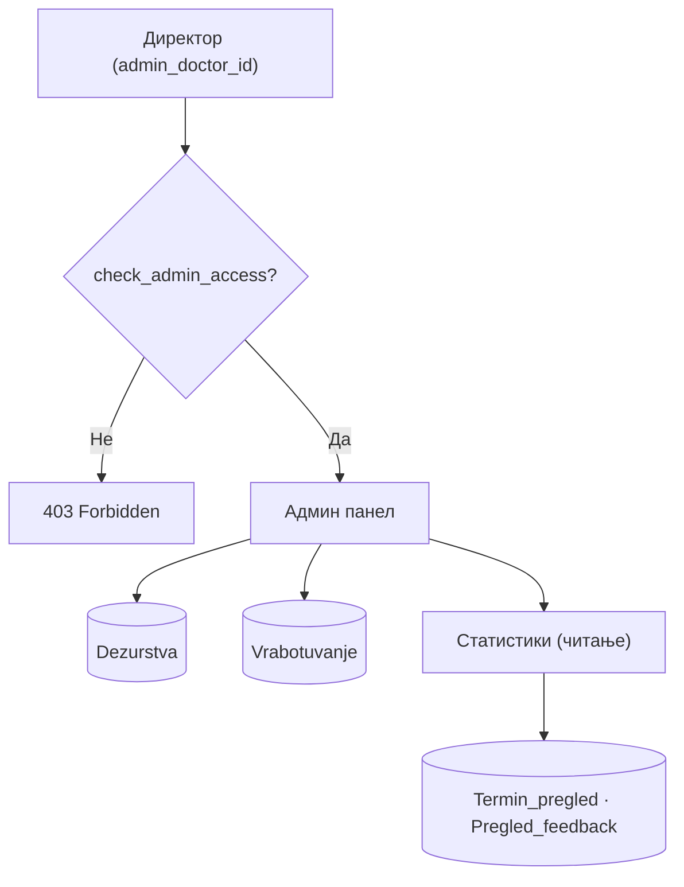
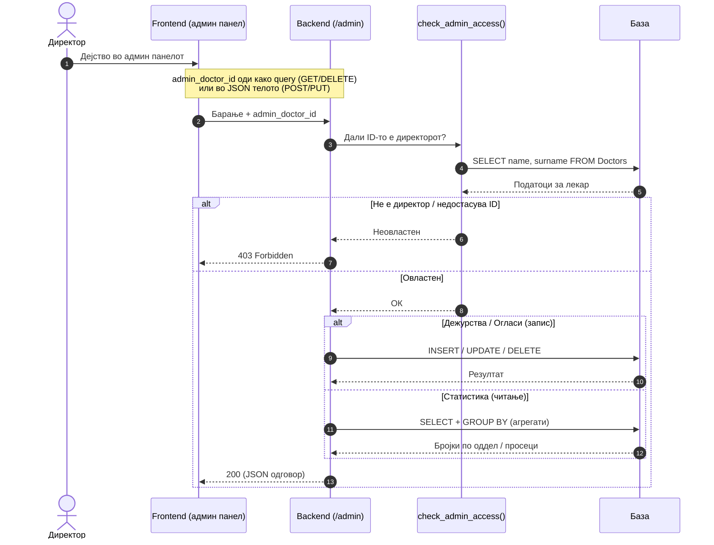

# Администрација

Административниот модул е дефиниран во `backend/routers/admin.py` и достапен под префиксот `/admin`. Претставува централна точка за управување со установата од страна на директорот — единствениот корисник со пристап до овие функции. Модулот опфаќа три клучни домени: управување со **распоредот на дежурства**, целосен CRUD над **огласите за работа** и пристап до **статистики** наменети за раководството. Секој endpoint во овој модул минува низ верификација на `admin_doctor_id` преку `check_admin_access()` пред да се изврши каква било операција — неовластени барања се одбиваат веднаш со `403 Forbidden`.

> **Интерактивно тестирање:** секој endpoint е придружен со вграден **OpenAPI блок** и копче **„Test it"**, погонувано од Scalar. Пополни ги потребните параметри или тело на барањето и испрати го директно кон живиот сервер (`klinicka-bolnica-stip2026.onrender.com`) — без да ја напушташ документацијата.

> Поврзани: [Конвенции](./) · [Лекари](lekari.md) · [Кариера](kariera.md) · [Новости](novosti.md) · [База на податоци](../the_database.md)

***

## 1. Преглед <a href="#id-1-pregled" id="id-1-pregled"></a>



| Група      | Метод/Патека                                 | Намена                           |
| ---------- | -------------------------------------------- | -------------------------------- |
| Дежурства  | `GET /admin/dezurstva`                       | Листа дежурства (со филтри)      |
| Дежурства  | `POST /admin/dezurstva`                      | Ново дежурство                   |
| Дежурства  | `PUT /admin/dezurstva/{id}`                  | Ажурирање дежурство              |
| Дежурства  | `DELETE /admin/dezurstva/{id}`               | Бришење дежурство                |
| Огласи     | `GET /admin/oglasi`                          | Листа на сите огласи             |
| Огласи     | `POST /admin/oglasi`                         | Нов оглас                        |
| Огласи     | `PUT /admin/oglasi/{id}`                     | Ажурирање оглас                  |
| Огласи     | `DELETE /admin/oglasi/{id}`                  | Бришење оглас                    |
| Статистика | `GET /admin/statistika/optovaruvanje-oddeli` | Завршени термини по специјалност |
| Статистика | `GET /admin/statistika/prosek-ocena-lekari`  | Просечна оцена по лекар          |

### Тек на податоци — секое барање минува низ проверка на пристап

Дијаграмот го прикажува текот на едно типично админ барање: пред која било операција (дежурство, оглас или статистика), backend-от прво проверува дали `admin_doctor_id` припаѓа на директорот. Само тогаш барањето стигнува до базата.



***

## 2. Авторизација — само директор <a href="#id-2-avtorizacija" id="id-2-avtorizacija"></a>

Секој endpoint во овој модул е заштитен со функцијата check\_admin\_access(admin\_doctor\_id), која верификува дали проследениот идентификатор припаѓа на директорот на болницата. Проверката не се сведува само на постоење на ID во базата — backend-от дополнително го валидира името на лекарот (на пр. „Владко Захариев"), со вградена толеранција за неколку транслитерациски варијации на истото име. Барањето продолжува кон извршување само ако двете проверки — постоење на ID и совпаѓање на име — поминат успешно. Начинот на кој се проследува admin\_doctor\_id зависи од HTTP методот:

1. кај **GET** и **DELETE** — како **query параметар** (`?admin_doctor_id=...`);
2. кај **POST** и **PUT** — како поле во **JSON телото**.

Доколку admin\_doctor\_id недостасува, не одговара на постоечки запис, или името не се совпаѓа со директорот, backend-от враќа `403 Forbidden` без да изврши каква било операција врз базата.

> Сите барања со тело користат `Content-Type: application/json`. Одговорите се стандарден JSON; грешките се враќаат во формат `{"detail": "порака"}` со соодветен HTTP статус.

**Имплементација (FastAPI) — заштита:**

```python
def check_admin_access(doctor_id: int) -> bool:
    db_cursor.execute("SELECT name, surname FROM Doctors WHERE doctor_ID = %s", (doctor_id,))
    doctor_name = f"{doctor['name']} {doctor['surname']}".strip()
    return doctor_name in ["Владко Захариев", "Влатко Захариев", ...]  # варијации на името
```

Функцијата се повикува на почетокот на секој `admin endpoint`, пред каква било операција врз базата — доколку `check_admin_access` врати False, извршувањето веднаш се прекинува со `403 Forbidden`.

***

## 3. Дежурства <a href="#id-3-dezurstva" id="id-3-dezurstva"></a>

Овој дел од административниот модул управува со распоредот на дежурства на лекарите, зачувани во табелата `Dezurstva`. Директорот преку овие endpoints може да ги прегледа, внесе, ажурира или отстрани дежурства — со поддршка за прецизно филтрирање по лекар, датум или оддел.

Од корисничка перспектива, дежурствата се прикажуваат на профилот на секој лекар — пациентите можат да видат кога нивниот лекар е на дежурство и да го земат тоа предвид при закажување. Доколку за одреден лекар нема рачно внесени дежурства, системот автоматски активира fallback механизам кој динамички го пресметува распоредот врз основа на специјалноста.

### GET `/admin/dezurstva`

Извршува SELECT врз табелата Dezurstva, сортиран по датум и час (DESC). Поддржува комбинација од опционални филтри кои се применуваат динамички во SQL барањето — само проследените параметри влијаат на резултатот, додека непроследените се игнорираат.

**Query параметри:**

* `admin_doctor_id` (задолжителен) — за верификација на пристап преку `check_admin_access()`
* `doctor_id` _(опционален)_ — ги филтрира само дежурствата на конкретен лекар
* `datum` _(опционален)_ — филтрира по конкретен датум во формат `YYYY-MM-DD`
* `oddel` _(опционален)_ — филтрира по naziv на оддел

**Успешен одговор (200):**

```json
[
  {
    "dezurstvo_ID": 3,
    "doctor_ID": 2,
    "doctor_name": "Ана Стојановска",
    "doctor_specialty": "Кардиологија",
    "datum": "2026-06-20",
    "oddel": "Кардиологија",
    "vreme_od": "08:00:00",
    "vreme_do": "20:00:00",
    "napomena": null
  }
]
```

**Можни грешки:**

* `403` (нема пристап)
* `500` грешка настаната на серверска страна.

**Каде се користи**: На frontend страна, response-от го консумира `script.js` и го рендерира во табелата со дежурства во административниот панел. На AI страна, истиот податок се сервира преку намерата pregled\_dezurstvo — единствената интенција во dežurstva-модулот без role-restriction, односно достапна е и за гостин и за пациент, не само за најавен директор.

**Имплементација (FastAPI):**

```python
@router.get("/dezurstva")
def get_all_dezurstva(admin_doctor_id: int, doctor_id=None, datum=None, oddel=None):
    if not check_admin_access(admin_doctor_id): raise HTTPException(403, ...)
    query = "SELECT d.*, doc.name, doc.surname FROM Dezurstva d JOIN Doctors doc ... WHERE 1=1"
    # динамички AND филтри за doctor_id, datum, oddel
    return result
```


[OpenAPI KlinickaBolnicaAPI](https://klinicka-bolnica-stip2026.onrender.com/openapi.json)


### POST `/admin/dezurstva` <a href="#id-32-post-dezurstva" id="id-32-post-dezurstva"></a>

**Креирањето на ново дежурство** endpoint каде самата операција е резервирана исклучиво за администратор — `admin_doctor_id` патува во телото на барањето, а `check_admin_access` го проверува тој идентификатор пред да се изврши било каква друга логика. Доколку лекарот зад тој ID нема администраторски привилегии, барањето се прекинува со `403`, пред системот воопшто да провери дали наведениот `doctor_ID` (лекарот за кој се креира дежурството) постои.

По авторизацијата, следуваат уште две проверки по ред.

1. Прво се потврдува дека `doctor_ID` навистина се однесува на постоечки запис во Doctors — ако не, враќа `404`.
2. Потоа, новото дежурство се споредува со веќе постоечките дежурства на истиот лекар за истиот датум, преку стандардна интервал-преклопувачка (interval-overlap) проверка: два временски опсега се преклопуваат секогаш кога едниот не завршува пред да започне другиот, без разлика дали преклопувањето е делумно или целосно. Ако таков судир постои, барањето се одбива со `400`, а записот не се зачувува — истиот принцип на „одбиј пред да запишеш" кој се среќава и кај закажувањето термини.

**Тело (JSON):**

```json
{
  "admin_doctor_id": 2,
  "doctor_ID": 2,
  "datum": "2026-06-20",
  "oddel": "Кардиологија",
  "vreme_od": "08:00",
  "vreme_do": "20:00",
  "napomena": "Ноќно дежурство"
}
```

* `doctor_ID`, `datum` и `oddel` се задолжителни полиња. `datum` се внесува во формат `YYYY-MM-DD`, додека `vreme_od/vreme_do` се во формат `HH:MM`, со подразбирани вредности `08:00–20:00` доколку не се наведени.

**Успешен одговор (200):**

```json
{ "message": "Дежурството е успешно креирано", "dezurstvo_ID": 5 }
```

**Можни грешки:**

* `400` (недостасуваат полиња, временско преклопување, или невалиден формат)
* `403` (повикувачот не е администратор)
* `404` (лекар со дадениот doctor\_ID не постои)
* `500` (внатрешна грешка на серверот)

**Каде се користи:** Формата за ново дежурство постои само во админ панелот во `script.js`— таа страница воопшто не се прикажува на обичен лекарски или пациентски профил, што е првата линија на заштита уште пред да се стигне до `403 проверката на backend-от`. Корисникот избира лекар, датум и временски опсег преку готови контроли, а не преку слободен текстуален внес, токму за да се избегнат невалидни формати уште пред барањето да биде испратено. По успешен одговор, листата со дежурства во панелот се освежува со новиот запис, без презагрузување на целата страница — клиентот веќе ja добил `dezurstvo_ID` вредноста од одговорот и може директно да ja вметне во приказот.

**Имплементација (FastAPI):**

```python
@router.post("/dezurstva")
async def create_dezurstvo(request: Request):
    data = await request.json()
    if not check_admin_access(data.get("admin_doctor_id")): raise HTTPException(403, ...)
    # валидација: doctor_ID, datum, oddel; парсирање vreme_od/vreme_do во time
    db_cursor.execute("SELECT doctor_ID FROM Doctors WHERE doctor_ID = %s", (doctor_id,))
    if not db_cursor.fetchone(): raise HTTPException(404, "Лекар не е пронајден")
    # проверка за преклопување (interval-overlap)
    db_cursor.execute("""
        SELECT dezurstvo_ID FROM Dezurstva WHERE doctor_ID = %s AND datum = %s
        AND ((vreme_od <= %s AND vreme_do >= %s) OR ...)
    """, (...))
    if db_cursor.fetchone(): raise HTTPException(400, "Лекарот веќе има дежурство за овој датум и време")
    db_cursor.execute("INSERT INTO Dezurstva (doctor_ID, datum, oddel, vreme_od, vreme_do, napomena) VALUES (%s, ...)", (...))
    conn.commit()
    return {"message": "Дежурството е успешно креирано", "dezurstvo_ID": db_cursor.lastrowid}
```

* Целата низа чекори е секвенцијална и секој следен зависи од успехот на претходниот: проверка на администраторски пристап, потврда дека лекарот постои, проверка за преклопување, а дури потоа INSERT и commit. Самата SQL проверка за преклопување е класичен пример на `interval-overlap` услов — наместо да се бара точно совпаѓање на времето, се проверува дали постојниот опсег и новиот опсег се сечат во кој било дел, со условот изразен преку комбинација од <=/>= споредби на `vreme_od и vreme_do` , а не преку едноставна еднаквост.


[OpenAPI KlinickaBolnicaAPI](https://klinicka-bolnica-stip2026.onrender.com/openapi.json)


### PUT `/admin/dezurstva/{dezurstvo_id}` <a href="#id-33-put-dezurstva" id="id-33-put-dezurstva"></a>

**Ажурирањето на постоечко дежурство** користи PUT, не PATCH — целото тело се испраќа одново, со истите полиња како кај креирањето (`doctor_ID`, `datum, oddel`, `vreme_od`, `vreme_do`, `napomena`, плус `admin_doctor_id` за авторизација), без можност да се измени само едно поле изолирано. Авторизацијата и валидацијата следуваат истиот редослед како кај POST-endpoint-от: прво check\_admin\_access врз admin\_doctor\_id, потоа потврда дека дежурството со дадениот dezurstvo\_id навистина постои. Проверката за временско преклопување е скоро идентична со онаа при креирање, со една суштинска разлика — тековното дежурство мора експлицитно да се исклучи од сопствената проверка (`dezurstvo_ID != %s`). Без тоа исклучување, секое ажурирање би било одбиено уште на старт, бидејќи записот секогаш би се преклопувал со самиот себе во базата, со исклучувањето, проверката реално гледа само дали новите вредности влегуваат во судир со други, туѓи дежурства на истиот лекар.

**Тело (JSON)** : исти полиња како кај POST /admin/dezurstva, со admin\_doctor\_id за авторизација. **Path параметар:** `dezurstvo_id` (цел број)

**Успешен одговор (200):** `{ "message": "Дежурството е успешно ажурирано" }`

**Можни грешки:**

* `400` (недостасуваат полиња, временско преклопување, или невалиден формат)
* `403` (повикувачот не е администратор)
* `404` (дежурство со дадениот dezurstvo\_id не постои)
* `500` (внатрешна грешка на серверот)

**Каде се користи:** Истата форма во админ панелот, во `script.js`, служи и за креирање ново дежурство, и за негово уредување — единствената разлика е почетната состојба на полињата. При уредување, формата се отвора предпополнета со постоечките вредности на избраното дежурство, наместо празна, а самото испраќање оди кон PUT наместо POST. По успешен одговор, клиентот не презагрузува цела листа од серверот: редот за конкретното дежурство се ажурира директно со новите вредности, бидејќи тие веќе се познати од самата форма.

**Имплементација (FastAPI):**

```python
@router.put("/dezurstva/{dezurstvo_id}")
async def update_dezurstvo(dezurstvo_id: int, request: Request):
    data = await request.json()
    if not check_admin_access(data.get("admin_doctor_id")): raise HTTPException(403, ...)
    # валидација: doctor_ID, datum, oddel; парсирање vreme_od/vreme_do
    db_cursor.execute("SELECT dezurstvo_ID FROM Dezurstva WHERE dezurstvo_ID = %s", (dezurstvo_id,))
    if not db_cursor.fetchone(): raise HTTPException(404, "Дежурство не е пронајдено")
    # проверка за преклопување со други дежурства (dezurstvo_ID != тековното)
    if conflict: raise HTTPException(400, "Лекарот веќе има дежурство за овој датум и време")
    db_cursor.execute("""
        UPDATE Dezurstva SET doctor_ID=%s, datum=%s, oddel=%s, vreme_od=%s, vreme_do=%s, napomena=%s
        WHERE dezurstvo_ID=%s
    """, (...))
    conn.commit()
    return {"message": "Дежурството е успешно ажурирано"}
```

* `admin_doctor_id` се чита од JSON телото, не од query-стринг — разлика во конвенција во споредба со GET и DELETE endpoints во истиот модул, каде идентификаторот патува низ URL-от.
* `dezurstvo_id`, наспроти тоа, секогаш доаѓа како path параметар, без разлика на HTTP методот, бидејќи тој еднозначно го идентификува конкретниот ресурс над кој се дејствува.


[OpenAPI KlinickaBolnicaAPI](https://klinicka-bolnica-stip2026.onrender.com/openapi.json)


### DELETE `/admin/dezurstva/{dezurstvo_id}` <a href="#id-34-delete-dezurstva" id="id-34-delete-dezurstva"></a>

Од трите endpoints за дежурства, **бришењето** е логички најкраткото — нема валидација на полиња, нема проверка за временско преклопување, само две проверки пред самото бришење: Дали повикувачот е администратор, и дали записот со даденото `dezurstvo_id` навистина постои. Токму затоа што бришењето е неповратна операција, без `soft-delete` или папка за отпадоци во базата, системот не дозволува непостоечки `dezurstvo_id` тивко да помине со `200` — секој таков повик експлицитно враќа `404`, наместо да остави корисникот во недоумица дали нешто реално се избришало. `admin_doctor_id` овде патува како query параметар, во самиот URL, а не во JSON тело — конзистентно со конвенцијата на HTTP методот: `DELETE`, како и `GET`, традиционално не носи тело со значење, додека `POST` и `PUT` го имаат токму за тоа, што е и причината `admin_doctor_id` таму да доаѓа поинаку, преку телото на барањето.

**Path параметар:** `dezurstvo_id` (цел број) **Query параметар**: `admin_doctor_id` (задолжителен)

```
DELETE /admin/dezurstva/5?admin_doctor_id=2
```

**Успешен одговор (200):** `{ "message": "Дежурството е успешно избришано" }`

**Можни грешки:**

* `403` (повикувачот не е администратор)
* `404` (дежурство со дадениот dezurstvo\_id не постои)
* `500` (внатрешна грешка на серверот)

**Каде се користи:** На frontend страна, копчето за бришење во листата дежурства во админ панелот најчесто е придружено со потврдна порака пред повикот воопшто да се испрати, токму затоа што операцијата е неповратна. По успешен одговор, редот за избришаното дежурство веднаш се отстранува од приказот на клиентска страна, без потреба од повторно вчитување на целата листа од серверот.

**Имплементација (FastAPI):**

```python
@router.delete("/dezurstva/{dezurstvo_id}")
def delete_dezurstvo(dezurstvo_id: int, admin_doctor_id: Optional[int] = None):
    if not check_admin_access(admin_doctor_id): raise HTTPException(403, ...)
    db_cursor.execute("SELECT dezurstvo_ID FROM Dezurstva WHERE dezurstvo_ID = %s", (dezurstvo_id,))
    if not db_cursor.fetchone(): raise HTTPException(404, "Дежурство не е пронајдено")
    db_cursor.execute("DELETE FROM Dezurstva WHERE dezurstvo_ID = %s", (dezurstvo_id,))
    conn.commit()
    return {"message": "Дежурството е успешно избришано"}
```

* Постоењето на записот секогаш се проверува пред самиот `DELETE`, а не по него — редослед кој значи дека базата никогаш не се повикува со намера да избрише ред кој веќе не постои, и дека `404` стигнува до клиентот пред да се направи било каков обид за бришење.


[OpenAPI KlinickaBolnicaAPI](https://klinicka-bolnica-stip2026.onrender.com/openapi.json)


***

## 4. Огласи за работа <a href="#id-4-oglasi" id="id-4-oglasi"></a>

Овој дел опфаќа целосен `CRUD` — креирање, читање, уредување и бришење — над табелата `Vrabotuvanje`, во која се чуваат огласите за слободни работни места. За разлика од јавните endpoints во Кариера, каде секој посетител може да прелистува активни огласи без најава, сите операции тука бараат администраторски пристап: **креирање нов оглас, негово ажурирање и бришење се резервирани исклучиво за администратор**, преку истиот механизам за авторизација (`admin_doctor_id`)\` што се користи и кај дежурствата во претходниот дел. Поделбата меѓу двата модула одразува две различни перспективи на истите податоци.

* kariera.md ja опишува страната на кандидатот — некој кој само прелистува отворени позиции и аплицира.
* Овој дел, наспроти тоа, ja опишува страната на администратора, кој ги одржува тие огласи низ нивниот целосен животен циклус — од објавување, преку уредување на детали, до затворање или бришење штом позицијата веќе не е активна.

### GET `/admin/oglasi` <a href="#id-41-get-oglasi" id="id-41-get-oglasi"></a>

**Прегледот на огласи во админ панелот** ja покажува целата историја, не само тековно отворените позиции — листата го вклучува секој оглас независно од `status_oglas`, подреден по `datum_na_objava` опаѓачки, така што најново објавените се секогаш на врвот. Тука нема предикатно филтрирање според статус, бидејќи администраторот треба увид во сите огласи, активни и завршени, на едно место. Тоа е и главната разлика од јавниот `/kariera endpoint`, кој враќа исклучиво активни огласи — таму филтрирањето по статус е намерно, бидејќи кандидат не треба да гледа позиции кои веќе се затворени. Двата endpoints читаат од истата табела `Vrabotuvanje`, само со различен опсег на видливост, во зависност од тоа кој е читателот.

**Query:** `admin_doctor_id` (задолжителен)

**Успешен одговор (200):**

```json
[
  {
    "id_oglas": 7,
    "pozicija": "Специјалист кардиолог",
    "oddel": "Кардиологија",
    "datum_na_objava": "2026-06-01",
    "datum_na_prijavuvanje": "2026-06-30",
    "status_oglas": "активен"
  }
]
```

**Можни грешки:**

* `403` (повикувачот не е администратор)
* `500` (внатрешна грешка на серверот)

**Каде се користи:** На frontend страна, листата на огласи во админ панелот не се потпира на оптимистички локални измени по секоja операција — наместо тоа, `script.js` повторно ja повикува истата листа секогаш кога состојбата можеби се променила. Тоа се случува на два момента: еднаш при самото отворање на таа секција, и повторно по секој успешен POST, PUT или DELETE врз оглас. Пристапот е поедноставен од рачно ажурирање на локалниот приказ, а гарантира дека прикажаната листа секогаш точно одразува што реално стои во базата, без можност за расинхронизација меѓу клиентот и серверот.

**Имплементација (FastAPI):**

```python
@router.get("/oglasi")
def get_all_oglasi(admin_doctor_id: Optional[int] = None):
    if not check_admin_access(admin_doctor_id): raise HTTPException(403, ...)
    db_cursor.execute("""
        SELECT id_oglas, pozicija, oddel, datum_na_objava, datum_na_prijavuvanje, status_oglas
        FROM Vrabotuvanje ORDER BY datum_na_objava DESC
    """)
    return db_cursor.fetchall()
```

* Како и кај останатите GET/DELETE endpoints во админ модулот, admin\_doctor\_id доаѓа како query параметар, проверен пред да се изврши самото читање од базата — ниту еден ред од Vrabotuvanje не се враќа доколку проверката за администраторски пристап не помине прво.


[OpenAPI KlinickaBolnicaAPI](https://klinicka-bolnica-stip2026.onrender.com/openapi.json)


### POST `/admin/oglasi` <a href="#id-42-post-oglasi" id="id-42-post-oglasi"></a>

**Новиот оглас** влегува во истата табела Vrabotuvanje која ja храни и јавната Кариера страница — штом редот се запише со INSERT, потенцијално веднаш е видлив за надворешни кандидати, ако статусот е активен. Затоа единствената вистинска проверка пред запис е авторизацијата преку `check_admin_access`. Самата валидација на полињата е минимална, бидејќи `pozicija` и `oddel` се задолжителни, додека датумите следат формат `YYYY-MM-DD`, а `status_oglas` е опционален и не мора да се наведе при креирање.

Двата endpoints — овој и јавниот од kariera.md — читаат и пишуваат во истиот ресурс, но со спротивна намера: таму се чита со предикатно филтрирање само по активни огласи, без авторизација, додека тука се пишува нов ред, со авторизација која е задолжителна и неизбежна. Истата табела, две различни перспективи на пристап. **Тело (JSON):**

```json
{
  "admin_doctor_id": 2,
  "pozicija": "Специјалист кардиолог",
  "oddel": "Кардиологија",
  "datum_na_objava": "2026-06-01",
  "datum_na_prijavuvanje": "2026-06-30",
  "status_oglas": "активен"
}
```

* `pozicija` и `oddel` се задолжителни полиња. Датумите се внесуваат во формат `YYYY-MM-DD`, а `status_oglas` е опционален.

**Успешен одговор (200):** `{ "message": "Огласот е успешно креиран", "id_oglas": 7 }`

**Можни грешки:**

* `400` (недостасуваат полиња или невалиден формат на датум)
* `403` (повикувачот не е администратор)
* `500` (внатрешна грешка на серверот)

**Каде се користи:** На frontend страна, формата за нов оглас во админ панелот (`script.js`) го повикува овој endpoint по внес на сите потребни полиња, а по успешен одговор листата на огласи се освежува со повик кон `GET /admin/oglasi`..

**Имплементација (FastAPI):**

```python
@router.post("/oglasi")
async def create_oglas_admin(request: Request):
    data = await request.json()
    if not check_admin_access(data.get("admin_doctor_id")): raise HTTPException(403, ...)
    # валидација: pozicija, oddel; парсирање датуми "YYYY-MM-DD"
    db_cursor.execute("""
        INSERT INTO Vrabotuvanje (pozicija, oddel, datum_na_objava, datum_na_prijavuvanje, status_oglas)
        VALUES (%s, %s, %s, %s, %s)
    """, (...))
    conn.commit()
    return {"message": "Огласот е успешно креиран", "id_oglas": db_cursor.lastrowid}
```

* Како и кај другите `INSERT-базирани endpoints` во овој модул, `id_oglas` доаѓа директно од `cursor.lastrowid`, без потреба од дополнително SELECT барање за да се дознае примарниот клуч на новиот ред.


[OpenAPI KlinickaBolnicaAPI](https://klinicka-bolnica-stip2026.onrender.com/openapi.json)


### PUT `/admin/oglasi/{oglas_id}` <a href="#id-43-put-oglasi" id="id-43-put-oglasi"></a>

**Уредувањето на оглас** , исто како и кај дежурствата, користи `PUT` со целосна замена на сите полиња — нема парцијален PATCH тука, само едно барање што го презапишува целиот ред наеднаш. Во пракса, најчеста причина за повик кон овој endpoint не е промена на самата позиција или одделот, туку промена на `status_oglas` — на пример, затворање на оглас откако позицијата е пополнета, без да се брише записот и без да се загуби историјата за претходно објавените огласи.

Редоследот на проверки повторува истиот модел кој се среќава низ целиот админ модул: **прво авторизација** преку `admin_doctor_id`, потоа **потврда дека `oglas_id` навистина постои во `Vrabotuvanje`** , и дури тогаш самиот **UPDATE**. Доколку огласот не постои, барањето запира со `404` пред воопшто да се стигне до наредбата за ажурирање.

**Тело (JSON)** : исти полиња како кај `POST /admin/oglasi`, со `admin_doctor_id за авторизација` **Path параметар:** `oglas_id`

**Успешен одговор (200):** `{ "message": "Огласот е успешно ажуриран" }`

**Можни грешки:**

* `400` (недостасуваат полиња или невалиден формат на датум)
* `403` (повикувачот не е администратор)
* `404` (оглас со дадениот oglas\_id не постои)
* `500` (внатрешна грешка на серверот)

**Каде се користи:** На frontend страна, истата форма за оглас во `script.js` служи и за креирање и за уредување — при уредување, полињата се предполнети со постоечките вредности, а испраќањето оди кон PUT наместо POST. По успешен одговор, листата во админ панелот се освежува со новите вредности.

**Имплементација (FastAPI):**

```python
@router.put("/oglasi/{oglas_id}")
async def update_oglas(oglas_id: int, request: Request):
    data = await request.json()
    if not check_admin_access(data.get("admin_doctor_id")): raise HTTPException(403, ...)
    db_cursor.execute("SELECT id_oglas FROM Vrabotuvanje WHERE id_oglas = %s", (oglas_id,))
    if not db_cursor.fetchone(): raise HTTPException(404, "Оглас не е пронајден")
    db_cursor.execute("""
        UPDATE Vrabotuvanje SET pozicija=%s, oddel=%s, datum_na_objava=%s,
            datum_na_prijavuvanje=%s, status_oglas=%s WHERE id_oglas=%s
    """, (...))
    conn.commit()
    return {"message": "Огласот е успешно ажуриран"}
```

* Датумите се парсираат на истиот начин како кај креирањето, а постоењето на огласот се проверува пред UPDATE, не по него — истиот принцип на „провери пред да дејствуваш" применет на секој пишувачки endpoint во овој модул.


[OpenAPI KlinickaBolnicaAPI](https://klinicka-bolnica-stip2026.onrender.com/openapi.json)


### DELETE `/admin/oglasi/{oglas_id}` <a href="#id-44-delete-oglasi" id="id-44-delete-oglasi"></a>

Бришењето на оглас го затвора `CRUD`-от над `Vrabotuvanje`, и, исто како кај дежурствата, нема меко бришење — редот се отстранува трајно штом DELETE наредбата помине. Бидејќи истата табела ja храни и јавната Кариера страница, бришење тука значи дека огласот веднаш престанува да постои и таму, не само во админ панелот. Тоа го разликува овој endpoint од промена на `status_oglas` преку PUT, која само го скрива огласот од јавниот приказ без да го отстрани записот — DELETE е единствениот начин трајно да се избрише историјата за конкретна позиција.

**Path параметар:** `oglas_id`\
**Query:** `admin_doctor_id`

**Успешен одговор (200):** `{ "message": "Огласот е успешно избришан" }`

**Можни грешки:**

* `403` (повикувачот не е администратор)
* `404` (оглас со дадениот oglas\_id не постои)
* `500` (внатрешна грешка на серверот)

**Каде се користи:** Бидејќи бришењето на оглас е неповратна операција, frontend-от не дозволува повикот да се испрати директно по клик — копчето за бришење во листата најчесто отвора потврдна порака, и барањето стигнува до серверот само по експлицитна потврда од корисникот. По успешен одговор, огласот се отстранува од приказот веднаш, без повторно вчитување на целата листа преку `GET /admin/oglasi` — клиентот веќе знае дека бришењето успеало, па сам ja ажурира локалната состојба.

**Имплементација (FastAPI):**

```python
@router.delete("/oglasi/{oglas_id}")
def delete_oglas(oglas_id: int, admin_doctor_id: Optional[int] = None):
    if not check_admin_access(admin_doctor_id): raise HTTPException(403, ...)
    db_cursor.execute("SELECT id_oglas FROM Vrabotuvanje WHERE id_oglas = %s", (oglas_id,))
    if not db_cursor.fetchone(): raise HTTPException(404, "Оглас не е пронајден")
    db_cursor.execute("DELETE FROM Vrabotuvanje WHERE id_oglas = %s", (oglas_id,))
    conn.commit()
    return {"message": "Огласот е успешно избришан"}
```

* Постоењето на огласот секогаш се проверува пред самиот DELETE, не по него — истиот принцип повторен низ целиот админ модул, без разлика дали станува збор за дежурство или оглас.


[OpenAPI KlinickaBolnicaAPI](https://klinicka-bolnica-stip2026.onrender.com/openapi.json)


***

## 5. Статистики <a href="#id-5-statistika" id="id-5-statistika"></a>

Овој дел опфаќа **аналитички endpoints** наменети за `раководството на болницата`. За разлика од претходните два дела, тука нема ниту еден POST, PUT или DELETE — секој endpoint само агрегира веќе постоечки податоци и враќа резиме, без да го измени ниту еден ред во базата. Авторизацијата сепак останува задолжителна: секој повик бара `admin_doctor_id`, истиот механизам користен низ целиот модул, бидејќи статистиката за оптовареност и работа на лекарите не е наменета за јавен ниту за лекарски увид.

Повеќето статистички endpoints прифаќаат опционален временски опсег, `datum_od` и `datum_do` —доколку не се наведени, пресметката опфаќа целата историја на податоци. Од друга страна доколку се наведени, резултатот се ограничува само на тој период. Првиот од овие endpoints мери оптовареност по оддел.

### GET `/admin/statistika/optovaruvanje-oddeli` <a href="#id-51-optovaruvanje" id="id-51-optovaruvanje"></a>

Овој endpoint брои колку завршени прегледи (`status_pregled = 'завршен'`) отпаѓаат на секоја специјалност, преку едно GROUP BY барање над `Termin_pregled` и `Doctors`. Бројката не вклучува закажани, откажани или во-очекување термини — само реално завршени прегледи влегуваат во пресметката, бидејќи токму тие претставуваат завршена, мерлива работа на лекарот, не само закажан термин кој можеби сè уште не се случил.

Опсегот `datum_od/datum_do` е опционален: ако не се наведе, се опфаќа сите завршени прегледи во базата без временско ограничување. Доколку се наведе, се брои само оној дел од историјата што паѓа во рамките на тој период. И двата датуми се враќаат назад во одговорот, дури и кога не се наведени (тогаш како null) — корисна потврда на клиентска страна дека филтерот навистина е применет онака како е побарано, без потреба клиентот сам да памти што бил испратен барањето.

**Query:** `admin_doctor_id` (задолжителен) · `datum_od` · `datum_do` (опционален опсег)

**Успешен одговор (200):**

```json
{
  "razdeli": [
    { "specijalnost": "Кардиологија", "broj_zavrseni": 42 },
    { "specijalnost": "Хирургија", "broj_zavrseni": 31 }
  ],
  "vkupno_zavrseni": 73,
  "datum_od": null,
  "datum_do": null
}
```

**Можни грешки:**

* `403` (повикувачот не е администратор)
* `500` (внатрешна грешка на серверот)

**Каде се користи:** Секцијата за статистика во админ панелот нуди опционални контроли за избор на временски период — ако администраторот не избере датуми, прикажаниот преглед опфаќа целата историја на завршени прегледи. Штом контролите се користат или сменат, `script.js` повторно го повикува истиот endpoint, сега со конкретни вредности за `datum_od` и `datum_d`o, а добиените резлутати се прикажуваат како график или табела со оптовареност по оддел.

**Имплементација (FastAPI):**

```python
@router.get("/statistika/optovaruvanje-oddeli")
def statistika_optovaruvanje(admin_doctor_id: int, datum_od=None, datum_do=None):
    # SELECT specijalnost, COUNT(*) FROM Termin_pregled JOIN Doctors
    # WHERE status_pregled = 'завршен' GROUP BY specialty
    return {"razdeli": [...], "vkupno_zavrseni": N}
```


[OpenAPI KlinickaBolnicaAPI](https://klinicka-bolnica-stip2026.onrender.com/openapi.json)


### GET `/admin/statistika/prosek-ocena-lekari` <a href="#id-52-prosek" id="id-52-prosek"></a>

Овој endpoint поминува низ три табели за да дојде до просечна оцена по лекар: `Pregled_feedback` чува самите оцени, поврзани преку `termin_ID` со `Termin_pregled`, а оттаму, преку `doctor_ID`, до `Doctors` за име, презиме и специјалност. И `AVG(ocena)`, и `бројот на гласови (COUNT(*))` се пресметуваат заедно во едно групирано барање — нема одделни SQL повици за просек и за број гласови.

Однесувањето се менува во зависност од тоа дали `doctor_id`е наведен. Без него, одговорот ги вклучува само лекарите со барем една оцена, подредени по просек опаѓачки — лекар без гласови нема смислена просечна вредност, па едноставно отпаѓа од листата, наместо да се прикаже со `null` или со нула. Со конкретен `doctor_id`, пак, истиот лекар секогаш се враќа, дури и ако нема ниту една оцена — во тој случај `broj_oceni` е 0, а `prosek_ocena` е `null`, бидејќи прашањето веќе е експлицитно „кажи ми за овој лекар", не „покажи ми ги најдобро оценетите".

**Query:** `admin_doctor_id` (задолжителен) · `doctor_id` · `datum_od` · `datum_do` (опционални)

**Успешен одговор (200):**

```json
{
  "lekari": [
    {
      "doctor_ID": 2,
      "ime": "Ана",
      "prezime": "Стојановска",
      "specijalnost": "Кардиологија",
      "prosek_ocena": 4.75,
      "broj_oceni": 12
    }
  ],
  "datum_od": null,
  "datum_do": null
}
```

**Можни грешки:**

* `403` (повикувачот не е администратор)
* `404` (зададен е doctor\_id кој не постои во базата)
* `500` (внатрешна грешка на серверот)

**Каде се користи:** Истиот endpoint служи за два различни приказа во секцијата за статистика, во зависност од тоа дали `doctor_id` е присутен во барањето. Без него, се прикажува рангирана табела на сите лекари по просечна оцена — брз преглед кој лекар или оддел се истакнува. Со конкретен `doctor_id`, истиот повик се користи поинаку: за приказ на профил на еден лекар, во контекст само на неговите сопствени оцени, без споредба со останатите.

**Имплементација (FastAPI):**

```python
@router.get("/statistika/prosek-ocena-lekari")
def statistika_prosek_ocena(admin_doctor_id: int, doctor_id=None, ...):
    # AVG(pf.ocena), COUNT(*) од Pregled_feedback → Termin_pregled → Doctors
    return {"lekari": [{"prosek_ocena": 4.75, "broj_oceni": 12, ...}]}
```


[OpenAPI KlinickaBolnicaAPI](https://klinicka-bolnica-stip2026.onrender.com/openapi.json)


* `404` се враќа само во режимот со конкретен `doctor_id` — ако наведениот лекар воопшто не постои во `Doctors`, нема смисла да се враќа празен резултат како да станува збор за лекар без оцени; разликата меѓу „лекар постои, но нема оцени" и „лекар воопшто не постои" мора да остане видлива до клиентот.

***

## 6. Поврзани табели <a href="#id-6-tabele" id="id-6-tabele"></a>

| Табела             | Улога во `/admin`                                    |
| ------------------ | ---------------------------------------------------- |
| `Dezurstva`        | Распоред на дежурства на лекарите                    |
| `Doctors`          | Проверка на пристап + податоци за лекар/специјалност |
| `Vrabotuvanje`     | Огласи за работа (CRUD)                              |
| `Termin_pregled`   | Извор за статистика (завршени термини)               |
| `Pregled_feedback` | Извор за статистика (оцени по лекар)                 |

Детали за колони и врски: [База на податоци](../the_database.md).

***

Следно: [AI чат](ai-chat.md) · [Конвенции](./)
