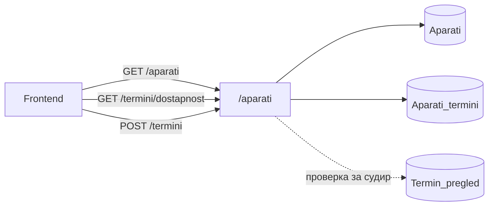
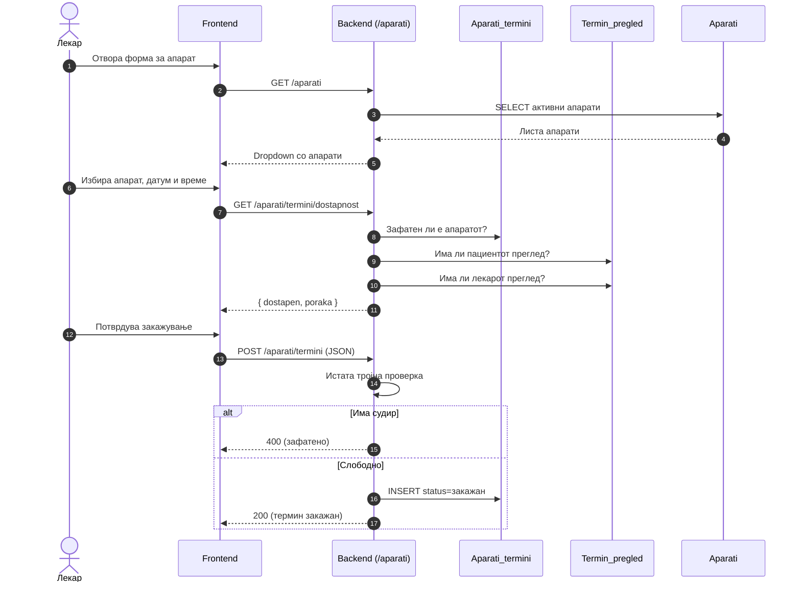

# Апарати

Закажувањето на **медицински апарат** бара повеќе од обична проверка на термин — токму затоа `backend/routers/aparati.py`, монтиран под префиксот `/aparati`, го гради целиот модул околу тројна проверка на конфликти, која мора да помине пред секое резервирање. Самиот модул опфаќа три клучни операции:

1. Листање на активни апарати
2. Проверка на достапност за конкретен термин
3. Закажување апарат од страна на лекар.

Проверката се извршува над сите три засегнати страни истовремено. Прво се потврдува дека самиот апарат е слободен во бараниот термин, преку табелата `Aparati_termini`. Потоа дека пациентот нема друг закажан преглед или апаратски термин во истото време, преку `Termin_pregledz` и како крајна проверка дали лекарот нема преклопување со друг преглед или апаратски термин, преку комбинација од истите две табели. Само ако сите три услови поминат без конфликт, терминот се зачувува — редослед кој гарантира целосна синхронизација меѓу календарот за прегледи и календарот за апарати, без можност една страна да остане слободна додека другата е веќе резервирана за истиот временски слот.

> **Интерактивно тестирање:** секој endpoint е придружен со вграден **OpenAPI блок** и копче **„Test it"**, погонувано од Scalar. Пополни ги потребните параметри или тело на барањето и испрати го директно кон живиот сервер (`klinicka-bolnica-stip2026.onrender.com`) — без да ја напушташ документацијата.

> Поврзани: [Конвенции](./) · [Термини](termini.md) · [Лекари](lekari.md) · [База на податоци](../the_database.md) · [Преглед на backend](../pregled.md)

***

## 1. Преглед <a href="#id-1-pregled" id="id-1-pregled"></a>



| Метод  | Патека                        | Намена                                                            |
| ------ | ----------------------------- | ----------------------------------------------------------------- |
| `GET`  | `/aparati`                    | Листа на сите активни апарати кој болницата ги има на располагање |
| `GET`  | `/aparati/termini/dostapnost` | Проверка дали апаратот е слободен за избран датум/време           |
| `POST` | `/aparati/termini`            | Закажување термин на апарат                                       |

### Тек на податоци — од избор до закажан апарат

Дијаграмот го прикажува целиот тек: листање апарати, проверка на достапност во живо додека корисникот избира, и финално закажување со тројната проверка на судири.



Сите барања што менуваат податоци се **JSON**. Грешките се враќаат како `{"detail": "порака"}` со соодветен статус.

***

## 2. Тројна синхронизација <a href="#id-2-sinhronizacija" id="id-2-sinhronizacija"></a>

Секое закажување на апарат поминува низ **три одделни SQL барања** за истиот датум и час, секое насочено кон поинаков ресурс кој потенцијално веќе би можел да биде зафатен:

1. Апарат — проверка врз `Aparati_termini: SELECT ... WHERE aparat = ? AND datum_vreme = ? AND status != 'откажан'`. Постоечки запис значи апаратот е зафатен во тој термин.
2. Пациент — проверка врз `Termin_pregled: SELECT ... WHERE pacient = ? AND datum_vreme = ? AND status = 'закажан'`. Постоечки запис значи пациентот веќе има друг закажан преглед во истото време.
3. Лекар — проверка врз истата табела `Termin_pregled: SELECT ... WHERE lekar_id = ? AND datum_vreme = ? AND status = 'закажан'`. Постоечки запис значи лекарот е зафатен во тој термин.

Терминот „тројна" овде се однесува на трите различни засегнати страни кои се покриени, не на буквално истовремено извршување — самите три SELECT барања се изведуваат секвенцијално, едно по друго, секогаш во истиот ред: апарат, пациент, лекар. Штом некое од нив најде постоечки конфликт, преостанатите воопшто не се извршуваат — закажувањето веднаш се одбива со `400`, а пораката прецизно укажува кој конкретен ресурс е зафатен, наместо да врати генеричка порака за грешка.

Овој редослед на проверки гарантира дека ниту лекар, ниту пациент, ниту апарат не може да биде резервиран на две места истовремено, без разлика дали конфликтот доаѓа од друг апаратски термин или од обичен преглед — двата календари остануваат синхронизирани преку истата заедничка проверка, не преку посебна логика за секој одделно.

***

## 3. GET `/aparati` <a href="#id-3-lista" id="id-3-lista"></a>

Листата на апарати е едноставна по намера — еден `SELECT, филтриран по aktiven = TRUE`, подреден по име, без параметри и без можност грешка да допре до клиентот. Активните апарати се единствените што воопшто треба да се појавуваат на frontend-от, бидејќи деактивиран апарат не може да биде избран ниту закажан, затоа филтрирањето се случува веднаш на ниво на база, не подоцна на клиентска страна.

Поважна од самиот SELECT е заштитата околу него: endpoint-от е дизајниран да никогаш не врати `500`, без разлика на причината за грешка. Доколку табелата Aparati сè уште не постои во базата — сценарио кое реално се случува во рана фаза на deployment, пред соодветната миграција да биде извршена — или ако SQL барањето пропадне поради друга причина, резултатот секогаш е празна листа `[]`. Овој пристап на graceful degradation значи дека frontend-от не мора посебно да обработува грешка за овој endpoint: dropdown менито за апарати едноставно останува празно, наместо целата страница да прикаже грешка поради единствен недостапен ресурс.

**Параметри:** нема.

**Успешен одговор (200):**

```json
[
  { "aparat_id": 1, "ime": "Магнетна резонанца (MRI)", "opis": "1.5T MRI скенер", "kod": "mri" },
  { "aparat_id": 2, "ime": "Компјутерска томографија (CT)", "opis": "64-слоен CT", "kod": "kt" }
]
```

**Можни грешки:**

* нема — при секоја грешка враќа `[]`, никогаш статус код различен од `200`

**Каде се користи:** На frontend страна, формата за закажување апарат во лекарскиот панел (`script.js`) го повикува овој endpoint штом се отвори, а додека одговорот не пристигне, dropdown менито останува празно. Штом податоците стигнат, менито се полни со активните апарати, веќе подредени по име онака како ги враќа самото SELECT барање — без потреба од дополнително сортирање на клиентска страна.

**Имплементација (FastAPI):**

```python
@router.get("")
def get_aparati():
    db_cursor.execute("""
        SELECT aparat_id, ime, opis, kod FROM Aparati
        WHERE aktiven = TRUE ORDER BY ime
    """)
    return db_cursor.fetchall()
    # except: return []   # ако табелата не постои — празна листа наместо 500
```

* Заштитата е имплементирана преку `try/except` околу самото SELECT барање — секој исклучок, без разлика дали доаѓа од непостоечка табела или од друга SQL грешка, резултира во истиот fallback: празна листа, никогаш статус код 500.


[OpenAPI KlinickaBolnicaAPI](https://klinicka-bolnica-stip2026.onrender.com/openapi.json)


***

## 4. GET `/aparati/termini/dostapnost` <a href="#id-4-dostapnost" id="id-4-dostapnost"></a>

Овој endpoint е читачка верзија на тројната проверка од претходниот дел — истата логика за конфликти, но без INSERT на крајот. Намерата е да даде моментална повратна информација додека корисникот сè уште ги пополнува полињата на формата, пред воопшто да се поднесе барање за реално закажување. Бидејќи не запишува ништо во базата, endpoint-от е безбеден за повторно повикување при секоја измена на формата, без ризик од несакани странични ефекти — класичен пример на идемпотентен GET.

Опсегот на проверка не е фиксен, туку прогресивно се проширува во зависност од тоа кои параметри се проследени. Со минимален сет — само aparat, datum и vreme — се проверува исклучиво достапноста на апаратот. Штом се додаде lekar\_id, проверката автоматски се проширува и врз распоредот на лекарот; штом се додадат pacient\_ime и pacient\_prezime заедно, се вклучува и пациентот. Вреди да се напомене дека пациентот овде се идентификува по име и презиме, не по е-пошта како кај повеќето други endpoints во системот — веројатно бидејќи во овој момент на пополнување форма, пред финалното поднесување, е-поштата можеби сè уште не е внесена или потврдена. **Query параметри:**

* `aparat` _(задолжителен)_ — код на апаратот (на пр. `mri`, `kt`)
* `datum` _(задолжителен)_ — формат `YYYY-MM-DD`
* `vreme` _(задолжителен)_ — формат `HH:MM`
* `lekar_id` _(опционален)_ — ако е проследен, се проверува и достапноста на лекарот
* `pacient_ime`, `pacient_prezime` _(опционални)_ — ако се проследени, се проверува и достапноста на пациентот

```
GET /aparati/termini/dostapnost?aparat=mri&datum=2026-06-20&vreme=10:00&lekar_id=2
```

**Успешен одговор (200):**

```json
{ "dostapen": true, "poraka": "Апаратот е достапен" }
```

Доколку има судир, `dostapen` е `false`, а `poraka` ги набројува причините (на пр. „Апаратот е зафатен…; Лекарот има закажан преглед…").

**Можни грешки:**

* `400` (недостасуваат задолжителни параметри или невалиден формат)
* `500` (внатрешна грешка на серверот)

**Каде се користи:** На frontend страна, формата за закажување апарат во `script.js` го повикува овој endpoint при секоја промена на датум, час, лекар или апарат — резултатот веднаш се прикажува покрај полето, без да се чека финалното поднесување, така што корисникот дознава за судир уште пред да притисне „закажи".

**Имплементација (FastAPI):**

```python
@router.get("/termini/dostapnost")
def check_aparat_dostapnost(aparat: str, datum: str, vreme: str,
                            lekar_id: int | None = None, pacient_ime: str | None = None, ...):
    # 1) Aparati_termini — дали апаратот е зафатен
    # 2) Termin_pregled — дали пациентот има преглед (ако се дадени ime/prezime)
    # 3) Termin_pregled — дали лекарот има преглед (ако е даден lekar_id)
    return {"dostapen": count == 0 and ..., "poraka": "; ".join(poraki) or "Апаратот е достапен"}
```

Логиката е истата тројна проверка користена и кај `POST /termini`, само без завршен INSERT — еден исти сет проверки за конфликти служи и за реално закажување, и за претходен преглед, без дуплирање на правилата на два места во кодот.


[OpenAPI KlinickaBolnicaAPI](https://klinicka-bolnica-stip2026.onrender.com/openapi.json)


***

## 5. POST `/aparati/termini` <a href="#id-5-zakazi" id="id-5-zakazi"></a>

Ако претходниот endpoint беше пробна верзија без последици, овој е реалното закажување. Истата тројна проверка за конфликти се повторува уште еднаш, овој пат непосредно пред INSERT, а пред неа дополнително се потврдува дека `lekar_id` навистина се однесува на постоечки лекар — провера која во точка 4 воопшто не постоеше, бидејќи таму целта беше брза повратна информација, не гарантирана точност. Само ако сите проверки поминат, записот се зачувува во `Aparati_termini`, паралелен календар на `Termin_pregled`s, наменет специфично за термини на апарати. Телото на барањето носи и `lekar_ime` и `aparat_ime`, покрај нивните идентификатори `lekar_id` и `aparat` — имињата се запишуваат директно во `Aparati_termini`, наместо да се извлекуваат секој пат преку JOIN кон Doctors и Aparati. Оваа намерна денормализација го прави читањето на календарот побрзо и поедноставно, со цена која треба да се има на ум: ако подоцна името на лекарот или апаратот се промени во соодветната табела, веќе запишаните термини ги чуваат старите вредности, освен ако посебно не се ажурираат.

**Тело (JSON):**

```json
{
  "lekar_id": 2,
  "lekar_ime": "Ана Стојановска",
  "pacient_ime": "Иван",
  "pacient_prezime": "Ивановски",
  "aparat": "mri",
  "aparat_ime": "Магнетна резонанца (MRI)",
  "datum_vreme": "2026-06-20T10:00",
  "opis": "Сомнеж за повреда на колено"
}
```

Задолжителни полиња: `lekar_id`, `pacient_ime`,`pacient_prezime`, `aparat`, `datum_vreme` и `opis`.

> `datum_vreme` се внесува во **ISO формат** `YYYY-MM-DDTHH:MM`, а `aparat` е краток код на апарата (на пр. mri). `aparat_ime` е опционален приказен назив

**Успешен одговор (200):**

```json
{ "message": "Терминот за апарат е успешно закажан!", "termin_id": 12 }
```

**Можни грешки:**

* `400` (недостасуваат полиња, невалиден формат, или судир со апарат, пациент или лекар)
* `404` (лекар со дадениот lekar\_id не постои)
* `500` (внатрешна грешка на серверот)

**Каде се користи:** На frontend страна, формата за закажување апарат во лекарскиот панел (`script.js`) го повикува овој endpoint како последен чекор во истиот тек што започнува со проверката за достапност — корисникот прво добива моментална потврда дека нема судир, а потоа истиот избор се испраќа овде за да стане трајно закажување. Двата повици го делат истиот сет проверки за конфликти; разликата е единствено во крајниот резултат — едниот само информира, другиот реално запишува во базата.

**Имплементација (FastAPI):**

```python
@router.post("/termini")
async def create_aparat_termin(request: Request):
    data = await request.json()
    dt = datetime.strptime(datum_vreme, "%Y-%m-%dT%H:%M")
    # тројна проверка: Aparati_termini + Termin_pregled (пациент) + Termin_pregled (лекар)
    if conflict: raise HTTPException(400, "Апаратот/пациентот/лекарот е зафатен...")
    db_cursor.execute("INSERT INTO Aparati_termini (...) VALUES (%s, ...)", (...))
    conn.commit()
    return {"message": "Терминот за апарат е успешно закажан!", "termin_id": db_cursor.lastrowid}
```

* `datum_vreme` се парсира во `ISO формат YYYY-MM-DDTHH:MM`пред да се користи во проверките за конфликт, а финалниот запис оди во `Aparati_termini`, не во `Termin_pregled` двете табели остануваат одделни, но синхронизирани преку истата тројна проверка применета на двете страни.


[OpenAPI KlinickaBolnicaAPI](https://klinicka-bolnica-stip2026.onrender.com/openapi.json)


***

## 6. Поврзани табели <a href="#id-6-tabele" id="id-6-tabele"></a>

| Табела            | Улога                                                |
| ----------------- | ---------------------------------------------------- |
| `Aparati`         | Каталог на апарати (`ime`, `opis`, `kod`, `aktiven`) |
| `Aparati_termini` | Закажани термини за апарати (паралелен календар)     |
| `Termin_pregled`  | Прегледи — се проверува за судир со лекар/пациент    |
| `Doctors`         | Потврда дека лекарот постои при закажување           |

> Календарите за **прегледи и апарати се синхронизирани** — закажан апарат блокира соодветен слот и обратно. Види и [Термини](termini.md#2-pravila).

Детали за колони и врски: [База на податоци](../the_database.md).

***

Следно: [AI чат](ai-chat.md) · [Конвенции](./)
