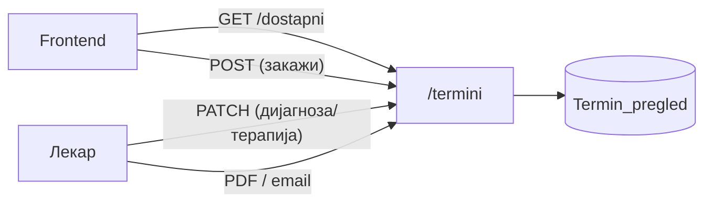
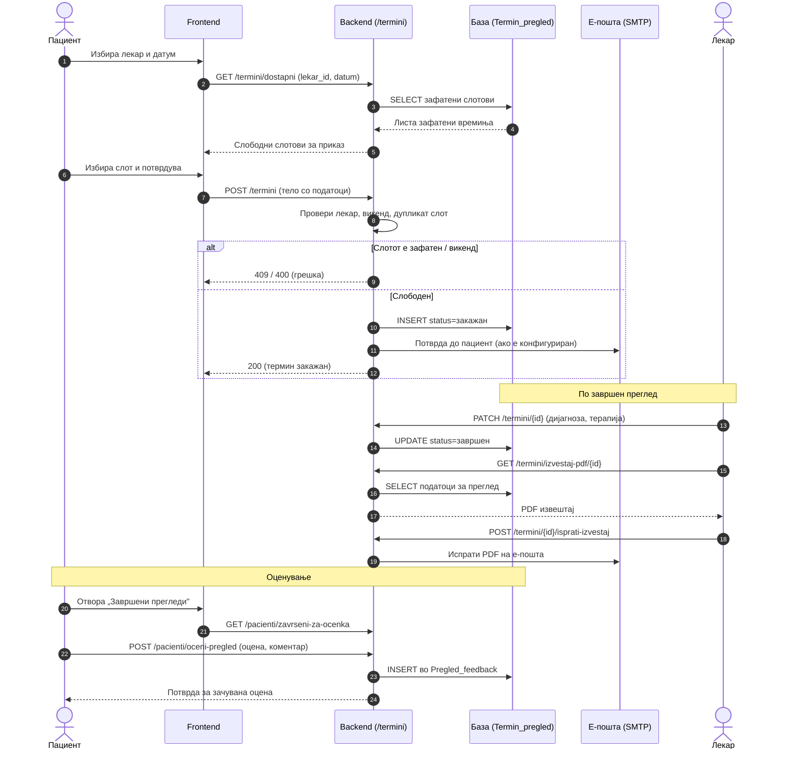

# Термини

Модулот `backend/routers/termini.py` е стандарден `FastAPI APIRouter`, монтиран со префикс `/termini`, и опфаќа најширок работен тек во целиот систем — животниот циклус на едно закажување, од проверка на слободни термини и креирање нов преглед, преку откажување и пренос на веќе закажан термин, до внесување дијагноза и терапија по завршен преглед и финално генерирање PDF извештај.

Бидејќи термините поврзуваат и пациент и лекар, повеќето endpoints во овој модул прифаќаат идентификатор за барем една од двете страни — `pacient_ID`, `doctor_ID`, или комбинација од двата — а дел дополнително проверуваат сопственост преку е-пошта, токму за да се спречи пациент или лекар да менува термин кој не му припаѓа. Одговорите се стандарден **JSON**, а грешките носат соодветен **HTTP статус код (400/403/404/500)** .

За читателот на документацијата, тоа значи дека секој endpoint подолу прецизно покажува кои податоци бара, кои враќа, и кои грешки можат да се очекуваат — без потреба да се чита самиот изворен код за да се разбере однесувањето.

> **Интерактивно тестирање:** секој endpoint е придружен со вграден **OpenAPI блок** и копче **„Test it"**, погонувано од Scalar. Пополни ги потребните параметри или тело на барањето и испрати го директно кон живиот сервер (`klinicka-bolnica-stip2026.onrender.com`) — без да ја напушташ документацијата.

> Поврзани: [Конвенции](./) · [Пациенти](pacienti.md) · [Лекари](lekari.md) · [База — Termin\_pregled](../the_database.md#tab-termin)

***

## 1. Преглед <a href="#id-1-pregled" id="id-1-pregled"></a>



| Метод   | Патека                                  | Намена                                                  |
| ------- | --------------------------------------- | ------------------------------------------------------- |
| `GET`   | `/termini/dostapni`                     | Враќа листа на слободни термини за избран лекар и датум |
| `POST`  | `/termini`                              | Креира нов термин и го закажува прегледот               |
| `PATCH` | `/termini/{termin_id}`                  | Внесува дијагноза и терапија по завршен преглед         |
| `GET`   | `/termini/izvestaj-pdf/{termin_id}`     | Генерира и враќа PDF извештај за завршен преглед        |
| `POST`  | `/termini/{termin_id}/isprati-izvestaj` | Го испраќа генерираниот PDF извештај на е-пошта         |

### Тек на податоци — од закажување до оцена

Следниот дијаграм го прикажува целиот животен циклус на еден преглед, чекор по чекор: од проверка на слободни слотови и закажување, преку внес на дијагноза и испраќање на PDF, до оценувањето од страна на пациентот.



***

## 2. Работно време и правила <a href="#id-2-pravila" id="id-2-pravila"></a>

Пред да се стигне до самото закажување, неколку **правила** се применуваат низ целиот модул, без разлика на конкретниот endpoint.

* Закажување за сабота и недела не е дозволено — backend-от автоматски враќа `400 статус код`, или, кај endpoints што враќаат листа слободни термини, празна листа наместо грешка за барање со викенд-датум.
* Слободните слотови се генерираат исклучиво на цел или половина час `(09:00, 09:30, 10:00...)` во рамките на работното време на болницата — нема произволни вредности на минути. = Секое внесено време автоматски се нормализира во формат `HH:MM` пред да се зачува или спореди, така што внес како 9:0 се конвертира во 09:00. Tоа обезбедува дека секоја следна споредба за слободен термин или судир секогаш работи со конзистентен формат, без разлика како корисникот изворно го внел времето.

Над овие правила за форматирање, постојат и правила за конфликт на ресурси.

* Еден лекар не може истовремено да има два активни термини во истиот слот — обид за такво преклопување се одбива со статус `409 Conflict`, наменски различен од `400`, бидејќи не означува невалиден внес, туку судир со веќе постоечка состојба.
* Календарите за прегледи и за медицински апарати се синхронизирани на ниво на податоци, не само визуелно во интерфејсот, доколку лекар веќе има закажан термин на апарат во одреден слот, истиот слот автоматски се блокира и во неговиот распоред за прегледи, и обратно — без потреба од рачна координација меѓу двата календари.

***

## 3. GET `/termini/dostapni` <a href="#id-3-dostapni" id="id-3-dostapni"></a>

И покрај тоа што патот се вика **dostapni (слободни)**, одговорот всушност содржи **зафатени термини, не слободни** . Frontend-от е тој што ja прави завршната пресметка — земa ги сите можни слотови во рамките на работното време и ги одзема зафатените, добиени токму од овој endpoint, за да дојде до конечната листа слободни термини за приказ. Овој дизајн го префрла знаењето за должината и распоредот на работно време кон клиентот, додека backend-от останува едноставен — само враќа што е веќе заето.

**Query параметри:**

* `lekar_id` (задолжителен)
* `datum` (задолжителен, формат `YYYY-MM-DD`, прифаќа и целосен `ISO timestamp`со `T` — на пример вредност генерирана од `JavaScript Date.toISOString()`— бидејќи backend-от автоматски ja отсекува временската компонента и ja задржува само датумската)

**Успешен одговор (200):**

```json
["09:00", "10:30", "13:00"]
```

> За викенд датуми, endpoint-от враќа празна листа `[]` наместо грешка — закажување во сабота и недела веднаш е исклучено, во согласност со правилата опишани погоре.

**Можни грешки:**

* `400` (датумот не е во валиден формат)
* `500` (внатрешна грешка на серверот)

**Каде се користи:** На frontend страна, овој endpoint се повикува од два различни контексти во `script.js` — формата за закажување термин (пациентска страна) и лекарскиот панел (преглед на сопствен распоред) — без посебна верзија за секој. И во двата случаи, повикот се изврши секогаш кога корисникот избере или смени лекар и датум, а резултатот веднаш се користи за пресметка на слободните слотови на клиентска страна, пред да се прикаже листата.

**Имплементација (FastAPI):**

```python
@router.get("/dostapni")
def get_dostapni_termini(lekar_id: int, datum: str):
    conn = None
    try:
        if "T" in datum:                        # ISO формат → земи само датумот
            datum = datum.split("T")[0]
        d = datetime.strptime(datum, "%Y-%m-%d").date()
        if d.weekday() >= 5:                     # сабота/недела → нема термини
            return []

        conn = get_connection()
        db_cursor = conn.cursor(dictionary=True)
        # Зафатени слотови = прегледи + термини на апарати (синхронизирани календари)
        db_cursor.execute("""
            SELECT TIME(vreme_pregled) AS vreme FROM Termin_pregled
            WHERE doctor_ID = %s AND DATE(datum_pregled) = %s AND status_pregled = 'закажан'
            UNION
            SELECT TIME(vreme_pregled) AS vreme FROM Aparati_termini
            WHERE doctor_ID = %s AND DATE(datum_pregled) = %s AND status != 'откажан'
        """, (lekar_id, datum, lekar_id, datum))

        out = []
        for r in db_cursor.fetchall():           # нормализирај го времето во "HH:MM"
            v = r.get("vreme")
            if hasattr(v, "strftime"):
                out.append(v.strftime("%H:%M"))
        return out
    except ValueError:
        raise HTTPException(status_code=400, detail="Неважечки формат на датум")
    except Exception as e:
        raise HTTPException(status_code=500, detail=str(e))
    finally:
        if conn and conn.is_connected():
            conn.close()
```

* Функцијата:

1. прво го проверува денот од неделата (weekday() >= 5) и веднаш враќа празна листа за сабота/недела, без воопшто да почне да чита од база.
2. Потоа, едно единствено UNION барање ги обединува зафатените слотови од две табели — `Termin_pregled`за обични прегледи и `Aparati_termini` за термини на апарати — токму тоа е читањето кое прави блокираните слотови да важат истовремено во двата календари. Секој резултат се нормализира во стринг формат `"HH:MM"` пред да се врати, со проверка `hasattr(v, "strftime")` која штити од неочекувани типови вредности од driver-от на базата. Грешките се разделени по тип: `невалиден формат на датум (ValueError од strptime)` резултира во 400, додека секој друг исклучок паѓа во генеричен `500`. Блокот finally гарантира затворање на конекцијата кон базата дури и кога функцијата излегува преку исклучок, не само при нормално завршување.


[OpenAPI KlinickaBolnicaAPI](https://klinicka-bolnica-stip2026.onrender.com/openapi.json)


***

## 4. POST `/termini` <a href="#id-4-zakazi" id="id-4-zakazi"></a>

Endpoint-от креира **нов термин и веднаш го закажува прегледот**, но само откако ред од проверки помине успешно. Прво се потврдува дека избраниот датум не е викенд — истото правило веќе важи и кај `/termini/dostapni`, конзистентно низ целиот модул. Потоа се проверува дека лекарот со даденото `lekar_id` постои во базата на податоци, и како финална проверка дека бараниот временски слот сè уште не е зафатен од друг закажан преглед. Доколку сите три услови поминат, се извршуваат `INSERT` и `commit`, а на пациентот автоматски му се испраќа потврда на е-пошта — доколку SMTP е конфигуриран во моменталната околина. Ако не е, повикот ниту пропаѓа, ниту блокира: помошната функција за испраќање едноставно не успева да го достави мејлот, без да го прекине веќе завршениот процес на закажување.

**Тело (JSON):**

```json
{
  "lekar_id": 28,
  "ime": "Иван",
  "prezime": "Ивановски",
  "datum": "2026-06-16",
  "vreme": "10:00",
  "email": "ivan@example.com",
  "telefon": "070123456",
  "napomena": ""
}
```

**Успешен одговор (200):**

```json
{
  "message": "Терминот е успешно закажан! Ќе добиете потврда на вашата е-пошта.",
  "appointment_ID": 42
}
```

**Можни грешки:** Како и кај сите endpoints така и овде имаме можност за настанување на грешка:

* `400` (избраниот датум е викенд или е во невалиден формат)
* `404` (лекар со дадениот `lekar_id` не постои во базата)
* `409` (бараниот временски слот е веќе зафатен од друг термин)
* `500` (внатрешна грешка на серверот)

**Каде се користи:** На frontend страна, формата за закажување термин во `script.js` го повикува овој endpoint како последен чекор од истиот тек што започнува со `/termini/dostapni` — корисникот прво избира лекар и датум, frontend-от прикажува слободни слотови добиени со одземање од зафатените, а потоа изборот на конкретен слот директно се испраќа овде за резервација. Двата endpoint-и формираат целина: едниот открива што е слободно, другиот ja прави самата резервација конечна.

**Имплементација (FastAPI):**

```python
@router.post("", openapi_extra={...})           # openapi_extra ја опишува JSON шемата за Swagger/Scalar
async def create_termini(request: Request):
    conn = None
    try:
        data = await request.json()             # сурово JSON тело од клиентот
        datum_str = data.get("datum", "").split("T")[0]
        appointment_date = datetime.strptime(datum_str, "%Y-%m-%d").date()
        if appointment_date.weekday() >= 5:     # викенд → 400
            raise HTTPException(status_code=400, detail="Не се закажуваат прегледи во сабота и недела.")

        vreme_str = data.get("vreme", "")       # нормализација "9:0" → "09:00"
        parts = vreme_str.split(":")
        vreme_str = f"{parts[0].zfill(2)}:{parts[1].zfill(2)}"

        conn = get_connection()
        db_cursor = conn.cursor(dictionary=True)
        db_cursor.execute("SELECT name, surname, specialty FROM Doctors WHERE doctor_ID = %s", (data['lekar_id'],))
        doctor = db_cursor.fetchone()
        if not doctor:                          # непостоечки лекар → 404
            raise HTTPException(status_code=404, detail="Лекар не е пронајден")

        db_cursor.execute("""
            SELECT termin_ID FROM Termin_pregled
            WHERE doctor_ID=%s AND DATE(datum_pregled)=%s AND TIME(vreme_pregled)=%s AND status_pregled='закажан'
        """, (data['lekar_id'], datum_str, vreme_str))
        if db_cursor.fetchone():                # зафатен слот → 409
            raise HTTPException(status_code=409, detail="Овој термин е веќе закажан.")

        db_cursor.execute("INSERT INTO Termin_pregled (...) VALUES (%s, ...)", (...))
        conn.commit()
        appointment_id = db_cursor.lastrowid    # ID на новиот термин
        _isprati_potvrda_na_email(...)          # потврда по е-пошта (ако SMTP е поставен)
        return {"message": "Терминот е успешно закажан! ...", "appointment_ID": appointment_id}
    except HTTPException:
        raise
    except Exception as e:
        raise HTTPException(status_code=500, detail=str(e))
    finally:
        if conn and conn.is_connected():
            conn.close()
```

* Истата нормализација на времето `("9:0" → "09:00")` што се користи кај `/termini/dostapni` се повторува и тука, пред слотот да се спореди со постоечките записи — конзистентен формат е критичен токму на местото каде се проверува судир, инаку две различно форматирани, но логички идентични вредности на времето би се третирале како различни слотови.
* Трите заштитни проверки — `викенд (400)`, `постоечки лекар (404)`, `слободен слот (409)` — се извршуваат секвенцијално, а секоја прекинува понатамошно извршување штом не помине, пред кодот воопшто да стигне до `INSERT`. По успешен запис, `appointment_ID` доаѓа директно од `cursor.lastrowid`, а испраќањето на потврдата е изолирано во посебна помошна функција — дизајн кој значи дека неуспех при испраќање мејл не го враќа назад веќе извршениот запис, бидејќи во базата терминот е трајно зачуван уште пред да се повика `_isprati_potvrda_na_email()`.


[OpenAPI KlinickaBolnicaAPI](https://klinicka-bolnica-stip2026.onrender.com/openapi.json)


***

## 5. PATCH `/termini/{termin_id}` <a href="#id-5-dijagnoza" id="id-5-dijagnoza"></a>

Овој endpoint го користи лекарот по завршен преглед за да ja внесе дијагнозата и терапијата во досието на пациентот. PATCH означува делумна измена на постоечки ресурс, во согласност со тоа што доволно е да се внесе барем едно од двете полиња, не задолжително двата заедно. Тоа, всушност, е и точката каде се затвора целиот циклус на закажување. Штом дијагноза или терапија се внесат, статусот на терминот автоматски се менува во завршен, а токму тој статус подоцна го прави прегледот видлив во `/pacienti/zavrseni-za-ocenka` и достапен за оценување преку `/pacienti/oceni-pregled`.

**Path параметри:** `termin_id` мора да го имаме за да може да се види за кој термин станува збор. **Тело (JSON):**

```json
{
  "dijagnoza": "Хипертензија",
  "terapija": "Контрола за 3 месеци, терапија по упатство"
}
```

**Успешен одговор (200):**

```json
{ "message": "Дијагноза и терапија се ажурирани." }
```

**Можни грешки:**

* `404` (термин со дадениот termin\_id не постои во базата)
* `500` (внатрешна грешка на серверот)

**Каде се користи:** На frontend страна, лекарскиот панел во `script.js` ja прикажува оваа форма по завршен преглед, со полиња за дијагноза и терапија. По успешен одговор, клиентот не презагрузува цела страница — само го отстранува конкретниот термин од листата „во очекување" и веднаш го додава во делот со завршени прегледи, бидејќи веќе го знае резултатот од повикот, без потреба од дополнително барање за да го потврди новиот статус.

**Имплементација (FastAPI):**

```python
@router.patch("/{termin_id}", openapi_extra={...})
async def update_termin_dijagnoza_terapija(termin_id: int, request: Request):
    conn = None
    try:
        data = await request.json()
        conn = get_connection()
        db_cursor = conn.cursor(dictionary=True)
        db_cursor.execute("SELECT termin_ID FROM Termin_pregled WHERE termin_ID = %s", (termin_id,))
        if not db_cursor.fetchone():            # непостоечки термин → 404
            raise HTTPException(status_code=404, detail="Термин не е пронајден")

        dij_n = (data.get("dijagnoza") or "").strip() or None
        ter_n = (data.get("terapija") or "").strip() or None
        if dij_n or ter_n:                      # има внес → статус = 'завршен'
            db_cursor.execute("""
                UPDATE Termin_pregled SET dijagnoza=%s, terapija=%s, status_pregled='завршен'
                WHERE termin_ID=%s
            """, (dij_n, ter_n, termin_id))
        else:
            db_cursor.execute("UPDATE Termin_pregled SET dijagnoza=%s, terapija=%s WHERE termin_ID=%s",
                              (dij_n, ter_n, termin_id))
        conn.commit()
        return {"message": "Дијагноза и терапија се ажурирани."}
    except HTTPException:
        raise
    except Exception as e:
        raise HTTPException(status_code=500, detail=str(e))
    finally:
        if conn and conn.is_connected():
            conn.close()
```

* `termin_id` доаѓа како path параметар, не query или тело — FastAPI ja поврзува вредноста од самата патека `/{termin_id}` директно со параметарот на функцијата. Пред UPDATE, секоj празен стринг се претвора во None ("" = None), наместо да се запише како празен текст во базата. Разликата е значајна затоа што NULL колона недвосмислено значи „сè уште не е внесено", додека празен стринг технички би бил валидна, но бесмислена вредност.
* Доколку барем едно од двата поле има реална вредност, истиот UPDATE дополнително го менува `status_pregled` во `завршен`;
* Доколку и двете се празни (на пример, лекар случајно поднесе празна форма), статусот останува непроменет, а се запишуваат само NULL вредности — однесување кое спречува преглед без реален внес да премине во „завршен" статус.


[OpenAPI KlinickaBolnicaAPI](https://klinicka-bolnica-stip2026.onrender.com/openapi.json)


***

## 6. GET `/termini/izvestaj-pdf/{termin_id}` <a href="#id-6-pdf" id="id-6-pdf"></a>

За разлика од сите претходни endpoints во овој модул, овој **не враќа JSON** — враќа бинарна `application/pdf` содржина, со заглавие `Content-Disposition: attachment` кое му наложува на прелистувачот директно да ja преземе датотеката (`izvestaj_termin_{id}.pdf`), наместо да ja прикаже инлајн или да ja третира како обичен текстуален одговор. Документот се составува динамички, на барање, со библиотеката `reportlab` — нема прет-генериран PDF на диск кој едноставно се сервира.

Генерирањето е поделено во две одделни помошни функции, секоја со своја одговорност:

1. `_get_termin_za_izvestaj` го чита терминот од базата преку JOIN на Doctors и patient, собирајќи податоци за пациент, лекар, дијагноза и терапија во една структура.
2. `_build_pdf_izvestaj` потоа ја прима таа структура и го рендерира документот во меморија, во `BytesIO бафер`, без да допре дискот на серверот во ниту еден момент. Овој раздел на читање-од-податоци наспроти рендерирање-на-документ значи дека секоја од двете функции може да се тестира и менува независно.

**Path параметри:** `termin_id` (цел број)

**Успешен одговор (200):** **бинарна PDF датотека** (`Content-Type: application/pdf`), не JSON.

**Можни грешки:**

* `404` (термин со дадениот termin\_id не постои во базата)
* `500` (грешка при генерирање на PDF)

**Каде се користи:** Главната намена на endpoint-от е во лекарскиот тек — откако дијагнозата и терапијата се внесени преку претходниот endpoint, се појавува копче за преземање извештај, а кликот директно го отвора овој URL и го поттикнува прелистувачот да зачува PDF датотека на диск. Истиот endpoint се користи и во api-playground.html, страницата за интерактивно тестирање на API-то — но таму, за разлика од лекарскиот тек, одговорот не се прикажува како форматиран JSON, туку директно како бинарна датотека, токму затоа што самиот формат на одговорот е поинаков од сите други endpoints во документацијата.

**Имплементација (FastAPI):**

```python
@router.get("/izvestaj-pdf/{termin_id}")
async def generate_izvestaj_pdf(termin_id: int):
    conn = None
    try:
        conn = get_connection()
        db_cursor = conn.cursor(dictionary=True)
        termin = _get_termin_za_izvestaj(db_cursor, termin_id)   # SELECT со JOIN на Doctors/patient
        if not termin:
            raise HTTPException(status_code=404, detail="Термин не е пронајден")

        pdf_content = _build_pdf_izvestaj(termin, termin_id)     # reportlab → PDF во меморија (bytes)
        return Response(                                         # бинарен одговор, не JSON
            content=pdf_content,
            media_type='application/pdf',
            headers={"Content-Disposition": f'attachment; filename="izvestaj_termin_{termin_id}.pdf"'}
        )
    except HTTPException:
        raise
    except Exception as e:
        raise HTTPException(status_code=500, detail=f"Грешка при генерирање на PDF: {str(e)}")
    finally:
        if conn and conn.is_connected():
            conn.close()
```

* Клучната разлика од останатите endpoints е во самиот тип на враќаната вредност: наместо речник кој FastAPI автоматски би серијализирал во JSON, функцијата експлицитно враќа Response објект со `media_type='application/pdf'`.
* Заглавието `Content-Disposition: attachment; filename=...` е тоа што го разликува „преземи датотека" однесувањето од обично прикажување на содржина во прелистувачот без него, истиот бинарен PDF потенцијално би се обидел да се рендерира директно во таб, во зависност од поставките на прелистувачот.


[OpenAPI KlinickaBolnicaAPI](https://klinicka-bolnica-stip2026.onrender.com/openapi.json)


***

## 7. POST `/termini/{termin_id}/isprati-izvestaj` <a href="#id-7-email" id="id-7-email"></a>

Наместо да го врати PDF-от директно на клиента како претходниот endpoint, овој презема дополнителен чекор: истиот документ се генерира на серверот, но потоа автоматски се испраќа на е-поштата на пациентот, наместо да се преземе рачно. Адресата не доаѓа од нов внес во барањето, туку директно од email\_pacient на самиот термин — истата адреса со која пациентот се најавил при закажувањето. Тоа значи дека извештајот секогаш стигнува на проверена, веќе позната дестинација, без можност лекарот случајно да внесе погрешна е-пошта токму во моментот на испраќање. За да функционира испраќањето, серверот мора да има конфигурирани SMTP променливи во .env — SMTP\_HOST, SMTP\_PORT (по подразбирање 587), SMTP\_USER, SMTP\_PASSWORD, и опционално FROM\_EMAIL. Без нив, endpoint-от враќа 503, статус код кој недвосмислено значи „услугата е привремено недостапна поради конфигурација", различно од 502, кој означува дека SMTP сесијата е воспоставена, но самото испраќање пропаднало некаде по пат. PDF-от се прикачува на пораката како base64-енкодиран MIMEBase дел со Content-Disposition: attachment заглавие — истиот концепт на заглавие како кај претходниот endpoint, само сега применет внатре во е-пошта наместо во HTTP одговор.

**Path параметри:** `termin_id` (цел број) **Успешен одговор (200):**

```json
{ "message": "Извештајот е успешно испратен на е-поштата на пациентот.", "email": "ivan@example.com" }
```

**Можни грешки:**

* `400` (пациентот нема валидна е-пошта)
* `404` (термин со дадениот termin\_id не постои)
* `502` (грешка при испраќање преку SMTP)
* `503` (SMTP не е конфигуриран на серверот) · 500 (друга внатрешна грешка)

**Каде се користи:** Во лекарскиот тек, копчето за испраќање извештај стои покрај копчето за преземање од претходниот endpoint — истиот документ, два различни начини да стигне до пациентот. Истиот endpoint е достапен и за тестирање преку api-playground.html, каде успешниот одговор се прикажува како обична JSON порака, за разлика од точка 6 каде одговорот е бинарна датотека.

**Имплементација (FastAPI):**

```python
@router.post("/{termin_id}/isprati-izvestaj")
async def isprati_izvestaj_na_pacient(termin_id: int):
    conn = None
    try:
        conn = get_connection()
        db_cursor = conn.cursor(dictionary=True)
        termin = _get_termin_za_izvestaj(db_cursor, termin_id)
        if not termin:
            raise HTTPException(status_code=404, detail="Термин не е пронајден")

        email_pacient = (termin.get("email_pacient") or "").strip()
        if not email_pacient or "@" not in email_pacient:       # нема валидна е-пошта → 400
            raise HTTPException(status_code=400, detail="Пациентот нема валидна е-пошта ...")

        pdf_bytes = _build_pdf_izvestaj(termin, termin_id)      # истиот PDF како GET endpoint-от

        smtp_host = os.environ.get("SMTP_HOST")                 # SMTP конфигурација од .env
        smtp_user = os.environ.get("SMTP_USER")
        smtp_password = os.environ.get("SMTP_PASSWORD")
        if not smtp_host or not smtp_user or not smtp_password: # ненаместен SMTP → 503
            raise HTTPException(status_code=503, detail="Испраќањето е-пошта не е конфигурирано ...")

        msg = MIMEMultipart()                                   # порака со PDF како attachment
        msg["Subject"] = f"Медицински извештај ... (термин #{termin_id})"
        msg.attach(MIMEText("Почитувани, ...", "plain", "utf-8"))
        part = MIMEBase("application", "pdf")
        part.set_payload(pdf_bytes); encoders.encode_base64(part)
        part.add_header("Content-Disposition", "attachment", filename=f"izvestaj_termin_{termin_id}.pdf")
        msg.attach(part)

        with smtplib.SMTP(smtp_host, smtp_port) as server:      # испраќање преко TLS
            server.starttls()
            server.login(smtp_user, smtp_password)
            server.sendmail(from_email, [email_pacient], msg.as_string())

        return {"message": "Извештајот е успешно испратен ...", "email": email_pacient}
    except HTTPException:
        raise
    except smtplib.SMTPException as e:                          # SMTP проблем → 502
        raise HTTPException(status_code=502, detail=f"Грешка при испраќање е-пошта: {str(e)}")
    except Exception as e:
        raise HTTPException(status_code=500, detail=f"Грешка: {str(e)}")
    finally:
        if conn and conn.is_connected():
            conn.close()
```

* Истата `_build_pdf_izvestaj` функција од претходниот endpoint се повторно користи тука без измена — единствената разлика е дестинацијата на резултатот: наместо да се врати како `HTTP Response`, истите бајтови се прикачуваат на MIMEMultipart порака и се испраќаат преку `smtplib.SMTP со starttls()`. Редоследот на проверки во кодот директно одредува кој статус код се враќа: непостоечки термин прекинува со `404` пред да се допре е-поштата воопшто, невалидна е-пошта со `400`, потоа недостасувачка SMTP конфигурација со `503`, и конечно секој проблем при самата SMTP сесија со `502`. Токму затоа `smtplib.SMTPException` се фаќа одделно, пред генеричкиот Exception — инаку секој SMTP проблем би завршил неточно класифициран како `500`, наместо прецизно означен како проблем со надворешната услуга за е-пошта.


[OpenAPI KlinickaBolnicaAPI](https://klinicka-bolnica-stip2026.onrender.com/openapi.json)


***

Следно: [Услуги](uslugi.md) · [Апарати](aparati.md) · [Лекари](lekari.md)
