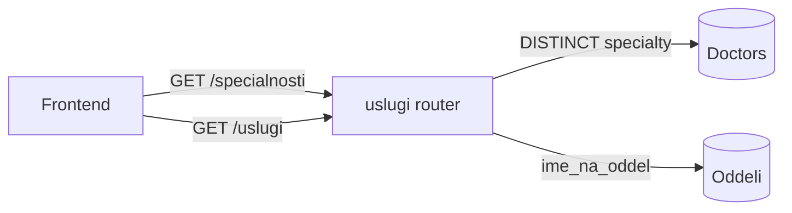
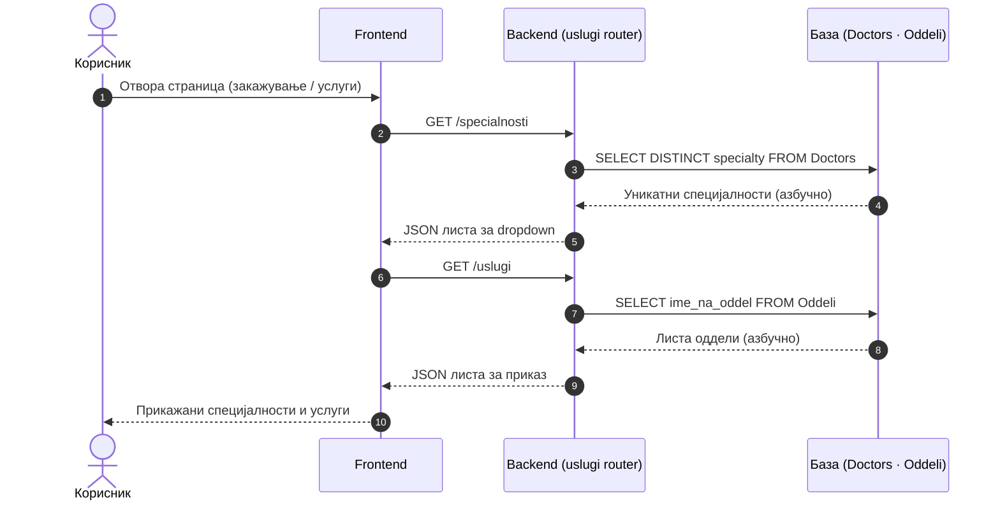

# Услуги

За разлика од повеќето други модули во апликацијата, кои имаат сопствен префикс, `backend/routers/uslugi.py` е исклучок — патеките `/specialnosti` и `/uslugi` се монтирани директно на коренот на FastAPI апликацијата, во main.py, без посредна заедничка патека. И двата endpoints се едноставни до крај: јавно достапни, без потреба од автентикација, а секој извршува само едно SELECT \* барање врз соодветната табела, без филтрирање, сортирање или пагинација. Тоа е оправдано со природата на самите податоци — списокот на медицински специјалности и списокот на одделенија се статични и кратки референтни листи, а не корисничка содржина која расте со времето, па не им треба посложена логика. Двата повици се случуваат уште при иницијализацијата на страницата, пред поголемиот дел од останатата содржина да се вчита, бидејќи останатиот интерфејс зависи од нив: dropdown менито за филтрирање лекари по специјалност, и пристапот до страницата на конкретен оддел, едноставно немаат од каде да земат опции без претходно успешно повикан /specialnosti или /uslugi. Ако едно од овие барања пропадне, последицата не е скриена грешка некаде во конзолата — корисникот веднаш гледа празно или нефункционално мени, што е причина зошто двата endpoints се меѓу првите што се повикуваат при вчитување, наместо да чекаат на ред.

> **Интерактивно тестирање:** секој endpoint е придружен со вграден **OpenAPI блок** и копче **„Test it"**, погонувано од Scalar. Пополни ги потребните параметри или тело на барањето и испрати го директно кон живиот сервер (`klinicka-bolnica-stip2026.onrender.com`) — без да ја напушташ документацијата.

> Поврзани: [Конвенции](./) · [Лекари](lekari.md) · [Термини](termini.md) · [База на податоци](../the_database.md) · [Преглед на backend](../pregled.md)

***

## 1. Преглед <a href="#id-1-pregled" id="id-1-pregled"></a>

Двата endpoints извршуваат операции само за читање врз базата — без бизнис логика, без валидација, само читање и враќање на JSON. `/specialnosti` извршува `SELECT DISTINCT` врз полето `specijalnost` во табелата `Doctors`, со што дедупликацијата се случува директно на ниво на SQL наместо на frontend-от — доколку десетина лекари споделуваат иста специјалност, во одговорот таа се појавува само еднаш. `/uslugi` извршува стандарден `SELECT` врз посебна табела со одделенија и ги враќа имињата директно, без дополнително филтрирање или трансформација.



| Метод | Патека          | Намена                             | Извор     |
| ----- | --------------- | ---------------------------------- | --------- |
| `GET` | `/specialnosti` | Уникатни специјалности на лекарите | `Doctors` |
| `GET` | `/uslugi`       | Листа на оддели / услуги           | `Oddeli`  |

### Тек на податоци — пополнување на менија

Дијаграмот покажува како frontend-от ги користи овие endpoints при вчитување на страница (на пр. формата за закажување или делот „Услуги").



Низ целиот модул, секој одговор доаѓа во JSON формат, а единствениот предвиден случај на грешка е внатрешна грешка на серверот — тогаш одговорот е `{"detail": "порака"}`, со статус `500`. Бидејќи ниту `/specialnosti`, ниту `/uslugi` не примаат влезни параметри, нема простор за `400` или друг тип грешка поврзана со валидација на влез.

***

## 2. GET `/specialnosti` <a href="#id-2-specialnosti" id="id-2-specialnosti"></a>

Endpoint-от враќа список на сите специјалности застапени меѓу лекарите во системот, извлечен директно од колоната `specialty во табелата Doctors`. Бидејќи повеќе лекари често делат иста специјалност, барањето користи `SELECT DISTINCT` за да се избегнат дупликати во резултатот. Празните или недефинирани вредности се исфрлаат, а останатите се подредуваат по азбучен ред, така што списокот секогаш пристигнува веќе спремен за директен приказ, без потреба од дополнителна обработка на frontend страна. Frontend-от го користи за **dropdown менија** при филтрирање лекари по специјалност и при изборот на специјалност за закажување.

**Параметри:** нема.

**Успешен одговор (200):**

```json
[
  { "specijalnost": "Кардиологија" },
  { "specijalnost": "Неврологија" },
  { "specijalnost": "Хирургија" }
]
```

**Можни грешки:**

* `500` (внатрешна грешка на серверот)

**Каде се користи**: На frontend страна, овој endpoint го повикува script.js на два различни места: еднаш за да ја пополни листата при филтрирање лекари по специјалност, и одделно за dropdown менито при закажување преглед, каде пациентот прво избира специјалност пред конкретен лекар. И двата контексти се потпираат на истиот, непроменет одговор — нема посебна верзија на листата за секој случај на употреба.

**Имплементација (FastAPI):**

```python
router = APIRouter(tags=["uslugi"])   # без prefix — монтиран на корен во main.py

@router.get("/specialnosti")
def get_specialnosti():
    db_cursor.execute("""
        SELECT DISTINCT specialty AS specijalnost FROM Doctors
        WHERE specialty IS NOT NULL AND specialty != '' ORDER BY specialty
    """)
    return db_cursor.fetchall()   # [{"specijalnost": "Кардиологија"}, ...]
```

* Логиката е намерно минимална — нема посебна табела за специјалности, ниту статичен список одржуван рачно; секоја нова специјалност се појавува автоматски штом администратор додаде лекар со ново поле specialty, без потреба од дополнителна синхронизација.


[OpenAPI KlinickaBolnicaAPI](https://klinicka-bolnica-stip2026.onrender.com/openapi.json)


***

## 3. GET `/uslugi` <a href="#id-3-uslugi" id="id-3-uslugi"></a>

Овој endpoint е речиси огледален близнак на /specialnosti од претходната точка — само што наместо специјалности на лекари, враќа список на болничките одделенија, овој пат од сопствена табела `Oddeli`, повторно подреден по азбучен ред. Главната разлика е во еден дополнителен чекор: имињата на одделенијата се поминуваат низ TRIM пред да се вратат на клиентот, со цел да се отстранат евентуални празни места кои `/specialnosti` не мора да решава, бидејќи таму вредностите веќе доаѓаат чисти директно од `Doctors.specialty`. Frontend-от го повикува овој endpoint при вчитување на секцијата „Услуги", каде целта е да се прикаже список на сите одделенија на болницата, и секаде каде е потребен сличен преглед — на пример, при навигација до страницата посветена на конкретен оддел.

**Параметри:** нема — враќа ги сите записи без филтрирање.

**Успешен одговор (200):**

```json
[
  { "naziv": "Кардиологија" },
  { "naziv": "Неврологија" },
  { "naziv": "Педијатрија" }
]
```

**Можни грешки:**

* `500` (внатрешна грешка на серверот)

**Каде се користи:** Покрај секцијата **„Услуги"**, истиот endpoint се користи и во админ панелот, секаде каде администраторот треба да избере оддел од готова листа — наместо рачно да го впише името и да ризикува правописна грешка или несовпаѓање со веќе зачуваниот запис во базата. И двата контексти се потпираат на истиот, непроменет одговор.

**Имплементација (FastAPI):**

```python
@router.get("/uslugi")
def get_uslugi():
    db_cursor.execute("SELECT ime_na_oddel AS naziv FROM Oddeli ORDER BY ime_na_oddel")
    rows = db_cursor.fetchall()
    return [{"naziv": (r.get("naziv") or "").strip()} for r in rows]
```

* **TRIM** чекорот се изведува во Python, не во самото SQL барање — секој ред се поминува низ .strip() пред да се додаде во конечниот резултат, за разлика од /specialnosti, каде вредностите доаѓаат веќе чисти директно од Doc


[OpenAPI KlinickaBolnicaAPI](https://klinicka-bolnica-stip2026.onrender.com/openapi.json)


***

## 4. Поврзани табели <a href="#id-4-tabele" id="id-4-tabele"></a>

| Табела    | Улога                                                   |
| --------- | ------------------------------------------------------- |
| `Doctors` | Извор на специјалности (`specialty`) за `/specialnosti` |
| `Oddeli`  | Извор на оддели / услуги (`ime_na_oddel`) за `/uslugi`  |

> Забелешка: специјалностите доаѓаат **директно од лекарите** — кога ќе се додаде лекар со нова специјалност, таа автоматски се појавува во `/specialnosti` без друга измена.

Детали за колони и врски: [База на податоци](../the_database.md).

***

Следно: [Апарати](aparati.md) · [Конвенции](./)
