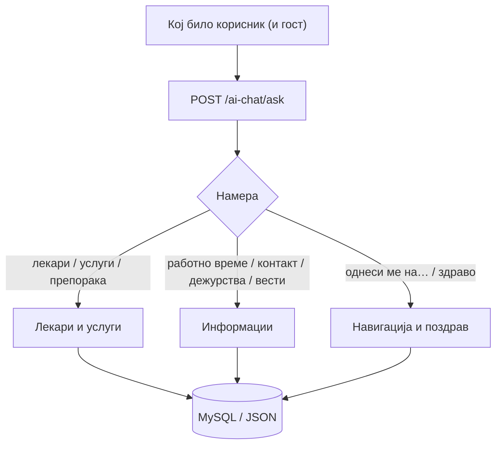

# Општо

Функциите во `backend/ai/opsto/` се достапни за **секого** — гости, пациенти, лекари и директори. Тоа се информативни и навигациски функции што не менуваат лични податоци: листа на лекари, услуги, работно време, препораки и навигација низ сајтот.

> Бидејќи не бараат најава, овие функции се „лицето" на асистентот за нови посетители. Сепак, податоците секогаш доаѓаат од база (лекари, услуги), а не се измислени.

## Содржина

* [1. Што може секој корисник](./#1-pregled)
* [2. Без авторизација (зошто се безбедни)](./#2-avtorizacija)
* [3. Како да тестираш](./#3-test)
* [4. Подстраници по област](./#4-podstranici)

> Поврзано: [Преглед на AI](../) · [Kernel](../kernel.md) · [API: Лекари](../../conventions/lekari.md) · [API: Услуги](../../conventions/uslugi.md)

***

## 1. Што може секој корисник <a href="#id-1-pregled" id="id-1-pregled"></a>

Функциите се сместени во `backend/ai/opsto/` и се групирани во **три области**. Секоја област има своја детална страница (види [секција 4](./#4-podstranici)).

| Област                   | Намери (intents)                                                                                                   | Што прави                                                                      | Страница                     |
| ------------------------ | ------------------------------------------------------------------------------------------------------------------ | ------------------------------------------------------------------------------ | ---------------------------- |
| **Лекари и услуги**      | `lekari_oddel`, `info_lekar`, `preporaka_lekar`, `preference_lekar`, `uslugi`                                      | Листа лекари по оддел; инфо за лекар; препорака по симптом; преференци; услуги | [Лекари и услуги](lekari.md) |
| **Информации**           | `rabotno_vreme`, `lokacija`, `kontakti`, `faq_pregled`, `rezultati_testovi`, `novosti_rezime`, `pregled_dezurstvo` | Работно време, локации, контакти, ЧПП, резултати, новости, дежурства           | [Информации](informacii.md)  |
| **Навигација и поздрав** | `navigacija`, `asistent_opsto`                                                                                     | Пренасочување до секции; поздрав/идентитет (fallback)                          | [Навигација](navigacija.md)  |



> **Извор на податоци:** лекари, услуги, дежурства и новости доаѓаат од **база**; работно време, локации и контакти од `backend/data/bolnica_info.json`. Асистентот никогаш не измислува лекари или термини.

***

## 2. Без авторизација (зошто се безбедни) <a href="#id-2-avtorizacija" id="id-2-avtorizacija"></a>

За разлика од пациентските/лекарските/директорските функции, овие **не бараат најава** — но и не откриваат лични податоци. Тие враќаат само јавни информации (кои лекари постојат, кога се работи, каде се одделите).

```python
# образец: чисто читање, без проверка на улога
def odgovori_za_uslugi(prasanje: str) -> str:
    oddeli = zimi_oddeli()       # SELECT од Oddeli
    aparati = zimi_aparati()     # SELECT од Aparati (aktiven = 1)
    ...                          # форматиран јавен одговор
```

> Многу одговори враќаат и `navigacija` (на пр. скрол до `#lekari`) — frontend-от ги користи за да го пренасочи корисникот, без да открива нешто приватно.

***

## 3. Како да тестираш <a href="#id-3-test" id="id-3-test"></a>

Сите функции одат преку **еден** endpoint — `POST /ai-chat/ask`. Бидејќи работат и за гости, `pacient` и `lekar` може да бидат `null`.

```json
{
  "prasanje": "Кои лекари се на кардиологија?",
  "pacient": null,
  "lekar": null,
  "kontekst": null
}
```

* `prasanje` — командата на природен јазик ја одредува намерата
* `pacient` / `lekar` — може да бидат `null` (гост)
* `kontekst` — се враќа од претходниот одговор (на пр. `last_oddel` за follow-up прашања)

> Секоја подстраница има свој **„Пробај"** блок со конкретни примери и реален излез, што може да се испрати директно кон живиот сервер преку копчето **„Test it"**.

***

## 4. Подстраници по област <a href="#id-4-podstranici" id="id-4-podstranici"></a>

За да не е сè натрупано на едно место, секоја област е документирана посебно — со код, реални примери и излез:

* [**Лекари и услуги**](lekari.md) — `lekari_oddel`, `info_lekar`, `preporaka_lekar`, `preference_lekar`, `uslugi`
* [**Информации**](informacii.md) — `rabotno_vreme`, `lokacija`, `kontakti`, `faq_pregled`, `rezultati_testovi`, `novosti_rezime`, `pregled_dezurstvo`
* [**Навигација и поздрав**](navigacija.md) — `navigacija`, `asistent_opsto`

***

Следно: [Лекари и услуги](lekari.md) · [Информации](informacii.md) · [Навигација](navigacija.md) · [Пациент](../pacient/) · [Лекар](../lekar/) · [Директор](../direktor/)
