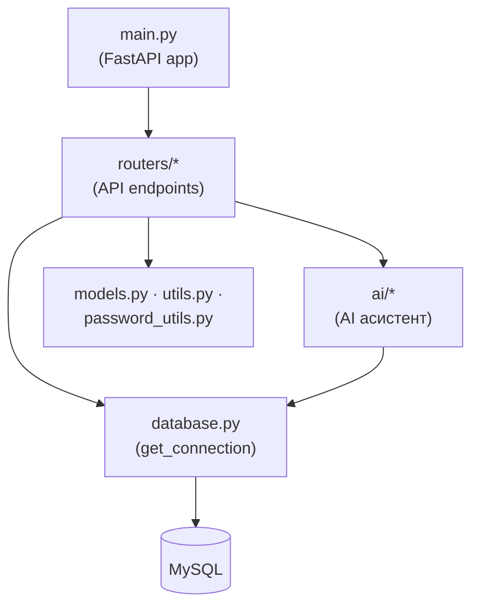
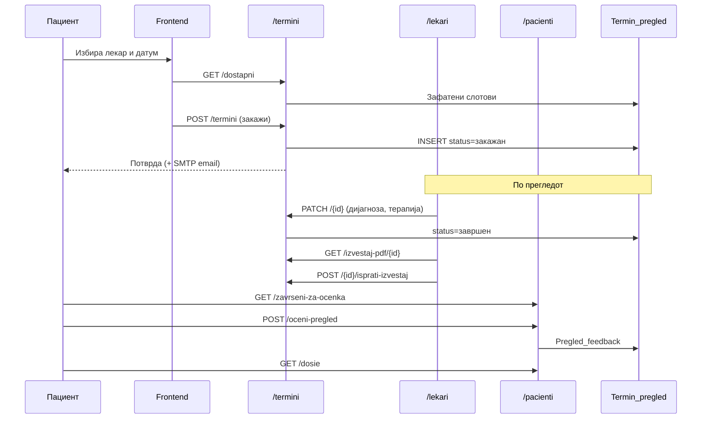

# Преглед на backend

Backend-от е **срцето** на системот — делот што ја обработува целата бизнис логика, комуницира со базата на податоци и ги опслужува сите барања од frontend-от преку HTTP. Напишан е во **Python** со framework-от **FastAPI**.

Овој документ објаснува **како е организиран** backend-от: структурата на папките, главните фајлови, како функционираат routers и како е изграден слојот за пристап до базата. За самата шема на базата види [База на податоци](the_database.md); за AI асистентот види [AI асистент](overview/); за поширок контекст на трите слоја види [Архитектура](../opshto-za-sistemot/architecture.md).


Поврзани страници: [Архитектура](../opshto-za-sistemot/architecture.md) · [База на податоци](the_database.md) · [API → Конвенции](conventions/) · [AI асистент](overview/)

***

## 1. Што е backend-от <a href="#id-1-sto" id="id-1-sto"></a>

Backend-от е срцето на системот и единствениот дел со **директен пристап до базата на податоци**. Frontend-от никогаш не комуницира со MySQL директно — секое дејство на корисникот, без разлика дали станува збор за најава, закажување термин, оставање оцена или поставување прашање до AI асистентот, поминува низ HTTP барање до backend-от. Тој го прима барањето, ја применува потребната логика, прави SQL до базата и враќа **JSON** одговор назад до frontend-от.

Ова разделување е намерно: со концентрирање на целата логика на едно место, системот станува полесен за одржување и побезбеден.

Главните одговорности на backend-от се:

* примање и валидација на барањата од frontend-от преку **FASTAPI**;
* содржување на целата **бизнис логика** — правила за термини, лозинки, дежурства, огласи и сл.;
* комуникација со MySQL преку централизираниот слој `database.py`;
* погонување на **AI асистентот** преку модулот `ai/` и Groq;
* испраќање на **е-пошта** преку SMTP за успешно направен термин кај лекар специјалист.

> Благодарение на изборот на **FastAPI**, документацијата на API-то се генерира автоматски и е достапна на `/docs` (Swagger UI) — практично за тестирање на endpoints без потреба од frontend.

***

## 2. Структура на папки <a href="#id-2-struktura" id="id-2-struktura"></a>

Сè живее во папката `backend/`. Главните делови се:

```
backend/
├── main.py                # влезна точка: создава FastAPI app, ги вклучува routers
├── database.py            # отвора конекција до MySQL (get_connection)
├── models.py              # Pydantic модели (структура на податоци)
├── password_utils.py      # хеширање / проверка на лозинки (bcrypt)
├── ai_chat_store.py        # чување историја на AI разговори во база
├── requirements.txt       # Python зависности
├── schema.sql             # дефиниција на базата (табели + почетни податоци)
├── routers/               # рутите на API-то, групирани по тема
│   ├── lekari.py          # /lekari
│   ├── pacienti.py        # /pacienti
│   ├── termini.py         # /termini
│   ├── admin.py           # /admin
│   ├── aparati.py         # /aparati
│   ├── uslugi.py          # /uslugi
│   ├── novosti.py         # /novosti
│   ├── kariera.py         # /kariera, /aplikacija
│   ├── ai_chat.py         # /ai-chat
│   └── utils.py           # заеднички функции (транслитерација)
├── ai/                    # логика на AI асистентот (види секција 7)
├── data/                  # статични JSON/текст податоци (FAQ, инфо за болница)
└── migrations/            # SQL миграции (постепени измени на шемата)
```



***

## 3. Влезна точка — `main.py` <a href="#id-3-main" id="id-3-main"></a>

`main.py` ја создава FastAPI апликацијата, додава CORS, ги „качува" статичките датотеки и ги вклучува сите routers. Секој router се регистрира со `include_router`, со што неговите рути стануваат дел од API-то:

```29:38:backend/main.py
app.include_router(lekari.router)  # ruti za lekari (login, lista, profil, ...)
app.include_router(pacienti.router)  # ruti za pacienti
app.include_router(termini.router)  # ruti za termini / pregledi
app.include_router(admin.router)  # ruti za admin panel
app.include_router(aparati.router)  # ruti za aparati
app.include_router(uslugi.router)  # ruti za uslugi
app.include_router(novosti.router)  # ruti za novosti
app.include_router(kariera.router)  # ruti za kariera / oglasi
app.include_router(kariera.app_router)  # posebni ruti za /aplikacija (prijava za rabota)
app.include_router(ai_chat.router)  # AI chat so Groq (asistentot)
```

Покрај тоа, `main.py` качува два статички монтажи (`/static` за слики, `/app` за фронтот на Render) и неколку `debug-*` endpoints за брза дијагностика на базата. Детали за статичкото сервирање: [Продукција](../deplojment/production.md).

> Стартување локално: `python main.py` (или `uvicorn main:app --reload`). Во Docker/Render: `uvicorn main:app --host 0.0.0.0 --port ${PORT:-8000}`.

***

## 4. Routers (рути по теми) <a href="#id-4-routers" id="id-4-routers"></a>

Секоја голема тема има свој фајл во `routers/`, со свој `APIRouter` и **префикс**. Префиксите директно одговараат на nginx regex-от и на routerите што frontend-от ги вика:

| Router        | Префикс                   | За што                                                         | API док.                               |
| ------------- | ------------------------- | -------------------------------------------------------------- | -------------------------------------- |
| `lekari.py`   | `/lekari`                 | Лекари: листа, најава, профил, лозинки, распоред               | [Лекари](conventions/lekari.md)        |
| `pacienti.py` | `/pacienti`               | Пациенти: регистрација, најава, досие, оценки на прегледи      | [Пациенти](conventions/pacienti.md)    |
| `termini.py`  | `/termini`                | Термини/прегледи: слободни термини, закажување, дијагноза, PDF | [Термини](conventions/termini.md)      |
| `admin.py`    | `/admin`                  | Администрација: статистики, дежурства, огласи                  | [Администрација](conventions/admin.md) |
| `aparati.py`  | `/aparati`                | Апарати и нивни термини, слободни и зафатени за закажување     | [Апарати](conventions/aparati.md)      |
| `uslugi.py`   | `/uslugi`                 | Услуги на болницата                                            | [Услуги](conventions/uslugi.md)        |
| `novosti.py`  | `/novosti`                | Новости / објави                                               | [Новости](conventions/novosti.md)      |
| `kariera.py`  | `/kariera`, `/aplikacija` | Огласи за работа и пријави                                     | [Кариера](conventions/kariera.md)      |
| `ai_chat.py`  | `/ai-chat`                | AI асистент (прашања, историја)                                | [AI чат](conventions/ai-chat.md)       |

Префиксот се задава при создавањето на router-от, на пр.:

```12:12:backend/routers/lekari.py
router = APIRouter(prefix="/lekari", tags=["lekari"])
```

### Чест образец на endpoint

Скоро сите endpoints го следат истиот сигурен образец: отвори конекција, изврши SQL преку `dictionary=True` cursor (резултати како речници), врати JSON, фати грешка со `HTTPException`, и **секогаш** затвори ја конекцијата во `finally`:

```32:61:backend/routers/lekari.py
@router.get("")
def get_lekari(specijalnost: Optional[str] = None):                                                     # ako se vnese string vraka lekari od vnesena specijalnost, ako ne vnese string gi dava site lekari 
    conn = None         # se postavuva deka nema da ima konekcija na pocetokot, sekoja konekcija ja otvaram vo try, a ja zatvaram vo finally
    try:            
        conn = get_connection()                     # povrzuvanje so bazata na podatoci, vo conn se cuva konekcijata
        posrednik = conn.cursor(dictionary=True)       # posrednik objekt sto ovozmozuva da se vrsi sql naredba, argumento (dictionary=True) ni go dava izlezot kako recenica ne kako tuples
        # tuka so voa izlezot ke mi e [ {'id': 1, 'ime': 'Ana', 'vozrast': 22},{'id': 2, 'ime': 'Marko', 'vozrast': 21}]

        if specijalnost and specijalnost.strip():   # se proveruva dali e izbrana specijalnost
            posrednik.execute("""
                SELECT doctor_ID, name, surname, COALESCE(specialty, '') AS specijalnost, email
                FROM Doctors
                WHERE specialty = %s
                ORDER BY name, surname
            """, (specijalnost.strip(),))
        else:
            # сите лекари – вклучувајќи ги и оние без специјалност (ќе се прикаже Н/П на frontend)
            posrednik.execute("""
                SELECT doctor_ID, name, surname, COALESCE(specialty, '') AS specijalnost, email
                FROM Doctors
                ORDER BY name, surname
            """)
        lekari = posrednik.fetchall()  # fetchall() vraka lista na lekari vo vid na recinica i se zapisuvaat vo promenlivata lakari
        return lekari       # se vrakaat lekarite vo JSON format {"doctor_ID": 1, ...},{... }}
    except Exception as e:  # ako nastane greska, Exception, vo e e smenstena porakata za greska 
        traceback.print_exc()
        raise HTTPException(status_code=500, detail=str(e))     # se dava 500 kako kod za greska  detail=str(e) poraka za prikaza na klient
    finally:                                # se vrsi ovoj blok bez razlika dali ima ili nema nastanato greska 
        if conn and conn.is_connected():    # dokolku postoi konekcija i taa e aktivna
            conn.close()                    # istata taa konekcija se zatvara
```

> Параметрите во SQL секогаш се праќаат преку `%s` плејсхолдери (не со составување на стринг) — тоа спречува **SQL injection**.

***

## 5. Слој за база — `database.py` <a href="#id-5-baza" id="id-5-baza"></a>

Целата комуникација со MySQL минува низ **една** функција: `get_connection()`. Таа ги чита поставките од `backend/.env` (преку `python-dotenv`), составува конекција со `mysql-connector-python` и враќа отворена конекција што endpoint-от ја користи па ја затвора.

```31:53:backend/database.py
    host = os.getenv("DB_HOST", "localhost")
    user = os.getenv("DB_USER", "root")
    password = os.getenv("DB_PASSWORD", "")
    database = os.getenv("DB_NAME", "Klinicka_Bolnica_Stip")
    port = int(os.getenv("DB_PORT", "3306"))

    if not all([host, user, database]):
        raise RuntimeError(
            "Недостасуваат податоци за базата. Во backend/.env постави: DB_HOST, DB_USER, DB_PASSWORD, DB_NAME. "
            "Погледни backend/.env.example за пример."
        )

    kwargs = {
        "host": host,
        "user": user,
        "password": password,
        "database": database,
        "port": port,
        "autocommit": False,
        "charset": "utf8mb4",
        "collation": "utf8mb4_unicode_ci",
        "use_pure": True,  
    }
```

Неколку важни детали од овој слој:

* **`charset=utf8mb4`** — целосна поддршка за кирилица (имиња на лекари, оддели, текст на македонски).
* **`autocommit=False`** — измените се потврдуваат експлицитно со `conn.commit()`, што овозможува сигурни трансакции.
* **SSL** — ако во `.env` стои `DB_SSL=1` (или `DB_SSL_CA`/`DB_SSL_MODE`), конекцијата се прави преку SSL. Тоа е задолжително за **Azure Database for MySQL** и за надворешни бази на Render.
* **Корисна грешка** — ако недостасуваат податоци за базата, се фрла јасна порака што да се постави во `.env`.

> Затоа `database.py` е единствената точка што треба да се менува за нова околина (локално, Azure, Render) — само преку `.env`, без допирање на кодот.

***

## 6. Помошни модули <a href="#id-6-pomosni" id="id-6-pomosni"></a>

Покрај routers и базата, неколку мали модули се користат низ целиот backend:

* **`models.py`** — Pydantic модели (`Doctor`, `Appointment`…) што ја опишуваат структурата на податоците. FastAPI ги користи за **автоматска валидација** на влезните барања и за документацијата.
* **`password_utils.py`** — хеширање и проверка на лозинки со **bcrypt** (лозинките никогаш не се чуваат како чист текст).
* **`routers/utils.py`** — заедничка функција `transliterate_mk_to_lat()` што претвора кирилица во латиница (потребно за најава бидејќи некои корисници пишуваат на латиница):

```6:12:backend/routers/utils.py
def transliterate_mk_to_lat(text):
    """Конвертира македонски текст од кирилица во латиница"""
    if not text:
        return ""

    # mora da go imam bidejki nekoj iminja ne moze da se poznaat poradi toa so mora da se najavaeme na laticica

    translit_map = {
```

* **`ai_chat_store.py`** — чување и читање на историјата на AI разговорите во базата (за најавени корисници).

***

## 7. AI модул (`ai/`) <a href="#id-7-ai" id="id-7-ai"></a>

Папката `ai/` ја содржи логиката на AI асистентот, организирана по **улоги**: `opsto/` (општи прашања), `pacient/` (закажување, оценки, апликации), `lekar/` (распоред, картони) и `direktor/` (огласи, дежурства, вести). Заедничкото јадро е во `ai/_kernel/` (препознавање намера, повикување на Groq, формирање одговор).

`routers/ai_chat.py` е „мостот" — го прима прашањето од frontend, го праќа во AI јадрото, и враќа JSON со одговор, контекст и евентуална акција/навигација.

> Бидејќи AI делот е обемен, тој е документиран посебно: [AI асистент — преглед](overview/) и [Kernel](overview/kernel.md).

***

## 8. Зависности <a href="#id-8-zavisnosti" id="id-8-zavisnosti"></a>

Сите Python библиотеки се во `backend/requirements.txt`:

```1:9:backend/requirements.txt
fastapi
uvicorn
mysql-connector-python
python-dotenv
bcrypt
python-multipart
reportlab
requests
youtube-transcript-api
```

Накратко: **fastapi** + **uvicorn** (веб framework и сервер), **mysql-connector-python** (база), **python-dotenv** (читање `.env`), **bcrypt** (лозинки), **python-multipart** (upload на слики), **reportlab** (PDF извештаи), **requests** (повици кон Groq/надворешни сервиси), **youtube-transcript-api** (помошна).

***

## 9. Конвенции <a href="#id-9-konvencii" id="id-9-konvencii"></a>

Неколку правила што се повторуваат низ целиот backend:

* **Конекцијата секогаш се затвора** во `finally` блок (`conn.close()`), за да нема исцрпување на конекции.
* **SQL параметрите** одат преку `%s` плејсхолдери — никогаш составување на стринг (заштита од SQL injection).
* **Грешките** се враќаат како `HTTPException` со соодветен статус код (на пр. `500` за серверска грешка, `404` за ненајдено).
* **Резултатите** се читаат со `cursor(dictionary=True)`, па одговорот е JSON со именувани полиња.
* **Тајните** (лозинки, клучеви) се читаат само од `.env`, никогаш не се хардкодирани во кодот.

> Деталните правила за форматот на API одговорите се во [API → Конвенции](conventions/).

***

## 10. Животен циклус на преглед <a href="#id-10-ciklus" id="id-10-ciklus"></a>

Прегледот не живее во еден router — тој се движи низ повеќе модули. Централната табела е `Termin_pregled`; статусот `status_pregled` оди од `закажан` → `завршен` (или `откажан`).



Клучни точки:

* **Закажување** — `POST /termini` (види [Термини](conventions/termini.md)); frontend прво ги зема зафатените слотови преку `GET /termini/dostapni`.
* **Завршување** — лекарот внесува дијагноза и терапија преку `PATCH /termini/{termin_id}`; статусот станува `завршен`.
* **Извештај** — PDF преку `GET /termini/izvestaj-pdf/{id}`; испраќање на е-пошта преку `POST /termini/{id}/isprati-izvestaj` (потребен SMTP во `.env`).
* **Оценување** — пациентот гледа завршени прегледи без оцена (`GET /pacienti/zavrseni-za-ocenka`) и остава оцена (`POST /pacienti/oceni-pregled`).
* **Досие** — `GET /pacienti/dosie` враќа закажани и завршени прегледи за најавениот пациент.
* **Лекарски поглед** — `GET /lekari/termini` ги листа термините на најавениот лекар со статус и медицински податоци.

За административна аналитика (оптовареност, просечни оцени) види [Администрација → Статистики](conventions/admin.md#5-statistika).

***

## 11. API документација <a href="#id-11-api-docs" id="id-11-api-docs"></a>

Секој router има посебна страница под `docs/backend/api/` со опис на endpoints, примери за барања/одговори и **интерактивни OpenAPI блокови** (копче „Test it" во GitBook).

| Страница                                       | Router                    | Статус |
| ---------------------------------------------- | ------------------------- | ------ |
| [Конвенции](conventions/)                      | заеднички правила         | готово |
| [Автентикација](conventions/authentication.md) | најава, лозинки, admin    | готово |
| [Лекари](conventions/lekari.md)                | `/lekari`                 | готово |
| [Пациенти](conventions/pacienti.md)            | `/pacienti`               | готово |
| [Термини](conventions/termini.md)              | `/termini`                | готово |
| [Новости](conventions/novosti.md)              | `/novosti`                | готово |
| [Кариера](conventions/kariera.md)              | `/kariera`, `/aplikacija` | готово |
| [Администрација](conventions/admin.md)         | `/admin`                  | готово |
| [Услуги](conventions/uslugi.md)                | `/uslugi`                 | готово |
| [Апарати](conventions/aparati.md)              | `/aparati`                | готово |
| [AI чат](conventions/ai-chat.md)               | `/ai-chat`                | готово |

Производната база на API: `https://klinicka-bolnica-stip2026.onrender.com`. Локално: `http://localhost:8000`.

***

## 12. OpenAPI и тестирање <a href="#id-12-openapi" id="id-12-openapi"></a>

FastAPI автоматски генерира OpenAPI спецификација:

| URL             | Намена                                             |
| --------------- | -------------------------------------------------- |
| `/docs`         | Swagger UI — интерактивно тестирање во прелистувач |
| `/redoc`        | ReDoc — читлива API документација                  |
| `/openapi.json` | Raw OpenAPI 3.0 (користи GitBook и Scalar)         |

Во `main.py` е дефинирано полето `servers` со production и локален URL — тоа е **задолжително** за копчето „Test it" во GitBook:

```9:16:backend/main.py
app = FastAPI(
    title="Клиничка Болница Штип – API",
    description="API за системот за управување со прегледи, термини и администрација",
    version="1.0",
    servers=[
        {"url": "https://klinicka-bolnica-stip2026.onrender.com", "description": "Produkcija (Render)"},
        {"url": "http://localhost:8000", "description": "Lokalen razvoj"},
    ],
)
```

Endpoints што читаат `request.json()` наместо Pydantic модел добиваат `openapi_extra` на декораторот за да GitBook прикаже полиња за внес (пример: `POST /pacienti/register`). Детали: поединечните API страници.

Во GitBook, OpenAPI спецификацијата се регистрира како **KlinickaBolnicaAPI**; по промена на backend, во GitBook → OpenAPI → **Check for updates**, па **Publish**.

***

## 13. Променливи на околина <a href="#id-13-env" id="id-13-env"></a>

Сите тајни и поставки за околина се во `backend/.env` (пример: `backend/.env.example`). Backend-от ги вчитува преку `python-dotenv` при стартување.

**База на податоци** — `DB_HOST`, `DB_USER`, `DB_PASSWORD`, `DB_NAME`, `DB_PORT`. За Azure MySQL додади `DB_SSL=1`. За Docker Compose: `DB_HOST=mysql`.

**AI (Groq)** — `GROQ_API_KEY`, `GROQ_MODEL`, `GROQ_MODEL_FALLBACK`. Опционално: `GROQ_DISABLED=1` (без AI), `GROQ_AUTO_OFFLINE=1` (по rate-limit локален режим).

**Е-пошта (SMTP)** — `SMTP_HOST`, `SMTP_PORT`, `SMTP_USER`, `SMTP_PASSWORD`, `EMAIL_FROM`. Без SMTP, потврдите за термини се печатат само во терминал.

**Azure Blob** — `AZURE_STORAGE_CONNECTION_STRING`, `AZURE_CONTAINER_NAME` за слики на новости во cloud. Без ова, сликите одат во `backend/static/uploads/novosti`.

> Целосен пример и коментари: `backend/.env.example`. За SMTP чекор-по-чекор: `backend/SMTP_SETUP.md`. За деплојмент: [Продукција](../deplojment/production.md).

***

Следно: [Термини (API)](conventions/termini.md) · [База на податоци](the_database.md) · [AI асистент](overview/) · [Архитектура](../opshto-za-sistemot/architecture.md)
