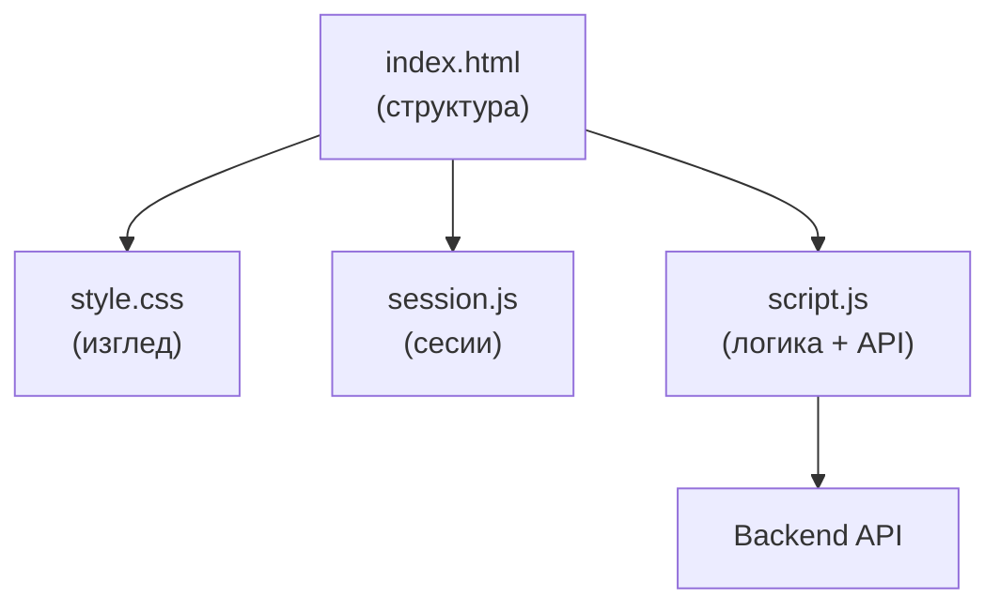
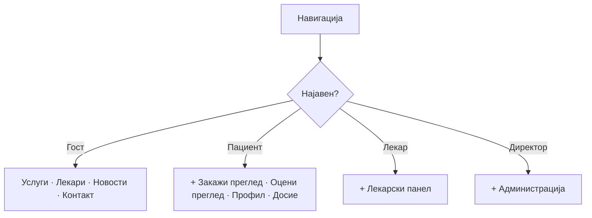
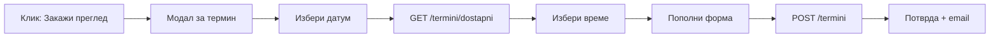

# index.html

`index.html` е единствената HTML датотека преку која поминува целата интеракција на корисникот со порталот. Иако на прв поглед изгледа дека станува збор за повеќе одделни страници — почетна, услуги, лекари, контакт — сето тоа е сместено во еден документ. Ова е таканаречен single-page application (SPA) пристап: секциите постојат едновремено во DOM-от, а навигацијата меѓу нив е scroll до соодветна котва (#home, #uslugi, #lekari…), без ново вчитување на страница.

> **Идејата:** наместо корисникот да чека нова страница да се вчита при секој клик, сите секции се веќе тука. Навигацијата само „лизга" (scroll) до соодветниот дел — означен со котва (`#home`, `#uslugi`, `#lekari`…). Резултат: брзо, непрекинато искуство, како во модерна апликација.

> Поврзано: [Преглед на frontend](../overview.md) · [Страници](./) · [AI чат виџет](../ai-chat-widget.md)

***

### Што е и зошто single-page <a href="#id-1-sto" id="id-1-sto"></a>

Традиционалниот пристап при изградба на веб-портали — каде секциja живее во своја .html датотека и корисникот физички преминува помеѓу нив — носи видлива пауза при секој клик. index.html го избегнува тоа: сите секции се рендерирани уште при првото вчитување, а клик на мени само го скролира прозорецот до соодветниот id. Резултатот е непрекинато, флуентно искуство без повторни мрежни барања. Дополнително, по најава на корисникот script.js динамички ги покажува или крие одредени делови (лекарски панел, административен панел, секцијата за оцени) врз основа на улогата. Така истата датотека служи и за гости и за сите видови најавени корисници — без дупли HTML фајлови.

***

### Како е составена <a href="#id-2-struktura" id="id-2-struktura"></a>

Страницата е поддржана од четири фајла:

| Фајл         | Улога                                                  |
| ------------ | ------------------------------------------------------ |
| `index.html` | HTML структура — секции, форми, модали                 |
| `style.css`  | Визуелен изглед (бои, распоред, форми, модали)         |
| `session.js` | Сесии — најава, истек, авто-одјава                     |
| `script.js`  | Целата логика — API повици, форми, календар, панел, AI |

**Редослед на вчитување** (на крајот од страницата):

```html
<script src="session.js?v=20260512-2"></script>
<script src="script.js?v=20260513-apl3"></script>
```

> `session.js` мора да се вчита **пред** `script.js`, бидејќи најавата и истекот на сесијата се користат низ целиот код. Параметарот `?v=...` спречува прелистувачот да кешира стара верзија.



***

### Хедер и навигација <a href="#id-3-header" id="id-3-header"></a>

Хедерот е фиксиран (position: sticky) и видлив на сите секции. Содржи лого, главно мени и копче за најава. Логото е составено од SVG симбол на црвен крст и текстот „ЈЗУ Клиничка Болница - Штип". Менито ги нуди следните врски: Почетна, Услуги, Лекари, Матични лекари (надворешен линк кон mojtermin.mk, отвора во нов таб), Новости и Контакт. Она што го прави менито покомплексно е тоа дека е реактивно на улогата на корисникот. По успешна најава script.js ги менува видливите ставки без reload:



На мобилни уреди менито се собира зад хамбургер копче (#nav-toggle), кое при клик го прикажува менито во вертикален overlay.

***

### Јавни секции <a href="#id-4-sekcii" id="id-4-sekcii"></a>

Сите секции се на иста датотека, една под друга:

| Секција        | ID                        | Што прикажува                                  | API                                |
| -------------- | ------------------------- | ---------------------------------------------- | ---------------------------------- |
| Hero           | `#home`                   | Почетен банер + копче „Закажи преглед"         | —                                  |
| Карактеристики | `.features-section`       | Три картички (24/7, тимови, опрема) — статични | —                                  |
| Услуги         | `#uslugi`                 | Хоризонтална лента со оддели                   | `GET /uslugi`                      |
| Лекари         | `#lekari`                 | Листа лекари со филтри                         | `GET /lekari`                      |
| Оцени преглед  | `#pacient-ocenki-section` | Завршени прегледи за оцена (само пациент)      | `GET /termini`                     |
| Контакт        | `#kontakt`                | Контакт форма                                  | —                                  |
| Кариера        | `#kariera`                | Огласи + форма за аплицирање                   | `GET /kariera`, `POST /aplikacija` |

Клик на картичка со услуга го носи корисникот на `oddel-details.html?oddel=ИмеНаОддел` — одделна страница со детален опис на одделот. Клик на „Закажи преглед" кај конкретен лекар го отвора модалот за термини со предпополнет doctor\_id.

***

### Модали (popup прозорци) <a href="#id-5-modali" id="id-5-modali"></a>

Модалите се слоеви рендерирани над страницата — не нови URL-а, туку

елементи со display: flex и z-index, контролирани со JavaScript. Секој модал се отвора програмски при конкретен настан и се затвора со клик надвор или на X копчето.

| Модал                  | Кога                    | API                                          |
| ---------------------- | ----------------------- | -------------------------------------------- |
| Најава (пациент/лекар) | Копче „Најави се"       | `POST /pacienti/login`, `POST /lekari/login` |
| Регистрација           | „Регистрирајте се"      | `POST /pacienti/register`                    |
| Заборавена лозинка     | Линк под формата        | `POST /pacienti/reset-password`              |
| Закажување термин      | „Закажи преглед"        | `GET /termini/dostapni`, `POST /termini`     |
| Мој профил / Досие     | Корисничко мени         | `GET /pacienti/dosie`                        |
| Лекарски панел         | Корисничко мени (лекар) | повеќе endpoints                             |

Текот на закажување термин минува низ неколку чекори внатре во ист модал:



***

### AI асистент <a href="#id-6-ai" id="id-6-ai"></a>

Во долниот десен агол постои плутачки виџет `(#kbs-ai-widget)` — копче кое при клик отвора панел за разговор со AI асистент на македонски јазик, погонуван преку Groq API. Виџетот е достапен за гости и за најавени корисници. Комуникацијата оди преку `POST /ai-chat/ask`, а историјата на разговорот се чува по сесија.

> Подетално: [AI чат виџет](../ai-chat-widget.md).

***

### Како изгледа во живо <a href="#id-7-zivo" id="id-7-zivo"></a>

Подолу е вградена вистинската главна страница директно од production серверот. Можеш да скролуваш, да отвораш модали и да тестираш форми — тоа е истиот index.html во живо:



> Серверот е на бесплатен план, па првото вчитување може да потрае до една минута додека се „разбуди". Освежи ако страницата е празна.

***

### Пробај ги функциите <a href="#id-8-probaj" id="id-8-probaj"></a>

Трите најчести API повици иницирани од index.html — достапни за интерактивно тестирање директно кон живиот сервер:

**Најава на пациент** — `POST /pacienti/login`

> **Тестирај го овде →** [POST `/pacienti/login`](../../backend/conventions/pacienti.md#4-login)

**Листа на лекари** — `GET /lekari`

> **Тестирај го овде →** [GET `/lekari`](../../backend/conventions/lekari.md#3-lista)

**Листа на услуги** — `GET /uslugi`

> **Тестирај го овде →** [GET `/uslugi`](../../backend/conventions/uslugi.md#3-uslugi)

***

Следно: [`novosti.html`](./#2-novosti) · [`oddel-details.html`](./#3-oddel) · [Преглед на frontend](../overview.md)
