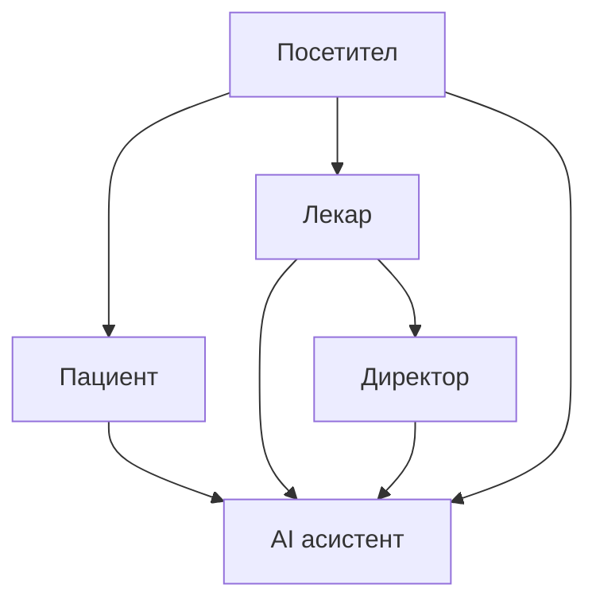

# Кориснички водич

Овој дел од документацијата е наменет за **корисниците на порталот** — пациенти, лекари, директор и посетители. Објаснува **како се користи сајтот**, чекор по чекор, без програмски код и API детали.

> За програмери и технички опис: [Преглед на системот](../overview_na_sisitemot/overview.md) · [Backend API](../backend/api/conventions.md) · [Frontend](../frontend/overview.md)

## Live портал

[Отвори го порталот на Клиничка Болница Штип](https://klinicka-bolnica-stip2026.onrender.com/app/)

## За кого е кој водич?

| Улога | Опис | Започни тука |
|-------|------|--------------|
| **Посетител** | Гледате информации без најава | [Посетител](posetitel.md) |
| **Пациент** | Регистрација, закажување, досие, оцени | [Регистрација и најава](pacient/registracija-i-najava.md) |
| **Лекар** | Распоред, картон, терапија, апарати | [Најава и панел](lekar/najava-i-panel.md) |
| **Директор** | Новости, огласи, дежурства | [Администрација](direktor/administracija.md) |
| **Сите** | AI асистент во долниот десен агол | [AI асистент](ai-asistent.md) |

## Содржина

* [Сајт и навигација](sajt-i-navigacija.md)
* [Посетител (без најава)](posetitel.md)
* **Пациент**
  * [Регистрација и најава](pacient/registracija-i-najava.md)
  * [Закажување преглед](pacient/zakazuvanje-termin.md)
  * [Мое досие и термини](pacient/moe-dosie-i-termini.md)
  * [Оценување на преглед](pacient/ocenuvanje-pregled.md)
  * [Кариера — апликација](pacient/kariera-aplikacija.md)
* **Лекар**
  * [Најава и панел](lekar/najava-i-panel.md)
  * [Распоред и картон](lekar/raspored-i-karton.md)
  * [Медицински апарати](lekar/aparati.md)
* [Директор — администрација](direktor/administracija.md)
* [AI асистент](ai-asistent.md)
* [Често поставувани прашања](cesto-prasanja.md)

***

Следно: [Сајт и навигација](sajt-i-navigacija.md)
