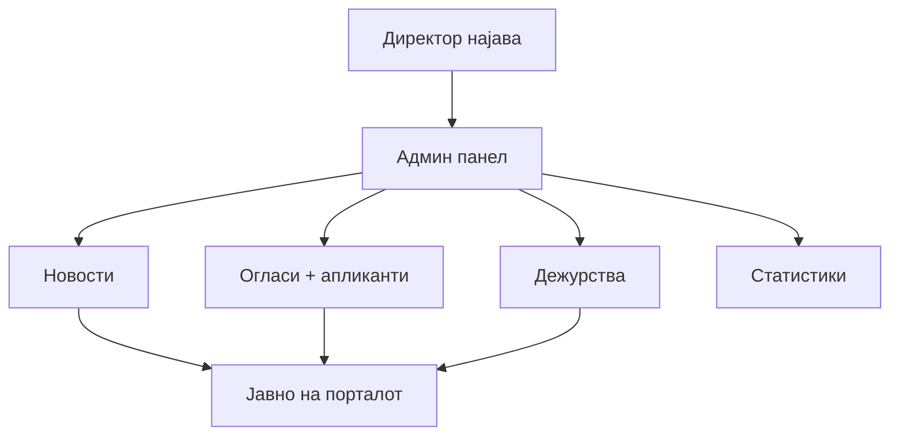

# Директор — администрација

Овој водич е наменет за **директорот** на болницата, или друго раководно лице со администраторски пристап. Објаснува, со обични зборови, како се користи администрацијата на сајтот.
Водичот ги покрива сите четири дела од административниот таб: **новости, огласи за работа, дежурства на лекари и статистики**. За секој дел се користени точните полиња што ги гледате на екран, чекор по чекор, без технички термини. Покрај панелот, објаснето е и кои од истите дејства можат да се направат побрзо преку AI-асистентот, со обична реченица наместо пополнување форма.

## Како се препознава

Не постои посебна „директорска" форма за најава — се најавувате на истото место каде што се најавува секој лекар, со е-пошта и лозинка, преку копчето „Најави се!" -> „Лекар". Системот сам препознава дека вашата сметка има администраторски пристап, врз основа на точното име и презиме со кое сте регистрирани, и автоматски ви отвора дополнителен таб **„Администрација"** во лекарскиот панел, кој обичен лекар не го гледа.

> Важно: тој пристап е врзан конкретно за вашето име, внесено точно во базата на болницата. Ако треба администраторски пристап да добие друга личност (на пр. нов директор), тоа бара измена директно во кодот на системот — не може самостојно да се додели некому преку самиот сајт.

Бидејќи сте регистрирани како лекар, во вашиот панел се достапни сите табови што ги гледа и обичен лекар — „Преглед на пациенти", „Распоред на дежурства", „Закажи термин на апарат" и „Поставки" — а табот „Администрација" се додава покрај нив, не наместо нив. Со други зборови, табот „Распоред на дежурства" во главниот лекарски панел ви прикажува само ваш сопствен распоред (како на секој лекар), додека реалното управување со дежурствата на сите лекари се прави одделно, внатре во „Администрација".

## Новости

Делот „**Новости**" служи за да ja известувате јавноста за случувања во болницата — нови услуги, промени во работењето, настани, важни известувања. Секоja вест што ja зачувате веднаш станува јавно видлива. Нема одделно копче „Објави" — зачувувањето и објавувањето се иста акција, без чекање на одобрување.

Како се додава нова вест: отворете „Администрација" - „Новости" - копче „+ Додади новост". Формата има пет полиња:
1. **Наслов** — кратко, во еден ред, опис на веста.
2. **Содржина** — целиот текст на вестa.
3. **Видео URL (опционално)** — линк до видео, ако сакате да го додадете рачно, без помош на асистентот.
4. **Главна слика (опционално)** — фајл со слика, директно од вашиот уред.
5. **Дополнителни слики (опционално)** — повеќе фајлови наеднаш, исто прикачени директно. Се прикажуваат како галерија под текстот на вестa.

По кликнување „**Зачувај**", вестa веднаш е јавно видлива на два места: на почетната страница, и на посебната страница „**Новости**" (`novosti.html`). Таа страница се отвора во нов прозорец, кога посетител кликне на „Новости" во главното мени.
За измена или бришење, отворете ja постоечка вест од листата. Од истото место можете да ja уредите, или трајно да ja избришете.

Побрз начин за видео-вести — преку **AI-асистентот**. Ако вестa се однесува на YouTube видео, не мора да пополнувате ништо рачно. Доволно е порака до асистентот, на пример: `„Објави вест од овој YouTube линк: ...`". Асистентот сам го прочитува насловот и содржината на видеото. Потоа сам состава наслов и текст за вестa, и ja објавува со вграден видео плеер и сликичка (`thumbnail`). Истиот канал работи и за бришење — на пример `„Избриши ja последната вест"` — без да треба прво да ja барате во листата.

> Уште еднаш ова е дозволено само за администрација (др Владко Захариев).

> За програмери: [API — Новости](../../backend/api/novosti.md) · [AI — вести](../../backend/ai-assistant/roles/direktor/vesti.md) · [novosti.html](../../frontend/stranici/novosti-html.md)

## Огласи за работа

Делот „**Огласи за работа**" служи за две одделни работи: `објавување слободни позиции, и следење на тоа кој се пријавил за нив`.

Огласот со статус „`Активен`" веднаш станува јавно видлив на страницата „Кариера" — секој посетител, без најава, го гледа и може да аплицира. Огласот не чека одобрување од никого друг — штом го зачувате со статус „Активен", истиот момент е достапен на сајтот.

Секоja пристигнатa апликација за конкретен оглас се чува заедно со него, во истиот запис. Затоа, отворајте го одредениот оглас секогаш кога треба да проверите кој е пријавен — листата на кандидати е секогаш врзана за позицијата за која аплицирале, не за некоja општa листа на сите апликанти.

Kако се додава нов оглас: отворете „Администрација" → „Огласи за работа" → копче „+ Додади нов оглас". Формата има пет полиња:
1. **Позиција** — на пр. „Лекар-специјалист по кардиологија".
2. **Оддел** — во кој оддел е позицијата.
3. **Датум на објава**.
4. **Рок за пријавување** — последен ден кога се прима апликација.
5. **Статус** — паѓачко мени со две вредности: Активен или Завршен.

Огласот со статус „`Активен`" е јавно видлив. Огласот со статус „`Завршен`" е скриен од јавниот приказ, но записот останува зачуван.

Кога позицијата е пополнета, не треба да го бришете огласот. Доволно е да го отворите и да му го промените статусот во „Завршен". Веднаш се крие од „Кариера", но историјата — вклучително листата на пријавени кандидати — останува зачувана за подоцна.

Трајно бришење на оглас е посебна, поретка операција. Најлесно се прави преку AI-асистентот, со порака како „`Избриши го огласот за хирург`" — само ако сте сигурни дека веќе нема никаква потреба од записот.

За преглед на пријавени кандидати, отворете го конкретниот оглас од листата — id видите име, презиме и контакт на секој пријавен. Истото може да го добиете и преку AI-асистентот, со прашање како „`Кој се пријавил за огласот за хирург?`" — добивате одговор веднаш во разговор, без да отворате панел.

> За програмери: [API — Кариера](../../backend/api/kariera.md) · [API — Администрација (огласи)](../../backend/api/admin.md#4-oglasi) · [AI — огласи](../../backend/ai-assistant/roles/direktor/oglasi.md)

## Дежурства

Делот „**Дежурства**" во „Администрација" служи за управување со распоредот на сите лекари — не само вашиот сопствен. Тука одредувате кој лекар е на дежурство, кога и во кој оддел.

Ова е различно од табот „**Распоред на дежурства**" во главниот лекарски панел, кој ви прикажува само ваш сопствен распоред, без можност за измена на туѓ. Делот во „Администрација" е единствениот начин да се внесе или промени дежурство за било кој лекар во болницата.

Откако ќе зачувате дежурство, истиот распоред автоматски се прикажува на профилот на соодветниот лекар, видлив за пациентите. Така, пациентите можат сами да проверат кога одреден лекар е на дежурство, без да треба да се јавуваат во болницата за таа информација.

Како се додава ново дежурство: отворете „Администрација" - „Дежурства" - копче „+ Додади ново дежурство". Формата има шест полиња:
1. **Лекар** — избира се од паѓачко мени.
2. **Датум** - датумот кога е дежурен лекарот.
3. **Оддел** - дали е дежурен во примена амбуланта или на главното оделение.
4. **Време од** - кога започнува дежурството.
5. **Време до** - кога е крај со работното време на лекарот.
6. **Напомена (опционално)** - барање или порака од директорот до лекарот.

Ако избраниот лекар веќе има внесено дежурство за истиот датум, новите податоци го ажурираат постоечкото дежурство. Не се создава дупликат запис.

Преку **AI-асистентот** истото се прави со обична реченица, на пример: „`Стави го д-р Петров на дежурство вo сабота`". Ако веднаш потоа сакате да прецизирате нешто, продолжете со „`смени му го времето на 9–17`". Асистентот се сеќава за кого и кој датум зборувавте во претходната порака — не треба повторно да го пишувате истото. Истиот принцип важи и за бришење: едноставно опишете кое дежурство сакате да се отстрани.

> За програмери: [API — Дежурства](../../backend/api/admin.md#3-dezurstva) · [AI — дежурства](../../backend/ai-assistant/roles/direktor/dezurstva.md)

## Статистики

Овој дел служи за брз преглед на работата на болницата, без рачно пребројување на записи. Преку овие бројки лесно забележувате кои оддели се најоптоварени, или кои лекари добиваат најдобри оцени од пациентите. Корисно е при планирање на персонал и дежурства.

Достапен е само во административниот панел. AI-асистентот не го поддржува — овие прегледи зависат од табели и бројки на екран, не од обичен текстуален одговор.

Имате два различни прегледи.

1. Оптовареност по специјалност. Овој преглед брои колку прегледи се завршени, групирани по специјалност на лекарот. Полињата „Од датум" и „До датум" се опционални. Ако ги оставите празни, бројката важи за целата историја. Ако внесете конкретен опсег и кликнете „Освежи", бројката важи само за тој период — на пример, последниот месец. Така лесно забележувате ако еден оддел има значително повеќе завршени прегледи од другите, во одреден период.

2. Просечна оцена по лекар. Овој преглед работи во два чекора. Прво избирате оддел од паѓачко мени. Штом одделот е избран, се отклучува второ мени со лекарите од тој оддел. Кога ще изберете конкретен лекар, се прикажуваат неговата просечна оцена и вкупниот број добиени оцени. Лекар не се пребарува директно по ime — секогаш се оди преку одделот. Овој преглед е користен за следење на квалитетот на услугата по оддели, и за препознавање на лекари со постојано високи оцени.

## Кратко резиме — AI-асистент наспроти панел
| Дејство | Преку панел | Преку AI-асистент |
|---------|-------------|-------------------|
|Објави вест (вклучително автоматски од YouTube линк)| Да | Да |
|Измени / трајно избриши вест|Да|Да (бришење)|
|Креирај оглас|Да|Да|
|Затвори оглас (промена на статус)|Да| - |
|Трајно избриши оглас| — | Да |
|Додади / измени дежурство |Да|Да|
|Избриши дежурство|Да|Да|
|Статистики и извештаи|Да | Не — само преку панел |

Во секој случај каде се користи асистентот, потребно е да сте најавени со сметка чие име е препознаено како директорско — во спротивно, асистентот ja одбива командата, исто како што панелот не би ви ja прикажал „Администрација" воопшто.

> За програмери: [API — Статистики](../../backend/api/admin.md#5-statistika)

> За програмери: [API — Администрација](../../backend/api/admin.md)
>[AI Agent](../../backend/api/ai-chat.md)
>[AI улога — Директор](../../backend/ai-assistant/roles/direktor.md)
***

Следно: [AI асистент](../ai-asistent.md) · [Посетител — новости](../posetitel.md)
