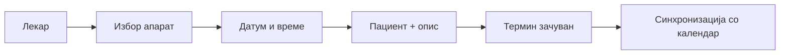

# Медицински апарати (лекар)

Покрај закажување на лекарски прегледи, секој лекар може да закажува термин за користење на медицински апарат: рендген, компјутерска томографија (CT), магнетна резонанца (MRI) или ултразвук. 
На пример, ако при преглед посомневате дека пациентот треба MRI снимка, не го пракате некаде надвор — самите закажувате термин за апаратот, директно од истиот панел каде закажувате и обични прегледи.
Ова не е административна функција, и нема никаква врска со улогата на директор. Достапна е во стандардниот лекарски панел, во таб „**Закажи термин на апарат**", веднаш до табовите за преглед на пациенти и распоред на дежурства. Секој лекар ja гледа и ja користи без посебна дозвола — без разлика на специјалност или работно искуство во системот.

## Зошто постои

Апаратот е ограничен ресурс. Во исто време може да го користи само еден пациент — додека еден пациент е на MRI снимање, апаратот физички не е достапен за никој друг. Затоа постои посебен календар за апарати, одделно од календарот за обични прегледи.

Тие два календари не се независни — автоматски се синхронизирани. Кога закажувате термин за апарат, системот истовремено проверува три ствари: дали апаратот е слободен во тој термин, дали пациентот веќе има друг закажан преглед во истото време, и дали лекарот веќе има друг преглед во истото време.

Доволно е само еден од овие три услови да не е исполнет, за терминот да не може да се зачува. На пример, ако пациентот веќе има закажан преглед во 10:00 кај друг лекар, систем нема да дозволи термин за апарат во 10:00 со истиот пациент — без разлика дали апаратот самиот е слободен. Истото важи и обратно: ако апаратот е зафатен, нема да помогне дури и ако пациентот и лекарот се целосно слободни.

Целта на ова е едноставна: да не дојде до судир кој подоцна треба рачно да се решава со телефонски повик или преместување термин. Не треба самите да проверувате распоред на колега или на пациент — системот тоа го прави за вас, веднаш, при самото пополнување на формата.

> За програмери: [API — Апарати](../../backend/api/aparati.md) · [API — Термини](../../backend/api/termini.md)

## Како да закажете (преку панел)
Отворете таб „Закажи термин на апарат" во лекарскиот панел. Формата има пет полиња:

1. **Апарат** — избирате од Рендген, Компјутерска томографија (CT), Магнетна резонанца (MRI) или Ултразвук.
2. **Лекар** - најавениот лекар.
3. **Име и презиме на пациент** — пишувате обично, без избор од листа на постоечки регистрирани пациенти.
4. **Датум и време** - на реализирање на прегледот на избраниот апарат.
5. **Зошто е потребно користење на апаратот** — кратко објаснување, причина за прегледот.

Кога ги пополните сите полиња, кликнете „Закажи термин". Терминот се зачувува само ако нема судир со апарата, пациентот или лекарот.

> За програмери: [API — Закажување апарат](../../backend/api/aparati.md)

## Достапност

Не треба да чекате до крај за да дознаете дали има судир. Додека ги пополнувате датумот, времето, апаратот и лекарот, системот веднаш проверува и ви јавува ако нешто веќе е зафатено — на пример, ако апаратот е резервиран во тој термин, или ако избраниот лекар во тоа време има друг преглед. Конкретната порака ви кажува точно што е зафатено, не само генеричка грешка. Така дознавате за проблемот пред да кликнете „Закажи термин", не дури по поднесувањето.

Истата проверка се повторува уште еднаш во моментот на самото зачувување. Тоа значи дека терминот сигурно нема да се зачува со судир, дури и ако во меѓувреме некој друг во истиот момент резервирал истиот апарат или лекар.

## AI

AI-асистентот за лекари помага со распоред на прегледи, картон на пациент, терапии и сопствена статистика. Не поддржува закажување термин за апарат преку разговор — тоа се прави единствено преку панелот.

> За програмери: [AI — лекар (распоред)](../../backend/ai-assistant/roles/lekar/raspored.md) — апарати не се поддржани преку AI

## Интерактивен демо-водич

Кликнете **„Најави се"** и тестирајте закажување на апарат директно тука — календар, временски слотови и проверка на судир (апарат, пациент, лекар):



***

Следно: [Најава и панел](najava-i-panel.md) · [Распоред и картон](raspored-i-karton.md)
