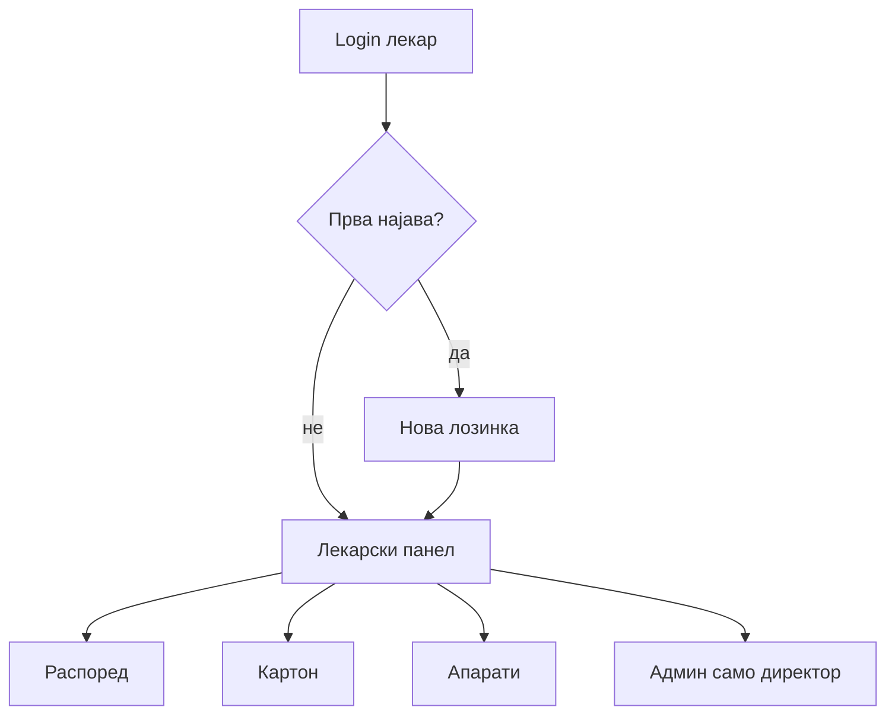

# Најава и панел

Лекарска сметка не се појавува сама од себе и лекарот не може самоиницијативно да си отвори профил, како што пациентите можат. Сметката секогаш тргнува од администрацијата: пред лекарот воопшто да помисли да се најави, некој од административниот тим мора прво да го внесе во системот, во делот за управување со кадар, со основни податоци — име и презиме. Дури откако тоj основен запис постои во базата, лекарот воопшто се здобива со можност да се појави на екранот за најава. Без тоj почетен чекор од администрацијата, никаков обид за најава или регистрација нема да успее, без разлика колку точно се внесени останатите податоци.

## Активирање на сметка — два случаи

Администрацијата никогаш рачно не внесува лозинка за лекар — таа само го внесува лекарот со основни податоци. Самата лозинка доаѓа на еден од два начина, зависно од тоа дали лекарот веќе постои во базата или сам се регистрира преку сајтот.

1. **Лекари кои веќе се внесени во базата**.

За лекарите кои администрацијата веќе ги има внесено, системот автоматски доделува иста, хардкодирана привремена лозинка: `Test123..` — никој не ja поставува рачно, тоа е стандардна вредност за секој таков запис. Лекарот се најавува со неа за прв пат, а системот веднаш препознава дека сметката сè уште ja користи таа привремена вредност и го принудува лекарот да ja смени — не може да продолжи со работа во апликацијата додека не постави своja нова лозинка.

2. **Нови лекари, самостojна регистрација преку сајтот**.

Кога нов лекар се регистрира самиот преку сајтот, веднаш поставува сопствена лозинка по сопствен избор (заедно со е-пошта и специјалност), уште од прва активација — без воопшто да доaѓa во допир со `Test123..`. Единствено ограничување: новата лозинка не може буквално да биде `Test123..`.

Без разлика на патот, лозинката мора да исполнува точно овие услови:

1. најмалку 8 знаци
2. барем една голема буква
3. барем еден интерпункциски знак
4. барем една бројка

Дури по успешна промена или регистрација, лекарот добива целосен пристап до останатите функции на панелот.

## Најава

Важна разлика од пациентите: лекар не се најавува со е-пошта. Корисничкото име се генерира автоматски, во формат `ime.prezime`, латинизирано и со мали букви — на пример, д-р Ана Стојановска би се најавила како `ana.stojanovska`. Не треба самите да го измислувате — системот сам го пресметува од име и презиме запишани во базата, и е толерантен на мали разлики во транслитерација (на пр. „ш" препознаено и како sh и како s).

## Лекарски панел

По најава (или по активирана сметка), се отвора лекарскиот панел — централно место од каде се одвива целата секојдневна работа со пациенти, распоред и сопствена сметка. Поделен е во неколку табови, секоj посветен на одделен дел од таа работа.

1. **Преглед на пациенти**

Овде се сите ваши термини — и закажаните што допрва доаѓаат, и веќе завршените. Термин не исчезнува од листата откако сте го одработиле. Tоj само го менува статусот, така што историјата на сите ваши прегледи останува видлива на едно место, не само оние во очекување.

Кога пациентот физички е на преглед кај вас, формата за тоj термин има полиња за дијагноза и терапија. Не мора да ги пополните двата заедно — доволно е барем едно од двата да внесете, и системот веднаш го третира прегледот како завршен. Токму тоj момент е значаен и за пациентот: штом прегледот премине во статус „завршен", на неговата страна се отклучува можност да остави оцена за тоj преглед. Ако формата случајно се испрати празна, без ниту дијагноза ниту терапија, статусот останува непроменет — преглед без реален внес не може случајно да се означи како завршен.

По внесена дијагноза и терапија, се појавуваат и две дополнителни опции за тоj конкретен преглед: преземање на извештајот како PDF документ директно на вашиот уред, или директно испраќање на истиот извештај на е-поштата на пациентот — истата адреса со која тоj се најавил при закажувањето, без можност за грешка при внес. Испраќањето по е-пошта работи само ако болницата има конфигурирана услуга за е-пошта на сервер; ако не е конфигурирана, опцијата за преземање PDF секогаш останува достапна.

2. **Распоред на дежурства**

Овде гледате сопствен распоред на дежурства — кои датуми, во кој оддел, и во кои часови сте на смена. Овоj таб е чисто информативен, само за преглед; распоредот не се менува одовде, туку преку администрацијата (видете Директор — водич за управување).

Ако администрацијата сè уште не внела рачно дежурства конкретно за вас, табот не останува празен — системот автоматски пресметува распоред врз основа на вашата специјалност, така што секогаш има прикажани информации. Штом администрацијата внесе вистински, рачно зададени дежурства, тие веднаш го заменуваат автоматски пресметаниот распоред.

3. **Закажи термин на апарат**

Закажување термин за пациент на рендген, CT, MRI или ултразвук. Овоj таб е стандарден дел од панелот на секоj лекар, не само на директорот — подетално објаснет во Медицински апарати — водич за лекари.

4. **Поставки**

Овде стои опцијата за промена на лозинка. Дури и ако сте веќе најавени и имате активна сесија, системот бара да ja потврдите тековната лозинка пред да прифати нова — заштита во случаj некој друг физички добие пристап до уред со веќе отворена сметка; без таа потврда, секој со пристап до отворениот browser би можел да ja преземе целата сметка со едноставна смена на лозинка.

5. **Администрација**

Овоj таб се појавува само ако сте препознаени како директор — види Директор — водич за управување.

## Одјава

Исто како кај пациент — од менито. По истек на сесија се одјавувате автоматски.

## AI за лекар

AI асистентот служи како брз пристап до истите функции што ги нудат табовите во панелот — само преку обичен разговор, без кликање низ менија. Достапен е исклучиво за најавени лекари; идентитетот се потврдува при секое барање, така што истите функции не се достапни за пациенти ниту за гости.

1. **Распоред и прегледи**

Можете да побарате да ви се прикаже распоредот за конкретен ден или период — на пример, „Кој е мојот распоред за утре?" — и асистентот директно враќа листа на закажани прегледи за тоj период. Преглед можете да означите како завршен и преку чат, без да отворате таб „Преглед на пациенти" — доволно е да го споменете пациентот по ime, на пример „Заврши го прегледот на Иван Петровски", и асистентот сам го наоѓа активниот термин за тоj ден. Истиот ефект како во панела: штом прегледот премине во статус „завршен", пациентот веднаш добива можност да остави оцена и коментар.

2. **Картон, историја и терапија**

Со барање од типот „Покажи ми го картонот на Марија Јованова" добивате целосен медицински картон на пациент — дијагнози, терапии и забелешки од сите негови прегледи, не само кај вас. Ако постојат повеќе пациенти со исто ime, асистентот не претпоставува кој се мисли, туку прво бара дополнително прецизирање. Потесно барање — на пример „Колку пати бил кај мене овој пациент?" — враќа само историја на прегледи кај тековниот лекар, без прегледите што пациентот ги имал кај други лекари. Освен читање, преку асистент може и директно да се запише дијагноза и терапија за завршен преглед, на ist начин како преку формата во панела, само со порака од типот „Запиши терапија: ибупрофен 400мг, 3 пати дневно". Во сите случаи, пристапот е ограничен исклучиво на пациенти и прегледи релевантни за вашата работа — асистентот не дозволува читање записи надвор од тоj опсег.

3. **Сопствена статистика**

Со барање како „Колку прегледи имав овој месец?" асистентот враќа лични показатели — вкупен број прегледи, просечна оцена од пациенти, и тековно активни термини. За разлика од директорската статистика во администрацијата, овде станува збор исклучиво за ваши лични бројки, не за целата болница.

4. **Брза навигација**

Ако не сакате податоци, туку само директно да стигнете до одреден дел од панелот, можете да побарате „Отвори го лекарскиот панел" — асистентот ве носи право таму, без рачно кликање низ менито.

> Заборавена лозинка: постои flow сличен на пациентот (код на е-пошта / reset).

> За програмери: [Автентикација — лекар](../../backend/api/authentication.md) · [API — Лекари](../../backend/api/lekari.md) · [AI — лекар](../../backend/ai-assistant/roles/lekar.md) · [AI — распоред](../../backend/ai-assistant/roles/lekar/raspored.md) · [AI — картон](../../backend/ai-assistant/roles/lekar/pacienti.md) · [AI — статистика](../../backend/ai-assistant/roles/lekar/statistika.md)

## Интерактивен демо-водич

Кликнете **„Најави се"** и тестирајте најава, лекарски панел, дијагноза/терапија и табови — директно тука:



***

Следно: [Распоред и картон](raspored-i-karton.md) · [Апарати](aparati.md)
