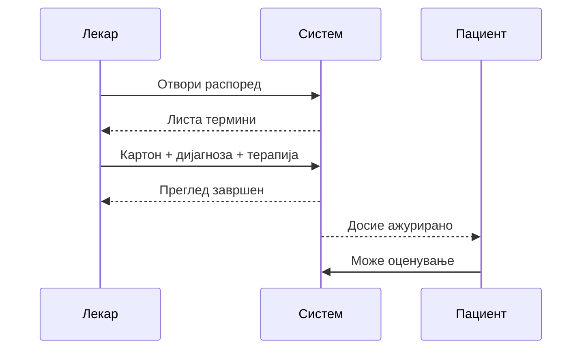

# Распоред и картон (лекар)

Секоj работен ден за лекар почнува со преглед на распоредот, а завршува со внесена дијагноза и терапија за секоj пациент што бил на преглед. Помеѓу тие два моменти стои целиот циклус на едно лекарско работење во системот, и токму тоj циклус овоj дел од панелот го покрива во целост.

Замислете конкретен пример: лекар отвора панел наутро и гледа дека за денес има закажани тројца пациенти. Прв пациент доаѓа на преглед, лекарот го прегледа, и веднаш потоа во истиот систем внесува дијагноза и евентуална терапија — без да треба да води посебна, рачна белешка некаде надвор од апликацијата. Штом тоj внес е зачуван, терминот автоматски се означува како завршен, а пациентот, од своja страна, веднаш добива можност да остави оцена за тоj преглед. Истиот циклус — отвори распоред, прегледај пациент, внеси наод, заврши термин — се повторува за секоj пациент, секоj работен ден.

Затоа овоj дел од панелот не е само листа со имена и датуми, туку местото каде физички се случува и официјално се бележи медицинската работа на лекарот: од момент кога пациент е закажан (уште пред да дојде на преглед), па сè до момент кога прегледот е официјално завршен и тоj факт станува видлив и за пациента.

## Распоред на прегледи

Во таб **Преглед на пациенти** стои листа на сите ваши термини — закажани и завршени заедно. Oткажани термини воопшто не се прикажуваат. За секоj термин се гледа името на пациент, датум и час, и статус, дополнително се појавува и поле за напомена доколку пациентот внел нешто(имам алергија на парацетамол.). Активните секогаш стојат на врвот, пред завршените, а помеѓу себе по датум и час — прво се гледа сè што допрва треба да се одработи.

Термин не исчезнува штом го одработите — само му се менува статусот, така што целата историја останува видлива на едно место, не само оние во очекување.
Можете да филтрирате по **датум** или да прегледате **сите** идни термини (зависно од UI).

## Картон на пациент

За разлика од очекувано посебен таб „пациенти", во панелот нема одделна страница насловена „картон" — дијагнозата и терапијата од секоj одделен преглед стојат директно во записот за тоj термин, во истата листа во „Преглед на пациенти". Ако сакате преглед на целата историја на конкретен пациент собрана на едно место — не само еден термин, туку сите негови досегашни прегледи, дијагнози и терапии заедно — најбрз пат до тоа е преку AI асистентот (видете подолу), кој на барање веднаш го враќа целосниот картон, без рачно прелистување на секоj поединечен термин.

## Завршување на преглед

Штом пациентот физички заврши преглед кај вас, во формата за тоj термин внесувате дијагноза, терапија, или и двете — не мора задолжително двата заедно. Веднаш штом барем едно од двата поле содржи реален текст, статусот на терминот автоматски преминува во „завршен". Ако формата случајно се испрати целосно празна, статусот останува непроменет, токму за да не може преглед без реален внес погрешно да се означи како завршен.

Тоj момент на завршување има директен ефект и кај пациентот: штом статусот стане „завршен", на неговата страна се отклучува можност да остави оцена и коментар за тоj конкретен преглед. Дополнително, за веќе внесена дијагноза и терапија, добивате опции да го преземете извештајот како PDF документ, или директно да го испратите на е-поштата на пациентот — истата адреса со која тоj се најавил при закажувањето, без можност лекарот случајно да внесе погрешна адреса токму во моментот на испраќање.

## AI — распоред и пациенти
Истите информации и постапки се достапни и преку обичен разговор со асистентот, без отворање панел:

1. „**Кои прегледи имам утре?**" — враќа листа закажани прегледи за избран ден или период.
2. **„Заврши го прегледот на Иван Петровски"** — го означува прегледот како завршен, со истиот ефект како преку панела (пациентот веднаш добива можност за оцена).
3. **„Покажи ми го картонот на Марија Јованова"** — целосен медицински картон на пациент, со сите дијагнози и терапии од сите негови прегледи. Доколку постојат повеќе пациенти со исто име, асистентот прво бара прецизирање пред да продолжи.
4. **„Колку пати бил кај мене овој пациент?"** — потесно барање, само историја на прегледи кај тековниот лекар, не кај сите лекари.
5. **„Запиши терапија: ибупрофен 400мг, 3 пати дневно"** — директен внес на дијагноза/терапија преку чат, наместо преку формата во панела.

>Сите овие функции бараат активна лекарска најава — недостапни се за пациенти и гости.

***

Следно: [Медицински апарати](aparati.md) · [AI асистент](../ai-asistent.md)
