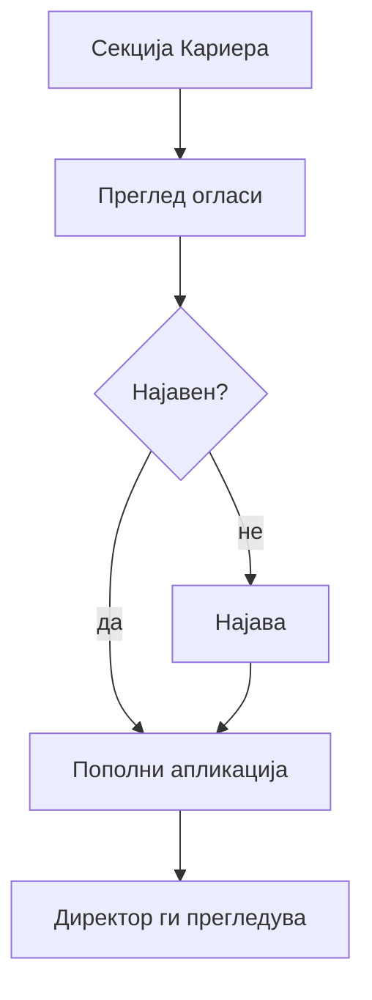

# Кариера — апликација (пациент)

Болницата објавува **огласи за слободни работни места** на порталот. Најавени корисници (или преку AI) можат да **аплицираат** директно.

## Преглед на огласи (без најава)

1. На главната страница одете на секција **„Кариера"** (`#kariera`)
2. Видете листа на **активни огласи** — позиција, оддел, датуми
3. За **апликација** потребна е најава

## Апликација преку форма

1. **Најавете се** (пациентска или општа сметка со профил)
2. Отворете **оглас**
3. Пополнете ја **апликацијата** (податоци што ги бара формата)
4. Испратете — добивате потврда

Раководството ги прегледува апликациите преку **административниот панел** (директор).

## Апликација преку AI

Можете да напишете, на пример:

* „Сакам да аплицирам за огласот за медицинска сестра"

Асистентот ќе ве води — **најава** е потребна ако сè уште не сте најавени.

## Статус на оглас

Огласите можат да бидат **отворени** или **затворени**. На затворен оглас не се примаат нови апликации.

***

Следно: [AI асистент](../ai-asistent.md) · [Директор — администрација](../direktor/administracija.md)
