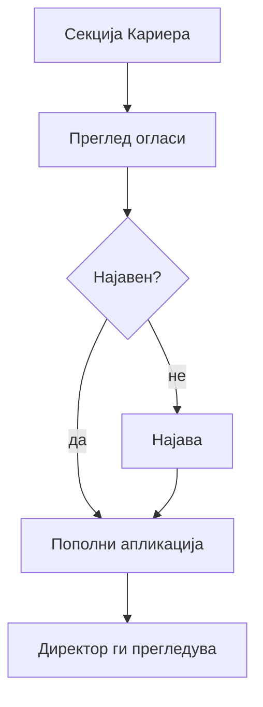

# Кариера — апликација (пациент)

Болницата редовно објавува огласи за слободни работни позиции директно на сајтот, во делот „**Кариера**". На пример, болницата бара нов лекар-специјалист или медицинска сестра. Таков оглас, штом е објавен, се појавува токму тука, достапен за секого да го прочита. Секој може слободно да ја прелистува целата листа на огласи. За тоа не е потребна сметка, ниту најава — токму како и кај новостите.

Ситуацијата се менува штом сакате реално да аплицирате за конкретна позиција. Тогаш е потребна сметка. Системот бара да сте најавени пред да поднесете апликација, токму за да секоја поднесена апликација е поврзана со конкретен, проверен корисник, а не со анонимен посетител. 

Накратко: прелистувањето на огласите е отворено за сите, а самото аплицирање бара претходна најава.

## Преглед на огласи (без најава)

Делот „Кариера" е јавно достапен, без потреба од најава. Прикажани се само активни огласи — затворени или истечени огласи никогаш не се прикажуваат јавно, без оглед на тоа колку огласи вкупно постојат во базата.

За секој оглас се гледа позиција, оддел, датум на објава и краен датум за пријавување. Целата листа е подредена од најнов кон постар оглас, така што најновите можности за работа секогаш се на врвот.

Важно е да се знае едно нешто: листата не се чисти автоматски штом помине крајниот датум за пријавување. На пример, ако датумот за пријавување за позицијата „Медицинска сестра" е истечен пред недела дена, огласот сепак останува видлив сè додека администрацијата рачно не го затвори. Статус „активен" не се менува сам од себе со истекот на датумот — туку исклучиво со намерна акција од раководството.

На скратено, да ги видите сите активни огласи:

1. На главната страница одете на секција **„Кариера"** (`#kariera`)
2. Видете листа на **активни огласи** — позиција, оддел, датуми
3. За **апликација** потребна е најава

> Поврзано: [Посетител — без најава](../posetitel.md) · [Сајт и навигација — #kariera](../sajt-i-navigacija.md)

## Апликација преку форма

За да поднесете апликација за конкретна позиција, прво треба да сте најавени со своја сметка — без најава, формата за апликација не е достапна. Откако сте најавени, отворате конкретен оглас и ја пополнувате формата за апликација.
 
На пример: гледате оглас за позиција „Медицинска сестра во Кардиологија", се најавувате со сопствена сметка и го отворате тој конкретен оглас. Во формата внесувате позицијата (веќе позната од самиот оглас), сопствено име и презиме, и контакт е-пошта; опционално, можете да внесете и телефон или број на медицинска лиценца, ако сте дел од медицински кадар.

Формата бара:
1. **Позиција за која аплицирате** (задолжително)
2. **Име на кандидатот** (задолжително)
3. **Презиме на кандидатот** (задолжително)
4. **е-пошта за контакт** (задолжително)
5. **Телефонски број** (опционално)
6. **Број на медицинска лиценца** (опционално - се бара само доколку се аплицира за позиција од некоја медицинска гранка)

Важна напомена: тековната верзија на формата прима исклучиво текстуални податоци — не постои опција за прикачување CV или придружни документи, дури и ако очекувате таа можност. По успешно поднесена апликација, на екран добивате порака за потврда, а болницата потоа ве контактира директно преку податоците што сте ги оставени во формата.
Раководството ги прегледува апликациите преку [административниот панел (директор)](../direktor/administracija.md).

## Апликација преку AI

Преку AI асистентот можете да прашате за активни огласи — на пример `„Дали има отворени огласи за медицинска сестра?"` — и асистентот ви враќа листа на активни огласи што одговараат на прашањето. Самото поднесување на апликација, меѓутоа, не се прави преку чат: за тоа сепак треба да се пополни формата на страницата „Кариера", по претходна најава, на начин описан погоре.

Ако сте гостин и побарате информации за огласи без претходна најава, асистентот одговара слободно, бидејќи тоа е општа, јавна информација. Штом, меѓутоа, спомнете дека сакате да аплицирате, ве потсетува дека за тој чекор е потребна сметка.
> Поврзано: [AI асистент](../ai-asistent.md)

## Статус на оглас

Секој оглас има статус: **активен** или **завршен**.

Штом оглас премине во статус „завршен", веднаш се повлекува од јавниот приказ. Повеќе не прима нови апликации — дури ако техничкиот запис останува во базата за интерна евиденција. Промената на статус се прави исклучиво рачно, од страна на администрацијата (видете Директор — водич за управување). Раководството ги прегледува сите пристигнати апликации преку административниот панел.

## Интерактивен демо-водич

Прегледајте огласи без најава, најавете се и поднесете апликација — директно тука:


***

Следно: [AI асистент](../ai-asistent.md) · [Директор — администрација](../direktor/administracija.md)
