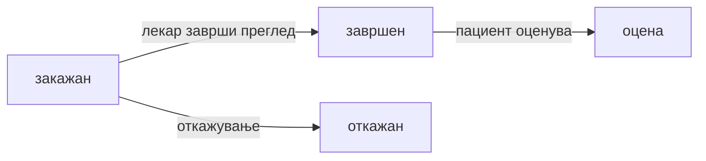

# Мое досие и термини (пациент)

По најава, пациентот има пристап до **личен профил** — идни и минати прегледи, дијагнози и терапии од завршени прегледи.

## Каде да го најдете

На главната страница, по најава како пациент, се прикажуваат делови поврзани со вашиот профил (идни термини, досие, оцени — зависно од UI секцијата / табовите на порталот).

## Идни термини

* Листа на **закажани** прегледи (статус „закажан")
* Датум, време, лекар, напомена
* Можност за **откажување** или **пренос** (преку форма или AI)

## Завршени прегледи

* Прегледи со статус **„завршен"**
* **Дијагноза** и **терапија** внесени од лекарот
* Овие податоци се дел од вашето **електронско досие**

## Откажување на термин

1. Најдете го терминот во **идни прегледи**
2. Изберете **откажи** (или кажете на AI: „Откажи го прегледот на …")
3. Терминот добива статус **„откажан"** — времето повторно станува слободно
4. Добивате **известување на е-пошта** за откажување

## Пренос на термин

Слично како откажување — избирате **нов датум/време** или AI асистентот ви помага во дијалог. Добивате **email** за промената.

## Статуси на термин

| Статус | Значење |
|--------|---------|
| **закажан** | Активен, времето е резервирано |
| **завршен** | Прегледот е одржан; може **оценување** |
| **откажан** | Откажан; времето е слободно |

## AI — „мои прегледи"

Во чатот може да прашате: *„Кои ми се идните прегледи?"* или *„Кога имам преглед?"* — асистентот ги чита вашите термини (само ваши, по е-пошта).

***

Следно: [Оценување на преглед](ocenuvanje-pregled.md) · [Кариера](kariera-aplikacija.md)
