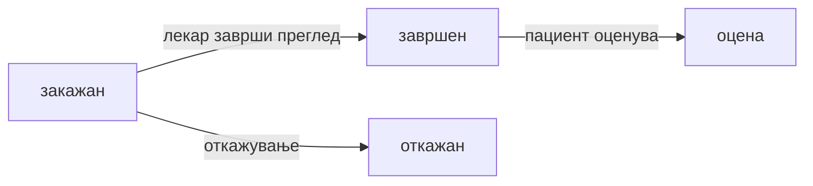

# Мое досие и термини (пациент)

Делот „**Мое досие**" веќе е претставен во Закажување преглед и Мое досие и Мое досие, оценки и извештаи — таму стои целосен преглед на профилот, идните и завршените прегледи, оцените и извештаите. Овој водич навлегува конкретно во еден дел од таа целина: самите термини, и животниот циклус низ кој секој од нив минува.

Замислете типична ситуација: закажете преглед кај кардиолог за вторник, но во меѓувреме се појави обврска токму во тој термин. Не треба да го оставите прегледот „во воздух", ниту да чекате некој од болницата физички да го избрише од распоредот — самостојно можете да го откажете, или директно да го пренесете за друг датум кога ви одговара. Овој водич токму објаснува како: кои статуси минува секој термин, и какви се чекорите за откажување и пренос.

>Претходно: [Закажување преглед](zakazuvanje-termin.md)
>[Оценување и извештаи](ocenuvanje-pregled.md).

## Каде да го најдете

На главната страница, по најава како пациент, се прикажуваат делови поврзани со вашиот профил (идни термини, досие, оцени — зависно од UI секцијата / табовите на порталот).

## Идни термини

Во делот за идни термини гледате секој закажан преглед — име на лекар, специјалност, датум и време. Тука се прикажуваат исклучиво термини со статус „закажан", со датум денес или во иднина, никогаш минати датуми. На пример, ако имате закажан преглед кај дерматолог следната недела и втор кај офталмолог по две недели, двата се гледаат заедно тука, секој со сопствени детали.

Штом термин се одржи или се откаже, веднаш излегува од овој дел: завршениот преминува во посебниот дел за завршени прегледи (со дијагноза и терапија), а откажаниот целосно се отстранува од досието, бидејќи веќе не е релевантен за вашата активна грижа.

> Поврзано: [Закажување преглед](zakazuvanje-termin.md)

## Завршени прегледи

Завршените прегледи стојат одделно од идните, и опфаќаат секој преглед кој веќе сте го одржале — заедно со дијагнозата и терапијата што ја внел лекарот, ако ја внел. На пример, ако сте биле на преглед кај кардиолог минатата недела и лекарот ви внел дијагноза „Хипертензија" со соодветна терапија, токму тој запис стои тука, трајно достапен за повторно читање секогаш кога ви е потребно.

Покрај самиот наод, тука стои и опцијата да [оставите оцена](ocenuvanje-pregled.md) за тој преглед, како и да преземете или да побарате на е-пошта PDF извештај со целосниот наод.

## Откажување на термин

Закажан преглед можете и самостојно да го откажете, без задолжително да контактирате ја болницата директно. Штом термин се откаже, статусот му се менува во „откажан", а тој слот веднаш повторно станува слободен за друг пациент — системот, при пресметка на слободни термини за тој лекар и датум, веднаш ги исклучува откажаните термини, токму затоа што веќе не блокираат ништо. Доколку болницата има активна е-пошта услуга во моментот, обично добивате и потврда на е-пошта за откажувањето, на сличен начин како при самото закажување.

Истата постапка функционира и преку обичен разговор со AI асистентот — доволно е да напишете, на пример, „Откажи го прегледот ми за утре", и асистентот сам го наоѓа точниот термин и го откажува, без да треба да отворате посебна форма.

> Поврзано: [AI асистент](../ai-asistent.md) · [Закажување преглед](zakazuvanje-termin.md)

## Пренос на термин

Пренос на термин за друг датум или час функционира на сличен начин — наместо да откажете и да закажете изнова од нула, директно можете да побарате промена на постоечкиот термин, со нов датум и час по ваш избор, преку формата на сајтот или преку AI асистентот во дијалог.

## Статуси на термин

| Статус | Значење |
|--------|---------|
| **закажан** | Активен, времето е резервирано |
| **завршен** | Прегледот е одржан; може **оценување** |
| **откажан** | Откажан; времето е слободно |

> Поврзано: [Закажување преглед](zakazuvanje-termin.md) · [AI асистент](../ai-asistent.md)

## AI — „мои прегледи"

Во чатот можете слободно да прашате нешто од типот **„Кои ми се идните прегледи?"** или **„Кога имам следен преглед?"**, а асистентот веднаш одговара со конкретните датуми, часови и имиња на лекари, без да треба прво да отворате „Мое досие" и сами да ги барате. На пример, ако прашате „Кога е следниот ми преглед?", а имате закажан преглед кај дерматолог во вторник, асистентот директно одговара со тој датум, час и името на лекарот — истата информација која инаку би ја нашле во делот за идни термини погоре.

Асистентот секогаш ги чита исклучиво вашите термини, препознаени преку е-поштата поврзана со вашиот профил — никогаш термини на друг пациент. Истиот принцип важи и за прашања поврзани со веќе завршени прегледи, на пример „Кои прегледи сум ги завршил минатиот месец?".
***

Следно: [Оценување на преглед](ocenuvanje-pregled.md) · [Кариера](kariera-aplikacija.md)
