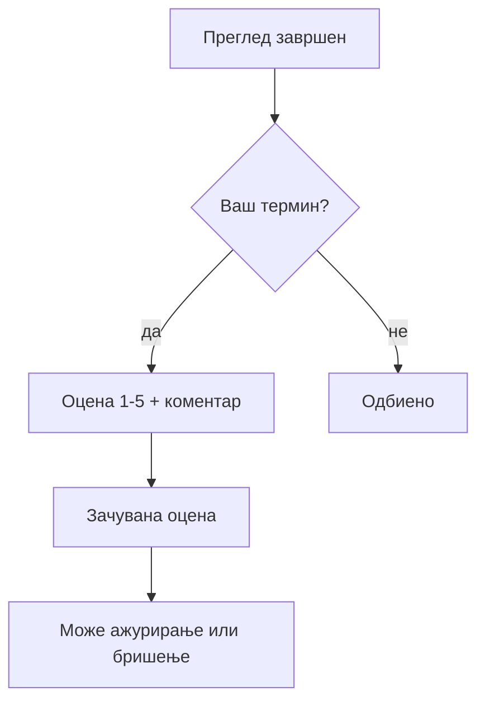

# Оценување на преглед (пациент)

Претходно споменавме за: [Мое досие и термини](moe-dosie-i-termini.md). Овоj водич навлегува подетално токму во самата функција за оценување — кои услови треба да се исполнети, какo функционира промена на веке дадена оцена, и зошто понекогаш опцијата за оценување воопшто не се појавува.
Замислете ситуација: имате преглед кај кардиолог во понеделник, а во среда лекарот ви внел дијагноза и соодветна терапија. Токму во тоj момент статусот на терминот автоматски станува „завршен", и веднаш потоа, во вашето „Мое досие", се отвора опцијата да оставите оцена за тоj конкретен преглед.

Оцената не е само формалност — таа реално се користи. Раководството на болницата, во делот „Статистики" од административниот панел, гледа просечна оцена и вкупен број на оцени за секоj лекар, групирано по оддел (повеke во Директор — водич за управување). Со други зборови, оцената што ja оставите по преглед кај кардиолог директно влегува во таа просечна вредност за тоj лекар — не е број кој само вие го гледате.

## Услови за оставање оцена

Три услови мора истовремено да бидат исполнети, без исклучок:
1. **Прегледот мора да биде завршен** — статус „закажан" или „откажан" не дозволуваат оценување, бидејkи преглед кој сè уште не се случил, или воопшто не се случил, нема за шта да се оцени.
2. **Терминот мора да биде ваш** — системот секогаш проверува дека е-поштата зачувана на терминот одговара точно на е-поштата од вашиот пациентски профил, дури и ако некако дознаете идентификатор на туѓ термин.
3. **Оцената мора да биде цел број од 1 до 5** - коментар е целосно опционален и може да остане празен.

> Поврзано: [Мое досие и термини — статуси](moe-dosie-i-termini.md) · [Регистрација и најава](registracija-i-najava.md)

## Промена на векe дадена оцена

Истата форма служи и за првото внесување оцена, и за подоцнежна промена. Ако прегледот сè уште нема оцена, формата е празна, доколку веќe има, се прикажува предпополнета со постоечката вредност. Внесувањето нова оцена секогаш ja заменува старата — никогаш не создава втор, паралелен запис за истиот преглед, и тоа важи и технички: во базата постои ограничување кое физички спречува два различни записи за оцена на еден термин.

Важна последица од овоj начин на работа: еднаш дадена оцена не може целосно да се „избрише" или повлече во празно. Можете слободно да ja промените во било која друга вредност од 1 до 5 во секое време, но самата опција за оценување, штом еднаш е искористена, останува засекогаш поврзана со тоj термин — само со последната внесена вредност.

На пример, ако веднаш по преглед оставите оцена 3 со коментар „Добро, но чекав долго", а подоцна решите дека всушност заслужува повисока оцена, доволно е повторно да отворите истиот преглед и да внесете 5 со нов коментар — старата вредност 3 целосно се замени, без трага дека некогаш постоела помала оцена.

## Како да оцените преку сајт
1. Најавете се во вашиот пациентски профил.
2. Отворете [Мое досие](moe-dosie-i-termini.md) и одете до делот со завршени прегледи.
3. Изберете преглед означен како достапен за оцена.
4. Внесете оцена од 1 до 5, и по желба може и коментар.
5. Потврдете — ако прегледот веke бил оценет, истата форма само ja ажурира претходната вредност.

> Поврзано: [Закажување преглед](zakazuvanje-termin.md)

## Како да оцените преку АI асистент

Истото може да се направи и без отворање панел, директно во разговор. На пример: **„Сакам да оценам последниот преглед со 5**"** или **„Оцени го прегледот кај д-р Петровски со 4, многу љубезен лекар"** — асистентот сам го наоѓа точниот термин по контекст и ja внесува оцената.
> Поврзано: [AI асистент](../ai-asistent.md)

***

Следно: [Кариера — апликација](kariera-aplikacija.md) · [AI асистент](../ai-asistent.md)
