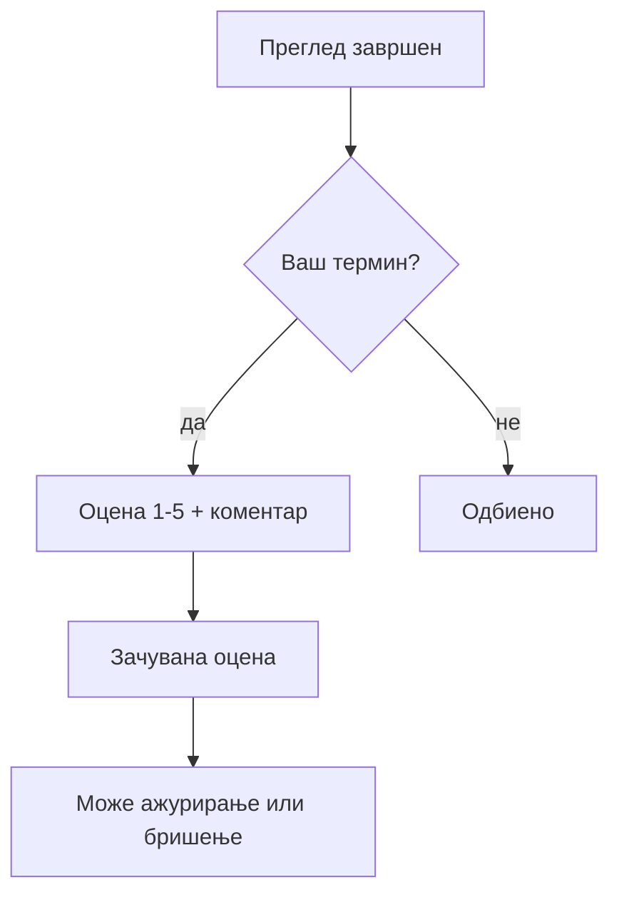

# Оценување на преглед (пациент)

По **завршен** преглед, пациентот може да остави **оцена** за искуството со лекарот — помага на болницата и другите пациенти.

## Правила

| Правило | Детали |
|---------|--------|
| Само **завршени** прегледи | Статус на терминот мора да биде „завршен" |
| Само **ваши** прегледи | Системот проверува дека терминот е на вашата е-пошта |
| Оцена **1 до 5** | Цел број |
| **Коментар** | Опционален текст |
| Еден термин = една оцена | Повторно оценување ја **ажурира** постоечката |
| **Повлекување** | Можете да ја отстраните оцената |

## Како да оцените (преку сајт)

1. Најавете се како **пациент**
2. Одете до делот за **завршени прегледи** / оцени
3. Изберете преглед што **може да се оцени**
4. Изберете **оцена 1–5** и по желба коментар
5. Потврдете

## Како да оцените (преку AI)

Пример: *„Сакам да оценам последниот преглед со 5"* или *„Оцени го прегледот кај д-р …"*

Асистентот ќе провери дали прегледот е завршен и дали ви припаѓа.

## Зошто не можам да оценам?

* Прегледот уште не е **завршен** (лекарот не го затворил)
* Не сте најавени како **пациент** на тој профил
* Терминот не е **ваш**

***

Следно: [Кариера — апликација](kariera-aplikacija.md) · [AI асистент](../ai-asistent.md)
