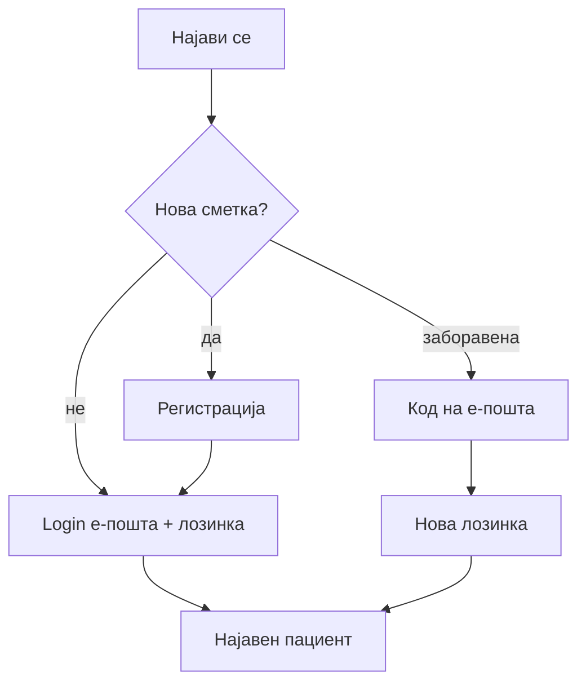

# Регистрација и најава (пациент)

За да закажувате прегледи, да го гледате досието и да аплицирате за работа, потребна е **сметка на пациент**. Регистрацијата е бесплатна и се прави еднш.

## Регистрација

1. На главната страница кликнете **„Најави се!"** (горе десно)
2. Изберете **регистрација** / форма за нов пациент
3. Пополнете ги полињата:

| Поле | Забелешка |
|------|-----------|
| Име, презиме | Задолжително |
| Е-пошта | Мора да биде **единствена** во системот |
| Лозинка | Минимум **8 знаци** |
| Телефон | Опционално |
| ЕМБГ | **13 цифри**, мора да биде **единствен** |

4. По успешна регистрација, најавете се со истата е-пошта и лозинка

> Ако е-поштата или ЕМБГ веќе постојат, системот ќе пријави грешка — не може дупликат сметка.

## Најава

1. **„Најави се!"** → форма за пациент
2. Внесете **е-пошта** и **лозинка**
3. По успех, во хедерот ќе видите вашето име — сега сте најавени

## Заборавена лозинка

1. Изберете опција за **заборавена лозинка**
2. Внесете ја вашата **е-пошта**
3. Добивате **код за ресетирање** (важи **1 час**)
4. Внесете го кодот и **новата лозинка**

> На локален развој кодот може да се прикаже во конзола на серверот; во продукција се испраќа на е-пошта.

## Одјава и сесија

* **Одјава** — од менито кога сте најавени
* Ако долго **не користите** страницата, сесијата **истекува** и ќе бидете одјавени автоматски
* По одјава, личните податоци не се прикажуваат — повторна најава е потребна

## Разговор со AI пред најава

Ако разговарате со AI како **гостин** и системот побара најава (на пр. за закажување), по успешна најава **претходниот разговор може да се продолжи** — види [AI асистент](ai-asistent.md).

***

Следно: [Закажување преглед](zakazuvanje-termin.md) · [Мое досие](moe-dosie-i-termini.md)
