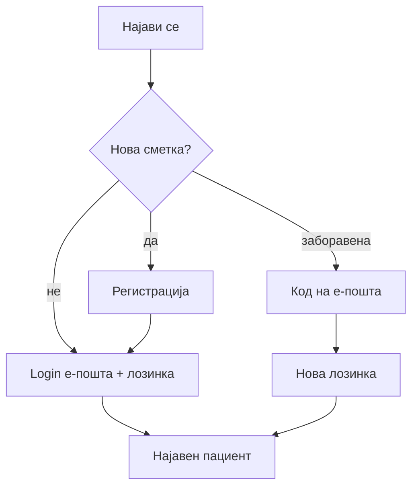

# Регистрација и најава (пациент)

Сметка е задолжителна — нема закажување преглед, ниту пристап до „Мое досие", оставање оцена, или аплицирање за работна позиција (видете [Кариера — апликација](kariera-aplikacija.md)) без претходна регистрација и најава. Овоj водич објаснува како се отвора сметка, како се најавувате, и што да направите ако ja заборавите лозинката.

На пример, дури и нешто наизглед едноставно како закажување преглед кај кардиолог не може да се направи без претходна најава — формата за закажување е достапна само откако сте се регистрирали и најавени. Сметка се отвора еднаш, а потоа важи трајно.

## Регистрација

Регистрацијата трае само неколку минути и се прави еднаш — потоа сметката важи трајно, без потреба од повторна регистрација при секоја следна посета.
1. На главната страница, кликнете „Најави се!" (горе десно).
2. Изберете опција за регистрација на нов пациент.
3. Пополнете ја целата форма.
4. Потврдете — по успешна регистрација, се пренасочувате кон екранот за најава.

Самата форма има пет полиња, секое со своја логика:

1. **Име и презиме** — задолжителни; единствено правило е да не остане поле празно.
2. **Е-пошта** — задолжителна, и мора да биде уникатна во системот: не може двајца различни пациенти да делат иста е-пошта. Токму на неа подоцна се најавувате, и токму на неа пристигнуваат сите известувања поврзани со сметката — потврда за закажан преглед, код за ресетирање лозинка, и така натаму. Затоа внесете е-пошта до која реално имате редовен пристап.
3. **Лозинка** — минимум 8 карактери; нема друго посебно правило за состав на знаци. Никогаш не се чува во чиста, читлива форма — се чува безбедно криптирана, и дури со целосен пристап до базата не може да се прочита назад во оригинал.
4. **Телефон** — опционален; корисен, на пример, ако болницата треба директно да ве контактира околу веќе закажан преглед.
5. **ЕМБГ** — исто опционален, но ако решите да го внесете, мора да биде точно 13 цифри и уникатен за секој пациент — двајца пациенти не можат да делат исто ЕМБГ.

По успешна регистрација, најавете се со истата е-пошта и лозинка

> Ако е-поштата или ЕМБГ веќе постојат, системот ќе пријави грешка — не може дупликат сметка.
> Поврзано: [Сајт и навигација — „Најави се!"](../sajt-i-navigacija.md)

## Најава

Откако веќе имате сметка, најавувањето е едноставно и секогаш исто:

1. „Најави се!" → форма за пациент.
2. Внесете е-пошта и лозинка — истите со кои сте се регистрирали.
3. Потврдете. По успех, во хедерот се појавува вашето име, а сте автоматски пренасочени кон вашиот профил.

Намерно, ако комбинацијата е погрешна, добивате иста, генеричка порака за грешка без разлика дали проблемот е во е-поштата или во лозинката — системот никогаш не открива дали внесена е-пошта воопшто постои во базата, токму за да не може некој да „пробува" различни е-пошти и да открие кои пациенти се регистрирани. На пример, ако внесете точна е-пошта, но погрешна лозинка, и ако внесете е-пошта која воопшто не постои во системот, добивате истата порака во оба случаи — нема начин однапред да претпоставите кој од двата проблема точно се случил.

По успешна најава, вашиот идентитет останува препознаен низ целиот сајт — секаде каде се прикажуваат лични податоци (на пример во [Моето досие](moe-dosie-i-termini.md)), системот веќе знае кој сте, без да треба повторно да внесувате е-пошта или лозинка при секоја нова страница, додека сте најавени.

> Поврзано: [Закажување преглед](zakazuvanje-termin.md) · [Мое досие и термини](moe-dosie-i-termini.md)

## Заборавена лозинка

1. Изберете опција за **заборавена лозинка**
2. Внесете ја вашата **е-пошта**
3. Добивате **код за ресетирање** (важи **1 час**)
4. Внесете го кодот и **новата лозинка**

Кодот пристигнува директно на внесената е-пошта. Ако побарате нов код пред да го искористите претходниот, стариот автоматски се поништува — важи само последниот издаден код.

> На локален развој кодот може да се прикаже во конзола на серверот, во продукција се испраќа на е-пошта.
> За програмери: [API — Автентикација](../../backend/api/authentication.md)

## Одјава и сесија

Сесијата не трае вечно — ако подолго време не сте активни на сајтот, автоматски се одјавувате, и при следна посета треба повторно да внесете е-пошта и лозинка. Покрај тоа, секогаш можете и сами да се одјавите порано, рачно, преку опцијата во менито додека сте најавени.

## Разговор со AI пред најава

Ако разговарате со AI асистентот како гостин, без претходна најава, а во меѓувреме системот побара најава за конкретна акција (на пример закажување) — по успешна најава, целиот претходен разговор автоматски се преселува во вашата трајна историја, без да треба да го повторувате ништо од тоа што веќе сте го кажале. Подетално во AI асистент.

Процесот на најава и регистрација може да го тестирате овде:


***

Следно: [Закажување преглед](zakazuvanje-termin.md) · [Мое досие](moe-dosie-i-termini.md)
