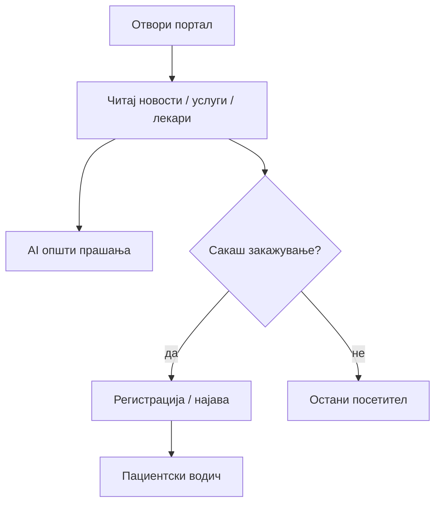

# Посетител (без најава)

Овој водич е наменет за секого кој го отвора сајтот на Клиничка болница — Штип без претходна регистрација, без значење дали воопшто планира подоцна да отвора сметка или само сака да се информира. На пример, ако сакате само да проверите дали болницата има кардиолог, кое е работното време, или да прочитате последна вест од болницата — за тоа не ви треба ниту регистрација, ниту најава. Сите тие делови на сајтот се целосно отворени и слободни за секого. Границата се појавува штом дејството станува лично, односно врзано конкретно за вас како поединец — на пример закажување на преглед на ваше име, или пристап до ваша лична медицинска историја. Токму таму сметката станува задолжителна. Подолу е појаснето токму каде се наоѓа таа граница: кои делови од сајтот се слободни за секого без исклучок, и кои бараат претходно отворена сметка. За самата постапка на регистрација и најава — формата, полињата, што се случува при заборавена лозинка — видете [Регистрација и најава](pacient/registracija-i-najava.md).

## Што можете без најава

Секој може да ја отвори главната страница без регистрација и да ги користи јавните делови на порталот — не ви треба сметка само за да се информирате за болницата, лекарите и услугите:

**Новости** — целата листа на објави на болницата, без ограничување во бројот или времето, достапна преку менито „Новости" или директно прикажана на почетната страница. Не треба да барате посебна форма или да се најавувате само за да прочитате што е ново — листата е целосно отворена, подредена по датум, со најновите први.

**Преглед на лекари**— целосна листа на сите лекари во болницата, со можност да ја филтрирате по специјалност (на пример, само кардиолози, само педијатри), за да не морате да скролувате низ целата листа. На пример, ако сакате само да проверите дали болницата воопшто има невролог, доволно е да отворите „Лекари" и да филтрирате по специјалност — без регистрација.

**Преглед на услуги** — секцијата „Услуги" дава преглед на сите одделенија во болницата, а клик на конкретен оддел отвора детален опис со повеќе информации за тој оддел. Корисно ако однапред сакате да проверите дали одреден оддел воопшто постои, пред да дојдете во болницата.

**Контакт** — контактна форма на сајтот, преку која можете да испратите порака или прашање директно до болницата, без потреба од сметка.

**Преглед на огласи за работна позиција** — секцијата „Кариера" ги прикажува сите тековно активни огласи за работа, затворените огласи не се прикажуваат во листата. Самото гледање на огласите е целосно слободно — сметка ви треба единствено доколку решите да аплицирате на конкретен оглас.

**AI асистент за општи прашања** — копчето долу десно е достапно и за гости, без претходна најава, и одговара на општи прашања, на пример „Кои кардиолози работат кај вас?", „Кое е работното време на болницата?" или „Како функционира закажувањето?". Штом побарате нешто лично специфично — на пример самото закажување — асистентот ве упатува кон најава.

> Поврзано: [Сајт и навигација](sajt-i-navigacija.md) · [AI асистент](ai-asistent.md) · [Кариера — преглед на огласи](pacient/kariera-aplikacija.md)

## Што **не** можете без најава

Сите дејства специфични за конкретен профил бараат претходна регистрација и најава:

**[Закажување, откажување или промена на термин](pacient/zakazuvanje-termin.md)** — на пример, ако сакате преглед кај кардиолог следната недела, самата форма за закажување воопшто не е достапна без претходна најава; системот бара сметка пред да ви овозможи избор на лекар, датум и термин. Истото важи и за веќе закажан преглед — измена или откажување е возможно само откако ќе се најавите.

**[Пристап до „Мое досие"](pacient/moe-dosie-i-termini.md)** — лична историја на сите ваши прегледи, дијагнози, терапии, забелешки од лекар и PDF-извештаи за секој завршен преглед. Без сметка, овој дел од сајтот воопшто не постои за вас — нема ниту страница која можете случајно да ја отворите.

**[Оставање оцена](pacient/ocenuvanje-pregled.md)** — оценувањето е врзано конкретно за ваш преглед во базата, па бара да сте најавени токму како тој пациент кој го имал тој преглед; гостин нема ниту начин да дојде до формата за оценување.

**[Аплицирање на оглас](pacient/kariera-aplikacija.md)** — самата апликациона форма бара најавен профил, за разлика од прегледувањето на огласите, кое е слободно достапно за секого без сметка.

**[Лекарски или административен панел](lekar/najava-i-panel.md)**  — тие се целосно одделени делови од сајтот, наменети исклучиво за најавени лекари, односно за ([директор](direktor/administracija.md)). Не се дел од истиот простор кој го гледа пациент или гостин, и не се отвораат без соодветна најавена улога.

## AI како посетител

Како гостин, без отворена сметка, можете слободно да разговарате со [AI асистентот](ai-asistent.md) за сите општи прашања — на пример „Кои кардиолози работат кај вас?", „Кое е работното време?" или „Кои услуги ги нудите?" — без никаква потреба од најава.

Штом побарате нешто за коешто е потребна сметка — на пример „Сакам преглед кај кардиолог следната недела" — асистентот ве известува директно во разговорот дека за тоа е потребна [најава](pacient/registracija-i-najava.md), и обично сам ве пренасочува кон формата за login. По успешна најава, разговорот не почнува од почеток: целиот претходен дел од разговорот како гостин автоматски продолжува во вашата сметка, без да треба да го повторувате тоа што веќе сте го напишале.

Важно е да се знае и спротивното: ако затворите страницата како гостин без да се најавите, тековниот разговор се губи и не може да се поврати — гостите немаат трајна историја на разговори, за разлика од најавените пациенти и лекари.

> Подетално: [AI асистент](ai-asistent.md) · [Закажување преглед](pacient/zakazuvanje-termin.md)

## Следен чекор

Штом решите да направите било кое од дејствата кои бараат сметка — да закажете преглед, да го следите вашето „Мое досие", да оставите оцена за завршен преглед, или да аплицирате за работна позиција — потребна е регистрација. Постапката се прави само еднаш: отворате сметка, се најавувате, и веднаш потоа имате пристап до сите тие функции, без да треба повторно да минувате низ регистрација при секоја следна посета на сајтот. На пример, ако денес само разгледувате листата на лекари како гостин, а следната недела решите да закажете преглед кај кардиолог, во тој момент е доволно само да се регистрирате еднаш — оттаму натаму сте најавен корисник со целосен пристап. Целата постапка — формата, полињата, што се случува при заборавена лозинка во [Регистрација и најава](pacient/registracija-i-najava.md). Потоа: [Закажување преглед](pacient/zakazuvanje-termin.md),[Мое досие](pacient/moe-dosie-i-termini.md),[Оценување](pacient/ocenuvanje-pregled.md).
***

Следно: [Регистрација и најава (пациент)](pacient/registracija-i-najava.md) · [AI асистент](ai-asistent.md)
