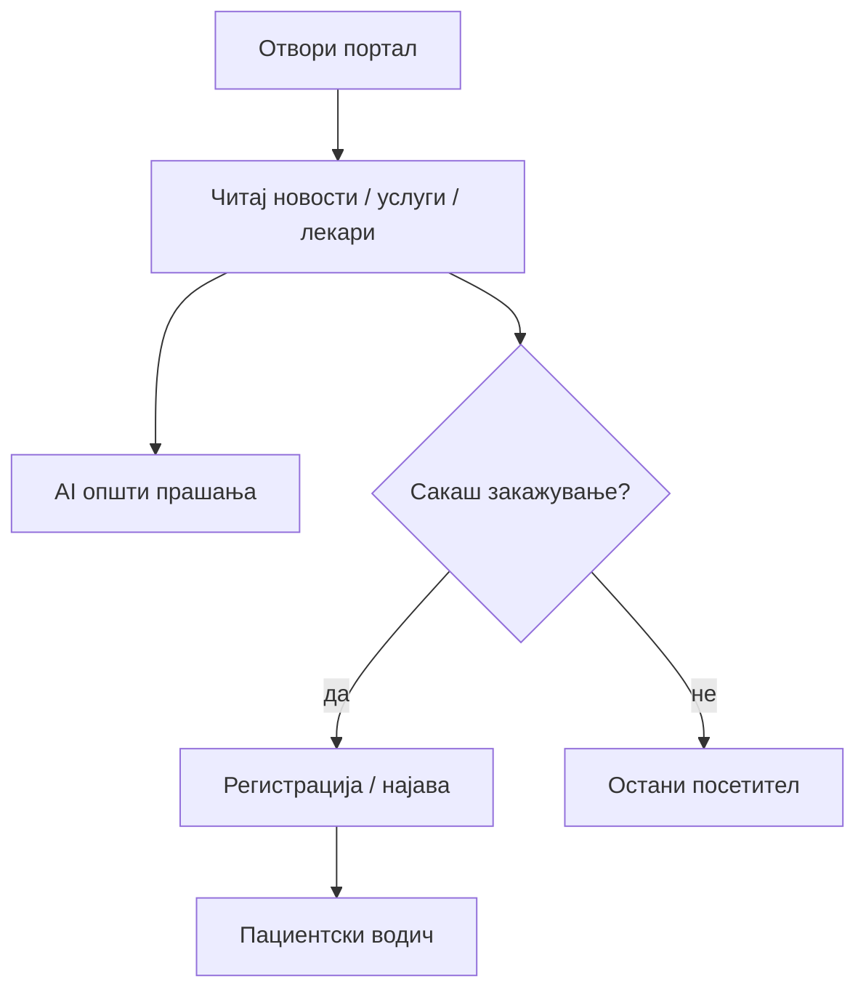

# Посетител (без најава)

Секој може да ја отвори страницата **без регистрација** и да ги користи јавните делови на порталот. Не ви треба сметка за да се информирате за болницата, лекарите и услугите.

## Што можете без најава

| Дејство | Како |
|---------|------|
| Читање **новости** | Мени → Новости, или почетна страница |
| Преглед на **лекари** | Секција „Лекари" — листа, филтер по име/специјалност |
| Преглед на **услуги** | Секција „Услуги" — клик за детали за оддел |
| **Контакт** | Секција „Контакт" |
| **AI асистент** (општи прашања) | Црвено копче долу десно — работно време, лекари, услуги, навигација |
| Преглед на **огласи за работа** | Секција „Кариера" — само читање; за апликација треба најава |

## Што **не** можете без најава

* Закажување, откажување или пренос на **ваш** преглед (освен преку AI да ве насочи кон најава)
* Преглед на **лично досие**
* **Оценување** на преглед
* **Аплицирање** за работа (формата бара најавен профил)
* Лекарски или администраторски панел

## AI како посетител

Можете да прашате на **македонски**, на пример:

* „Кои кардиолози работат кај вас?"
* „Кое е работното време?"
* „Како да закажам преглед?"

Ако сакате да **закажете термин**, асистентот ќе ви каже дека треба **најава како пациент** и може да го отвори формата за login — разговорот може да продолжи по најава. Види [AI асистент](ai-asistent.md).

## Следен чекор

Ако сакате да закажувате прегледи и да го следите вашето досие → [Регистрација и најава](pacient/registracija-i-najava.md).

***

Следно: [Регистрација и најава (пациент)](pacient/registracija-i-najava.md) · [AI асистент](ai-asistent.md)
