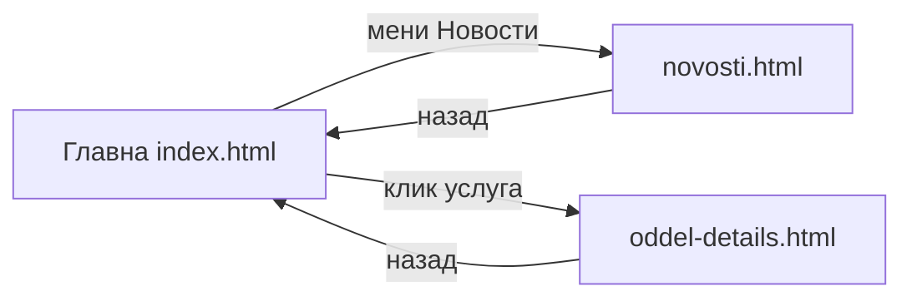

# Сајт и навигација

На прв поглед, сајтот на Клиничка болница — Штип изгледа како да е составен од многу одделни страници: **почетна, услуги, лекари, контакт**. Во суштина, сепак, скоро сè се случува на една единствена страница. Клик на ставка од менито не отвора ништо ново — само ве лизга нагоре или надолу до соодветниот дел, слично како да скролувате низ долг документ, со таа разлика што секој дел тука има свое копче во менито. На пример, клик на „Услуги" не предизвикува никакво вчитување: страницата едноставно ве спушта до делот каде сите медицински услуги веќе стојат прикажани, уште од моментот кога сте ја отворили страницата.

> Live: [klinicka-bolnica-stip2026.onrender.com/app/](https://klinicka-bolnica-stip2026.onrender.com/app/)

## Три страници

Целиот сајт е поделен на три засебни страници, не една единствена:
1. **Главната страница** е местото каде се случува речиси сè — почетен банер, листа на лекари, услуги, закажување преглед, најава, а за лекари и директор и соодветните панели. Овде ќе ја минете најголемиот дел од времето, бидејќи скоро секое дејство — од прелистување на услуги до закажување термин — се случува токму тука, без напуштање на страницата.

2. **Страницата за новости** се отвора како посебна, целосно самостојна страница штом кликнете на „Новости" во менито. За разлика од делови како „Услуги" или „Лекари", кои се само скрол-делови на главната страница, тука навистина се вчитува нова страница, со сопствена адреса во прелистувачот. Тоа е корисно ако, на пример, сакате да испратите некому директен линк до конкретна вест, или да се вратите подоцна токму на новостите, без да минувате прво низ главната страница. За враќање назад, страницата има свое копче „<- Вратете се на главната страница" во горниот дел.

3. **Страницата за оддел** се отвора секогаш кога кликнете на конкретна услуга од листата „Услуги" — на пример, ако кликнете на „Кардиологија", се отвора страница токму за тој оддел, со опис и списокот на лекари кои работат таму. Технички, сите одделенија ја користат истата страница; само податоците кои се вчитуваат се различни според тоа кој оддел сте го избрале, препознаен преку оддел во самата адреса. Затоа болницата во иднина може да додаде нов оддел само со внес во базата, без програмер да прави нова, посебна страница за него. Враќањето назад се прави преку копчето „← Назад кон услуги", кое ве носи директно на делот „Услуги" на главната страница.

И покрај тоа што се три одделни страници, најавата важи на сите три: ако сте најавени и потоа отворите новости или конкретен оддел, останувате најавени и таму — не треба повторно да внесувате лозинка само затоа што сте преминали на друга страница.

> За програмери: [index.html](../frontend/stranici/index-html.md)
>[novosti.html](../frontend/stranici/novosti-html.md)
>[oddel-details.html](../frontend/stranici/oddel-details-html.md)

## Мени (горе)

Горниот, фиксен дел од страницата (хедерот) е секогаш видлив, без разлика колку скролувате надолу. Во него постојано стои логото на болницата — SVG симбол на црвен крст, заедно со текстот „ЈЗУ Клиничка Болница - Штип" — а покрај него, главното мени, преку кое можете да отворите: **Почетна, Услуги, Лекари, Новости и Контакт**. Покрај нив, ставката **„Матични лекари"** е единствениот линк кој ве носи надвор од сајтот — отвора во нов таб надворешната платформа „[Мој термин](https://mojtermin.mk)", наменета за закажување преку матичен лекар, а не преку самата болница. Одделно од менито, во хедерот стои и копчето „Најави се!", преку кое се отвора формата за најава или регистрација. На мобилен телефон, целото мени се собира зад копче во форма на „хамбургер" (три хоризонтални линии); клик на него го отвора истото мени, но прикажано вертикално, преку целиот екран.

Самото мени не изгледа исто за секого. Како гостин, без сметка, го гледате само основното мени плус „Најави се!". Штом се најавите како пациент, се додаваат и ставки специфични за вас — закажување преглед, оставање оцена, профил, „Мое досие". Ако сте лекар, се додава лекарски панел; ако сте директор, се додава административен панел. Менито, со други зборови, сам ја препознава вашата улога и ви покажува токму она што ви е достапно — без да треба сами да барате каде е кој дел. На пример, штом еднаш закажете преглед и се вратите на страницата, веднаш ќе видите и „Мое досие" во менито — иста ставка која гостин на истата страница воопшто не ја гледа, бидејќи за него таа сè уште не постои.

Од фиксниот хедер може да одите на:

* **Почетна** — hero банер, краток преглед
* **Услуги** — што нуди болницата (клик води кон детали за оддел)
* **Лекари** — листа на лекари, филтер по име или специјалност
* **Матични лекари** — линк кон надворешната платформа „Мој Термин"
* **Новости** — посебна страница
* **Контакт** — информации за контакт
* **Најави се!** — најава или регистрација (пациент или лекар)

## Секции на главната страница

Со скролување надолу низ главната страница минувате низ повеќе одделни делови, секој со своја цел:

## Најава и одјава

Постапката за најава не е иста за пациент и за лекар. Пациент се најавува со е-пошта и лозинка — истата комбинација внесена при регистрација. Лекар, наспроти тоа, нема посебна е-пошта за најава; наместо неа, системот му генерира корисничко име во форма име.презиме, латинизирано — на пример, лекар по име Ана Стојановска би се најавил со корисничко име „ana.stojanovska", плус лозинка. Подетално за самата постапка на пациентска регистрација и најава,видете [Регистрација и најава](pacient/registracija-i-najava.md). За лекари: [Најава и панел](lekar/najava-i-panel.md).

Откако сте најавени, не треба повторно да внесувате лозинка при секој следен клик низ сајтот — сесијата останува активна додека самите не се одјавите преку менито, или додека не измине подолг период на неактивност, по кој системот автоматски ве одјавува заради безбедност.

## AI асистент

Копчето на AI асистентот — „пловечко" копче во долниот десен агол — се наоѓа единствено на главната страница, не и на посебните страници за новости или за оддел; тие се самостојни страници, надвор од истата структура во која е вграден виџетот. Клик на копчето отвора прозорец за разговор, каде асистентот одговара веднаш, на македонски јазик.

Достапен е и без најава, со ограничени можности до општи информации — на пример, гостин слободно може да праша „Кое е работното време на болницата?", без да отвора сметка. Целосните можности, различни според тоа дали сте пациент, лекар или директор, се подетално објаснети во [AI асистент](ai-asistent.md).

## Што е различно од tech документацијата?

Овој водич опишува **што гледате и што кликатe**. За тоа како е изграден кодот, видете [Frontend](../frontend/pages.md).

> За програмери: [Frontend — страници](../frontend/pages.md)

***

Следно: [Посетител](posetitel.md) · [Регистрација и најава](pacient/registracija-i-najava.md) · [AI асистент](ai-asistent.md) · [Почетна на водичот](README.md)