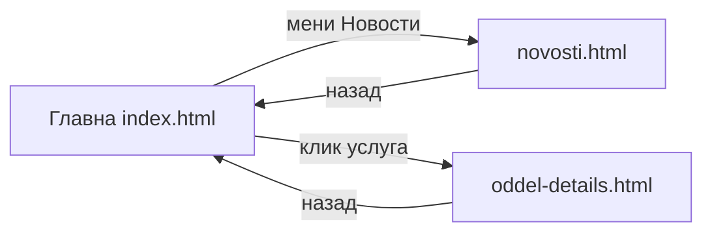

# Сајт и навигација

Порталот на Клиничка Болница Штип е веб-страница со **три главни делови**. Најголемиот дел од работата се прави на **главната страница** — преку менито скролувате до различни секции, без да се отвора нова страница.

> Live: [klinicka-bolnica-stip2026.onrender.com/app/](https://klinicka-bolnica-stip2026.onrender.com/app/)

## Три страници

| Страница | Што е | Кога ја користите |
|----------|-------|-------------------|
| **Главна** (`index.html`) | Почетна, лекари, услуги, закажување, најава, лекарски панел | Најчесто — сè на едно место |
| **Новости** (`novosti.html`) | Листа и детали за вести од болницата | Мени → Новости |
| **Оддел** (`oddel-details.html`) | Детали за медицинска услуга/оддел | Клик на услуга од листата |

## Мени (горе)

Од фиксниот хедер може да одите на:

* **Почетна** — hero банер, краток преглед
* **Услуги** — што нуди болницата (клик води кон детали за оддел)
* **Лекари** — листа на лекари, филтер по име или специјалност
* **Матични лекари** — линк кон надворешната платформа „Мој Термин"
* **Новости** — посебна страница
* **Контакт** — информации за контакт
* **Најави се!** — најава или регистрација (пациент или лекар)

## Секции на главната страница

Главната страница не се делите на посебни URL-и — скролувате до секција:

| Секција | За што е |
|---------|----------|
| `#home` | Почетна |
| `#uslugi` | Медицински услуги |
| `#lekari` | Лекари и закажување |
| `#kariera` | Огласи за работа |
| `#kontakt` | Контакт |

## Најава и одјава

* **Пациент** — е-пошта + лозинка (или регистрација)
* **Лекар** — корисничко име (име.презиме) + лозинка
* **Одјава** — од менито кога сте најавени
* По **неактивност** сесијата истекува и системот ве одјавува автоматски

## AI асистент

На **главната страница**, во **долниот десен агол**, има **црвено кругло копче** — тоа е AI чатот. Достапен е и без најава (со ограничени можности). Подетално: [AI асистент](ai-asistent.md).

## Што е различно од tech документацијата?

Овој водич опишува **што гледате и што кликатe**. За тоа како е изграден кодот, видете [Frontend](../frontend/pages.md).

***

Следно: [Посетител](posetitel.md) · [Пациент — регистрација](pacient/registracija-i-najava.md)
